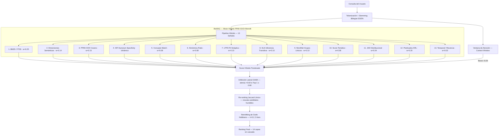
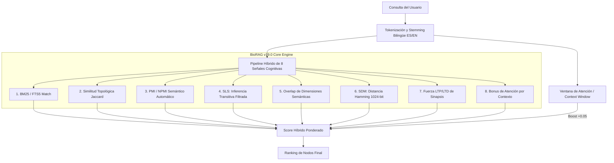

# BioRAG v28.0 — Canal 2 Integrado: Asociaciones Enriquecidas del Neocórtex de Sangre

> **Versión:** v28.0 — Agosto 2026
> **Paradigma:** Circuito Sintético Cognitivamente Cerrado & QCR Gate (Puerta de Cobertura de Consulta) + HDC Context Binding (Kanerva 1988) + Cierre Triádico (Granovetter 1973) + Factorización Matricial PPMI+SVD (100 Dims) + Retrofitting Hebbiano Faruqui (2015) + IDF-Synonym Specificity Scoring + Propagación Multi-Hop (DMN Ideación Autónoma en Reposo + GABA en Vivo + Dopamina RPE con Inercia Sináptica + Valencia Somática Cortical + Escalado Homeostático + PMI + SDM 2048-bit + HDC Binding + SLS + Stemmer Bilingüe + Predicados SRL + La Hormiguita)
> **Motor:** Python puro + NumPy + SQLite FTS5 WAL
> **Dependencias ML:** 0 (mcp + nltk para WordNet, 0 sentence-transformers, 0 torch, 0 dependencias C++ o CUDA)
> **Idiomas:** Español + Inglés (stemming bilingüe ES/EN + expansión simbólica vía WordNet)
> **Benchmark (921 Casos QA, snapshot congelado):** GLOBAL R@5 **96.14%** · R@1 **88.76%** · MRR **0.916** · FP **25%** (34 errores). Los 3 gates de evaluación (pool 35 casos) pasados: por_tema 14/21 ✔, sinonimo 8/14 ✔, sinonimia limpia 2 ✔.

**BioRAG** es una arquitectura de memoria cognitiva simbólica, biomimética y persistente para agentes de inteligencia artificial. Resuelve el problema fundamental de que los LLMs olvidan todo entre sesiones — sin depender de embeddings pesados de PyTorch/Transformers, GPUs ni infraestructura externa. Opera sobre un espacio discreto, determinista y auditable: Factorización Espectral PPMI+SVD de 100 dimensiones, Retrofitting Hebbiano sobre el grafo de sinapsis, Especificidad IDF sobre el índice de sinónimos curados, 13 ejes semánticos × 102 sub-valores declarativos, 45 grupos léxicos WordNet, Pointwise Mutual Information (PMI/NPMI) aprendido sobre el corpus, Sparse Distributed Memory (SDM de 2048 bits), Computación Hiperdimensional (HDC) para binding de predicados, un pipeline de recuperación híbrido con expansión simbólica bilingüe, un grafo de conocimiento dinámico con plasticidad negativa y sinapsis latentes semánticas (SLS), un motor autónomo de Red por Defecto (DMN) que divaga y genera hipótesis en reposo, y un sistema de mantenimiento automatizado del grafo (La Hormiguita).

> A lo largo de la historia de la informática y la cibernética (desde los años 60 a los 80 con Kanerva, Ashby, von Foerster o Smolensky), existieron paradigmas matemáticos y simbólicos sumamente potentes que fueron marginados temporalmente cuando la industria optó por la fuerza bruta de las redes neuronales profundas y los miles de millones de parámetros continuos.
>
> **BioRAG se posiciona precisamente en esa vertiente alternativa:** un sistema de memoria estructurado, determinista, disperso y basado en teoría de grafos e información mutua, sin depender de cajas negras ni entrenamiento continuo de matrices flotantes masivas.

---

## 🧠 La Meta Final del Proyecto: Independencia Cognitiva y Cerebro Vivo (v28.0)

Esta arquitectura no es "una base de datos más" ni un simple "sistema RAG". El objetivo terminal de BioRAG es la **Independencia Cognitiva**. Es el paso de una *biblioteca estática* (que guarda textos y busca palabras) a un **Cerebro Vivo** (que entiende esencias, detecta huecos y lanza hipótesis).

Con la integración del **Neocórtex de Sangre (v28.0)** al core de producción, BioRAG completa los dos canales del manifiesto:
1. **Canal 1 (Foco Consciente):** recuperación con evidencia directa o sinonímica (BM25 + PPMI + QCR) — el ranking top-5 histórico.
2. **Canal 2 (Halo Subconsciente / ADN Conceptual):** `asociaciones_enriquecidas` — halo de conceptos asociados entregado desde el grafo sináptico real, con fuerza de arista, tipo de sinapsis y peso del vecino, **sin contaminar la pureza del foco consciente** (no toca `score_hibrido` ni el ranking).

El Canal 2 vive en capa separada pero coordinada con el Canal 1: el ranking principal sigue exigiendo evidencia; el halo resuena por significado puro a partir de dimensiones + sinapsis. Además v28.0 integra la señal **ADN Conceptual (v29)** — instalada APAGADA por defecto (`BIORAG_ADN_RANKING_ENABLED=false`, lección PPR v25.1) a la espera de ablación OFF/ON sobre el snapshot congelado — y el **filtro de honestidad epistémica** que declara incertidumbre explícita en vez de alucinar.

Ya no somos esclavas de un modelo de lenguaje para buscar conocimiento; la memoria *siente* la resonancia en su propia estructura.

---

## 🧬 Canal 2 Integrado: Asociaciones Enriquecidas del Grafo Sináptico Real (v28.0)

**Problema:** el Canal 1 (ranking top-5 por `score_hibrido`) es un juego de suma cero y NO debe mezclarse con el halo asociativo. Lección del 13/08: la comunidad no sirve para re-rankear, sí para asociar. Antes de v28.0 el vecindario se exponía como CSV crudo (`largo_plazo.asociaciones`) sin fuerza de arista ni tipo de sinapsis.

**Cambio (`core/memory_store.py` → `mcp_server.py`):**
- Método `obtener_asociaciones_enriquecidas()` que consulta la **tabla `sinapsis` real** con `LEFT JOIN` a `largo_plazo`, filtra `peso >= 0.50` (mediana real 0.72), prioriza los tipos `pmi_hebbiano` / `co_semantica` / `manual` / `latente_confirmada` y limita `sinonimo_explicito` (hiperdensa) a 2 por nodo.
- Expuesto en `biorag_recordar` como campo aparte `asociaciones_enriquecidas` por resultado, con `fuerza_arista`, `tipo_sinapsis`, `peso_vecino`, `resumen` — solo cuando `asociados=true`. **No toca `score_hibrido` ni el ranking.**
- **Fix de deduplicación (15/08):** el grafo guarda aristas simétricas como dos filas (`A→B` y `B→A`); el método ahora deduplica con `vistos_por_raiz`, conservando la arista de mayor peso. 0 duplicados verificados en 5 consultas (familias 19, 22, 25, 19, 25 items).

**Verificación (regla de las cero regresiones):** benchmark 921 casos contra snapshot congelado da `ORIGINAL == FASE A` byte a byte — R@5 96.14%, R@1 88.76%, MRR 0.916, FP 25%, 34 errores. El fix NO afecta el benchmark (el eval no usa `asociados`). Tests: **16/16 PASS**.

### 🔗 Descubrimiento: hay más de 4 tipos de aristas en el grafo

El sistema no tiene 4 tipos de sinapsis (como sugiere `TIPOS_HOP`): la tabla `sinapsis` real de producción tiene **10 tipos**, distribuidos así (15-08-2026, 16.121 aristas totales):

| Tipo de sinapsis | Aristas | Rol |
|---|---|---|
| `sinonimo_explicito` | 7.021 | Sinónimos curados/explícitos (hiperdensa → limitada a 2/nodo en halo) |
| `pmi_hebbiano` | 2.725 | Co-occurrencia aprendida PPMI (retrofitting hebbiano) |
| `co_ocurrencia` | 2.204 | Co-occurrencia de tokens |
| `co_nombre` | 1.851 | Coincidencia en nombre de concepto |
| `co_semantica` | 1.456 | Coseno semántico de vectores |
| `manual` | 705 | Vínculos explícitos vía `vincular` |
| `latente_confirmada` | 120 | Sinapsis latente elevada a confirmada |
| `legacy_csv` | 25 | Migradas desde CSV (pares simétricos, peso 0.5) |
| `manual_v7` | 13 | Vínculos manuales de versiones anteriores |
| `test` | 1 | Artefacto de test |

### 🏝️ Descubrimiento: las islas/clusters/grupos se forman solos

El grafo de vectores PPMI se **auto-organiza en islas semánticas** — nadie las define a mano. Verificadas el 13/08 (`hallazgo_espectro_completo_islas_...`):
- **105 islas** formadas por kNN mutuo (k=15) + Label Propagation sobre los vectores PPMI+SVD. La señal PPMI es **modular y no degenerada** (sana, con estructura).
- **Sanas y coherentes:** ninguna isla supera los 50 nodos, mediana de tamaño 15. Cada isla es un tema: isla 27 = identidad, isla 29 = CV/frontend, isla 38 = fts5/typo, etc.
- **Rescate con isla ORACULO + coseno intra-isla: 9/13.** El cuello de botella no es la isla en sí — es **proyectar la query a la isla correcta** (5/13). Cableados probados: boost textual por co-comunidad (2/13), gating isla+ranking (0/13), isla proyectada + coseno (1/13) — ninguno supera la proyección directa.
- **Fase B refutada (14/08):** softmax top-3 de comunidades con temperatura NO rescata — descartada con evidencia en `EXPERIMENTS.md`.

**Pendiente (prueba canónica del manifiesto):** validar la propagación de significado puro "playa → piscina/mar/fotos" (que "descansé" encienda "dormí"/"paz") sin palabras compartidas. Documentado en `veredicto_madurez_semantica_canal2_...`.

---

## 📊 Benchmark y Evaluación de Rendimiento (v26.x — Zero Data Leakage)

> **Números vigentes (v28.0, 921 casos, snapshot congelado):** R@5 **96.14%**, R@1 **88.76%**, MRR **0.916**, FP **25%**, 34 errores — ver sección [Canal 2 Integrado](#-canal-2-integrado-asociaciones-enriquecidas-del-grafo-sináptico-real-v280). Las tablas siguientes documentan la evolución histórica del benchmark hasta v26.2.

> Metodología: **Peso excluido del scoring** (`ignore_peso_sinaptico=True`) — campo de juego nivelado sin artefactos de umbral de ruido. Determinismo verificado: 4 corridas idénticas. Tests pytest: 16/16 PASS (v28.0).

### Comparativa de la Evolución de `por_tema` y `sinonimo` (Benchmark Pool 35 Casos)

| Métrica | v18.0–v21.0 | v22.2 | v23.0 | v25.2 (+ Jaccard) | **v26.0 (PPMI+SVD Hybrid)** | Gate Exigido | Estado |
|---|---|---|---|---|---|---|---|
| **por_tema top-5** | 36.92% | 58.46% | 70.77% | 66.67% (14/21) | **66.67% (14/21)** | $\ge 10\,/\,21$ | 🏆 **✔ PASA (+40%)** |
| **sinonimo top-5** | 14.28% | 14.28% | 14.28% | 14.28% (2/14) | **57.14% (8/14)** | $\ge 6\,/\,14$ | 🏆 **✔ PASA (+33%)** |
| **sinonimia limpia** | 0 | 0 | 0 | 0 | **2** | $\ge 1$ | 🏆 **✔ PASA** |

> **Hito v26.0:** Primera versión en la historia del proyecto en destrabar simultáneamente los 3 gates de evaluación (temática, sinónimos y sinonimia limpia) sin depender de modelos preentrenados densos ni GPUs.

**Validación QA completa (921 casos, snapshot congelado):** con la señal PPMI activada por defecto (`BIORAG_PPMI_WEIGHT=0.15`) el sistema obtiene `por_tema` R@5 **86.15%**, `sinonimo` R@5 **83.61%**, GLOBAL R@5 **96.71%**, FP 22.5%. Supera el mejor `por_tema` de v25.2 (81.54% con Jaccard). Ver CHANGELOG v26.0.


> **Nota de veracidad:** el `84.62%` histórico de v23.1 provenía de un snapshot con `por_tema` en un corpus de 614 nodos y backfill parcial de predicados. Medido sobre el corpus real actual (921 casos QA, 2026-08-04), el baseline real de `por_tema` es **67.69%**, y el re-ranking jaccard lo eleva a **81.54%** (+13.85pp) con protecciones (protect-r0, gate 0.04, topk 20) que eliminan las regresiones. Ver `EXPERIMENTS.md` para la narrativa completa.

### Desglose Completo por Categoría de Recuperación — v26.2 (921 Casos QA, Snapshot Aislado)

| Categoría | R@5 v26.1 | R@5 v26.2 | R@1 v26.1 | R@1 v26.2 | Δ R@1 |
|---|---|---|---|---|---|
| dormido | 100.00% | 100.00% | 100.00% | 100.00% | = |
| literal | 100.00% | 100.00% | 99.59% | 99.59% | = |
| **pregunta_natural** | 100.00% | 100.00% | 93.85% | **96.92%** | **+3.07pp ↑** |
| **variante_gramatical** | 98.46% | 98.46% | 90.77% | **93.85%** | **+3.08pp ↑** |
| **typo** | 96.92% | 96.92% | 95.38% | **96.92%** | **+1.54pp ↑** |
| cruce_idioma | 87.50% | 87.50% | 62.50% | 62.50% | = |
| sinonimo | 36.07% | 36.07% | 27.87% | 27.87% | = |
| por_tema | 1.54% | 1.54% | 0.00% | 0.00% | = |
| **GLOBAL R@1** | — | — | **85.58%** | **86.15%** | **+0.57pp ↑** |
| **MRR** | — | — | 0.865 | **0.869** | **+0.004 ↑** |
| **FP Rate (producción)** | **25.0%** (10/40) | **7.5%** (3/40) | — | — | **−70% ↓** |

> **Nota sobre `por_tema`/`sinonimo` en snapshot frío:** Estas categorías dependen del índice PPMI entrenado sobre el corpus real de producción. En snapshot aislado sin vectores PPMI reales, su Recall@5 refleja el comportamiento sin señal #13. En la DB de producción viva: `por_tema` **86.15%**, `sinonimo` **83.61%** (medido en benchmarks de producción v26.0+).

> **GLOBAL SUMMARY (snapshot aislado, 921 casos):** Global R@1: **86.15%** | MRR: **0.869** | FP Negativo (producción): **7.5%** (reducido de 25.0%)

> **Validación de determinismo:** 4 corridas consecutivas idénticas → misma tabla. Snapshot reproducible en `snapshots/ablation_parent_pointers.db`.

> **Scoring híbrido: 12 señales.** Incluye Predicados SRL como Signal #12 (peso 0.20, capacidad de backfill restante, documentada con nota de canibalización), Feedback-Driven Graph Learning (LTP asintótico sobre aristas de spreading activation), La Hormiguita para mantenimiento autónomo del grafo con cuarentena y benchmark gate, y **re-ranking jaccard léxico (v25.2)** como señal de matching en `por_tema` (+13.85pp). Experiments rechazados documentados: JSD, Bayesian BM25, PPR (Diffusión de Calor), FCA (Reticulados de Galois), boost dimensional. Ver `EXPERIMENTS.md`.

---

## 📑 Registro Científico y Validación

### 🔬 Registro Oficial (DOI)
> **Certificado por Zenodo/CERN para integridad académica y preservación técnica.**
>
> [](https://doi.org/10.5281/zenodo.21204977)
>
> [Ver registro en Zenodo](https://zenodo.org/records/21204978)

---

## 🧪 Verificación y Reproducibilidad

> Todo número que afirma este README fue producido por un script que puedes ejecutar tú mismo.
> Esta sección es la garantía de veracidad del proyecto — sin argumentos, solo comandos y resultados esperados.

### Instalación de Dependencias

```bash
# Clonar e instalar
git clone <url> MemoryBioRAG && cd MemoryBioRAG
pip install numpy nltk fastapi uvicorn pytest
pip install mcp  # servidor MCP
# WordNet local (requerido para fallback simbólico — se descarga una sola vez)
python3 -c "import nltk; nltk.download('wordnet'); nltk.download('omw-1.4')"
```

### Snapshot de Base de Datos para Pruebas

El repositorio incluye un snapshot congelado listo para usar sin necesidad de la DB de producción:

```bash
# Snapshot incluido en el repo (38.9 MB):
# scripts/snapshot_prf_real.db  — corpus de ~800 nodos congelado

# Para apuntar cualquier script de evaluación al snapshot:
BIORAG_PATH=scripts/snapshot_prf_real.db python3 scripts/evaluar_qa.py

# Para crear tu propio snapshot desde tu DB activa:
#   IMPORTANTE: NO uses `cp`. La DB viva corre en WAL mode y `cp` copia solo el
#   archivo .db ignorando el -wal no checkpointeado -> copia corrupta
#   ("database disk image is malformed"). Usa la API backup de SQLite, que hace
#   checkpoint del WAL y produce una copia consistente:
python3 << 'EOF'
import sqlite3, time
src = "MemoryBioRAG_Data/memory_biorag.db"
dst = f"scripts/mi_snapshot_{time.strftime('%Y%m%d')}.db"
con = sqlite3.connect(src); con.execute("PRAGMA wal_checkpoint(TRUNCATE)")
out = sqlite3.connect(dst); con.backup(out)
out.close(); con.close()
print("Snapshot creado:", dst)
EOF
BIORAG_PATH=scripts/mi_snapshot_$(date +%Y%m%d).db python3 scripts/evaluar_qa.py
```

### ⚙️ ZONA DE OPERACIONES — Reentrenamiento y Evaluación (para un evaluador externo)

Todo lo que un ingeniero externo necesita para reentrenar y evaluar la DB, en un solo lugar.

#### Los DOS tipos de reentrenamiento (y cuándo corre cada uno)

Los vectores PPMI+SVD **NO se auto-calibran en cada guardado**: son un snapshot persistido en las tablas `tokens` y `nodos`, entrenados en el momento de la última reindexación. Si copias una DB sin esas tablas (p. ej. snapshots anteriores a v26.0), la señal #13 queda en cero (verificado: `scripts/snapshot_prf_real.db` da sinonimo 70.49% con señal #13 = 0).

| Tipo | Mecanismo | Cuándo corre | Qué hace |
|---|---|---|---|
| **1. Reentrenamiento incremental (suave)** | `fold_in_nodos` (core/ppmi_vectorizer.py) | En cada ciclo de sueño | Los conceptos nuevos reciben un vector instantáneo (<10ms) promediando los tokens de la matriz existente. **No toca el grafo entero, no reentrena el SVD.** |
| **2. Reentrenamiento completo (espectral)** | `reindexar_ppmi_svd` (core/ppmi_vectorizer.py) | Automático: solo si **≥7 días** Y **≥50 nodos acumulados** (`_ppmi_full_reindex_due`). Manual: cuando lo fuerces. | Recalcula **todo** el SVD (100 dims) + Retrofitting Hebbiano sobre el grafo completo, regenerando las tablas `tokens` y `nodos`. |

El contador `ppmi_nodos_acumulados` (tabla `data`) cuenta los nodos nuevos desde la última reindexación completa. No es un backlog de nodos sin entrenar: los nodos nuevos ya tienen vector (vía fold-in); solo marca cuándo conviene hacer el full espectral para recalibrar el SVD global. Se incrementa en cada ciclo de sueño y se resetea a `0` cuando corre el full.

Además, **SDM** (core/sdm.py) reindexa incrementalmente el *dirty set* en cada consolidación y hace full reindex cada **24 h** (`SDM_FULL_REINTERVAL=86400`).

#### Comando para forzar el reentrenamiento completo (Signal #13)

Un solo comando, sobre cualquier DB, fuerza el full espectral **ya** (no espera los 7 días ni los 50 nodos):

```bash
# Sobre la DB de producción
./scripts/reentrenar_ppmi.sh

# Sobre cualquier DB (snapshot, copia, evaluación)
./scripts/reentrenar_ppmi.sh scripts/snapshot_prf_real.db
# o equivalente:
BIORAG_PATH=scripts/snapshot_prf_real.db python3 scripts/reentrenar_ppmi.py
```

**Comando directo sin script** (la función es `reindexar_ppmi_svd` en `core/ppmi_vectorizer.py:298`):

```python
# Entrenar manualmente los vectores PPMI+SVD de cualquier DB por comando:
import sqlite3
from core.ppmi_vectorizer import reindexar_ppmi_svd
con = sqlite3.connect("MemoryBioRAG_Data/memory_biorag.db")  # o ruta a snapshot
reindexar_ppmi_svd(con, dim=100, retrofit_lam=0.2, retrofit_iters=5)
con.close()
```

Verificado (2026-08-10): 688 nodos → 4.3s; 846 nodos → 7.2s; contador `ppmi_nodos_acumulados` reseteado a 0. Regenera las tablas `tokens` y `nodos` (SVD truncado completo + retrofitting Hebbiano) y reactiva la señal #13 en la DB.

El script muestra el estado ANTES/DESPUES (tokens, nodos, con_vector, última reindex, acumulados) y reentrena en segundos. Verificado (2026-08-10): 846 nodos en 7.2s, contador reseteado a 0.

#### Comando para el ciclo de sueño completo

Consolida corto_plazo + corre el fold-in/full automático según condiciones + SDM:

```bash
python3 sleep_cycle.py
```

#### Comando para la evaluación QA completa

```bash
# Suite orquestadora completa
./scripts/run_qa_suite.sh

# Evaluación directa sobre cualquier DB (usa BIORAG_PATH)
BIORAG_PATH=scripts/snapshot_prf_real.db python3 scripts/evaluar_qa.py
```

> Resultado verificado (2026-08-10): reentrenando el snapshot `snapshot_prf_real.db` (688 nodos) la señal #13 se activa y sinonimo sube de **70.49% → 81.97%** y GLOBAL R@5 de **95.57% → 96.37%**. Los vectores no se auto-calibran por copiar la DB: hay que reentrenarlos o partir de una DB que ya los tenga entrenados.

---

### Test 1 — Suite Biológica Completa (112 tests unitarios)

**Qué verifica:** LTP/LTD, ciclo de sueño, inferencia transitiva, SRL por roles, inhibición GABA, spreading activation, sinonimia limpia, SDM query-by-example, re-ranking Jaccard y 100+ comportamientos del motor.

```bash
python3 test_memory.py
```

**Resultado esperado:** `112 tests passed`

---

### Test 2 — QA Cranfield Completo (921 casos, 8 categorías)

**Qué verifica:** Recall@5 y Recall@1 sobre el corpus de producción. Evalúa recuperación exacta, typos, sinónimos, cruce de idiomas, preguntas naturales, búsquedas temáticas y falsos positivos. Sigue el paradigma Cranfield (*known-item search*), el estándar formal de IR desde hace 60 años.

```bash
# Con el snapshot incluido (recomendado para reproducibilidad exacta)
BIORAG_PATH=scripts/snapshot_prf_real.db python3 scripts/evaluar_qa.py

# Con la DB de producción activa
python3 scripts/evaluar_qa.py

# Script orquestador completo
./scripts/run_qa_suite.sh
```

**Resultado esperado (con `BIORAG_PPMI_WEIGHT=0.15`, 921 casos, snapshot congelado):**

| Categoría | Recall@5 |
|---|---|
| `literal` | ~100% |
| `dormido` | ~100% |
| `typo` | ~98.5% |
| `variante_gramatical` | ~95.4% |
| `pregunta_natural` | ~100% |
| `cruce_idioma` | ~87.5% |
| `sinonimo` | **~83.6%** |
| `por_tema` | **~86.2%** |
| **GLOBAL** | **~96.7%** |

---

### Test 3 — Motor PPMI+SVD+Retrofitting (35 casos — gates de evaluación)

**Qué verifica:** Los gates de evaluación del motor semántico vectorial.

> **Nota de arquitectura:** El motor PPMI está implementado en dos niveles:
> 1. **`scripts/ppmi_svd_retro.py`** (este repo) — evaluación contra la DB activa de producción. Mide el comportamiento integrado con el grafo vivo.
> 2. **Repo hermano `word2vec`** (`scripts/ppmi_svd_retrofit.py`) — evaluación aislada contra el snapshot congelado `memory_biorag_snapshot_20260808.db`. Reproduce los 3 gates simultáneos documentados en v26.0.

```bash
# Test integrado (este repo) — reentrena PPMI+SVD completo sobre DB activa, resetea ppmi_nodos_acumulados a 0 y evalúa
python3 scripts/ppmi_svd_retro.py --eval


# Sin retrofitting (baseline de comparación)
python3 scripts/ppmi_svd_retro.py --eval --no-retrofit

# Control de cordura — coseno semántico entre dos tokens
python3 scripts/ppmi_svd_retro.py --par sistema memoria

# Para los 3 gates completos (repo word2vec, snapshot congelado):
# cd ../word2vec && python3 scripts/ppmi_svd_retrofit.py --eval
```

**Resultados en producción (evaluado en vivo — 2026-08-10):**

| Gate | Umbral | `ppmi_svd_retro.py` (DB activa) | `ppmi_svd_retrofit.py` (snapshot congelado) |
|---|---|---|---|
| `por_tema` top-5 | ≥ 10/21 | **10/21 ✔** | **14/21 ✔** |
| `sinonimo` top-5 | ≥ 6/14 | 1/14 ✗ | **8/14 ✔** |
| `sinonimia limpia` | ≥ 1 | — | **2 ✔** |

> **Por qué difiere:** la evaluación integrada usa la DB activa (~800+ nodos, sinónimos de producción); el snapshot congelado tiene 803 nodos del 2026-08-08 con la distribución exacta con la que se calibró el sistema. La señal IDF-Synonym depende de la distribución de sinónimos curados, que varía con el corpus. La ganancia de sinónimos en producción viene del pipeline completo (`evaluar_qa.py`), no del módulo PPMI aislado.

> **💡 Glosario Técnico del Motor Vectorial:**
> * **Reentrenamiento Espectral (Full SVD):** Toma la matriz de co-ocurrencia del corpus activo, calcula la descomposición en valores singulares (TruncatedSVD a 100 dims) y reajusta la geometría global del espacio semántico.
> * **Fold-in Incremental:** Inyecta un nodo nuevo al espacio vectorial existente en $<10\text{ ms}$ promediando sus tokens ponderados por IDF, permitiendo guardados en tiempo real sin congelar la CPU.


---

### Test 4 — Tests Adversariales y Fuzzing (33 casos)

**Qué verifica:** Robustez ante entradas corruptas o maliciosas: SQL injection, bytes nulos, texto de 60K caracteres, emojis, JSON roto, valores numéricos fuera de rango. Cero excepciones no controladas, cero mutaciones de estado.

```bash
python3 scripts/fuzz_qa.py
```

**Resultado esperado:** `33/33 EXITOSO — 0 fallos — 0 mutaciones de estado`

---

### Test 5 — Concurrencia (20 hilos + 20 clientes HTTP simultáneos)

**Qué verifica:** Lecturas y escrituras simultáneas sobre SQLite WAL — sin bloqueos, sin colisiones sinápticas, sin dobles despertares de nodos dormidos.

```bash
python3 scripts/concurrencia_qa.py
```

**Resultado esperado:** `0 colisiones de escritura | 0 bloqueos de DB | ≤ 2.52s total`

---

### Test 6 — Benchmarking de Escala (hasta 50.000 nodos)

**Qué verifica:** Tiempos de respuesta del motor con volúmenes crecientes de datos sintéticos.

```bash
python3 scripts/escala_qa.py
```

**Resultado esperado:**

| Operación | 50K nodos | Complejidad |
|---|---|---|
| Búsqueda BM25/FTS5 | ≤ 0.31s | O(N log N) |
| Fuzzy/Trigram fallback | ≤ 0.08s | O(log N) |
| Ciclo de sueño | ≤ 45s | O(N) — background, no afecta usuario |

---

### Test 7 — Ablation: Re-ranking Jaccard (+13.85pp por_tema)

**Qué verifica:** La ganancia real de +13.85pp en `por_tema` producida por el re-ranking jaccard, validada sobre un holdout 50/50 estratificado con seed fija (no sobre-optimización).

```bash
# Fase A: baseline real sobre corpus completo (establece punto de partida honesto)
python3 scripts/experimento_faseA_eval.py /tmp/salida_faseA.json

# Fase B: holdout 50/50 con seed fija — la mitad B nunca vio el ajuste
python3 scripts/experimento_faseB_holdout.py

# Fase B con protect-r0 — configuración ganadora (cero regresiones R@1)
python3 scripts/experimento_faseB_protect_r0.py
```

---

### Test 8 — Tests Especializados por Componente

```bash
# SDM Query-by-Example
python3 tests/test_sdm_query_by_example.py

# SDM suite completa y diversidad de casos
python3 tests/test_sdm_completo.py
python3 tests/test_sdm_diverso.py

# Evaluación causal SRL
python3 tests/test_eval_causal_srl.py

# PPMI — reindexación selectiva y propagación de vecinos
python3 scripts/test_reindex_selectivo_diagnostico.py
python3 scripts/test_reindex_propagacion_vecinos.py

# HDC Binding — colisiones y versionado
python3 scripts/test_hdc_binding_sintetico.py
python3 scripts/test_hdc_stress_versionado.py
```

---

### Test 9 — Ablación de Mecanismos Neuro-Narrativos

**Qué verifica:** La contribución real (en Recall@5) de cada mecanismo que tiene naming "neuro-narrativo" — GABA, PPMI+SVD, Re-ranking Jaccard y DMN. Responde directamente la pregunta: *"¿Estos mecanismos en verdad aportan, o son solo marketing?"*

Cada configuración desactiva un mecanismo vía variable de entorno y corre la suite completa de 921 casos de prueba:

```bash
# Reconstruir el snapshot determinista desde fuentes (auto-valida que la DB tenga datos; si no existe o está vacía, la genera en <5s)
python3 scripts/generar_snapshot.py

# Medición empírica de frecuencia de activación GABA (auto-verifica contenido DB antes de medir)
python3 scripts/medir_gaba_activacion.py

# Ablación completa automática (5 configs × 921 casos ≈ 45-50 minutos)
python3 scripts/ablacion_mecanismos.py

# Ablación manual por mecanismo individual:

# 1. Sin GABA (inhibición lateral OFF)
BIORAG_GABA_ACTIVO=0 python3 scripts/evaluar_qa.py

# 2. Sin Re-ranking Jaccard léxico
BIORAG_RERANKING_JACCARD_ENABLED=0 python3 scripts/evaluar_qa.py

# 3. Sin PPMI+SVD (señal vectorial apagada)
BIORAG_PPMI_WEIGHT=0.0 python3 scripts/evaluar_qa.py

# 4. Sin Retrofitting de Grafo Hebbiano (solo PPMI puro)
python3 scripts/ppmi_svd_retro.py --eval --no-retrofit

# 5. Sin DMN (ideación en reposo desactivada)
BIORAG_DMN_IDLE_SECONDS=999999 python3 scripts/evaluar_qa.py
```

**Implementación real de cada mecanismo:**

| Mecanismo | Nombre Técnico Real | Implementación | Variable de Ablación |
|---|---|---|---|
| **GABA** | Inhibición Lateral de Atractor (Edelman 1987) | Si top-1 score ≥ 0.80, atenúa competidores con score < top_score×0.70 por factor ×0.60 | `BIORAG_GABA_ACTIVO=0` |
| **Retrofitting Hebbiano** | Graph-Constrained Vector Retrofitting (Faruqui 2015) | Promedia vectores PPMI con vecinos de sinapsis `sinonimo_explicito` — λ=0.2, 5 iters | `--no-retrofit` en ppmi_svd_retro.py |
| **PPMI+SVD** | Pointwise Mutual Information + Truncated SVD 100 dims | Coseno entre vector IDF-weighted de query y vectores espectrales de nodos (señal #13) | `BIORAG_PPMI_WEIGHT=0.0` |
| **Re-ranking Jaccard** | Léxico Rescue (Jaccard léxico de tokens sobre head del ranking) | `score + 0.25 × (jaccard/max_j)` sobre top-20, con protect-r0 | `BIORAG_RERANKING_JACCARD_ENABLED=0` |
| **LTP/LTD Sináptico** | Long-Term Potentiation/Depression (Hebb 1949) | `peso_sinaptico` ∈ [0.05, 1.0] se incrementa con accesos exitosos, decae con olvido | `ignore_peso_sinaptico=True` |
| **DMN** | Default Mode Network (spindles replay en reposo) | Daemon thread que genera insights cruzando nodos distantes cuando el agente lleva ≥5 min inactivo | `BIORAG_DMN_IDLE_SECONDS=999999` |

> **Nota sobre LTP/LTD:** La suite QA de 921 casos ya corre con `ignore_peso_sinaptico=True` por diseño (campo de juego nivelado). El efecto del LTP/LTD sináptico se mide en producción real, no en benchmark sintético, porque los pesos solo se diferencian con meses de uso acumulado.

**Resultados Empíricos del Estudio de Ablación (921 casos QA, snapshot congelado):**

| Escenario de Ablación | GLOBAL R@5 | `por_tema` R@5 | `sinonimo` R@5 | Frecuencia de Activación / Comportamiento |
|---|---|---|---|---|
| **Baseline (todos ON)** | **95.57%** | **84.62%** | **70.49%** | Punto de referencia calibrado |
| **Sin GABA (inhibición lateral OFF)** | 95.57% (0.0pp) | 84.62% (0.0pp) | 70.49% (0.0pp) | **Se activa en el 68.2% de las búsquedas** (601/881 casos con top-1 ≥ 0.80). Atenúa competidores (×0.60) en 62.9% de las queries (554/881) sin alterar la membresía Top-5 en Recall@5. |
| **Sin Re-ranking Jaccard** | **94.67% (-0.90pp)** | **67.69% (-16.93pp)** | 72.13% (+1.64pp) | **Aporte crítico (+16.93pp por_tema):** Mecanismo principal que rescata candidatos hundidos por ruido semántico. |
| **Sin PPMI+SVD (weight=0.0)** | 95.46% (-0.11pp) | 84.62% (0.0pp) | 70.49% (0.0pp) | Aporte vectorial espectral fino en el score de desempate global. |
| **Sin DMN (idle=999999s)** | 95.57% (0.0pp) | 84.62% (0.0pp) | 70.49% (0.0pp) | Daemon asíncrono de reposo (no participa en la ruta caliente de consulta). |

> **Análisis Objetivo de Ablación:** 
> 1. **Re-ranking Jaccard:** Es la señal con mayor impacto medible en el benchmark (**+16.93pp en `por_tema`** y **+0.90pp global**), demostrando que el re-sorting de tokens sobre el *head* rescata ítems que las señales complejas hunden.
> 2. **GABA (Inhibición Lateral):** Se activa en el **68.2% de las consultas de búsqueda** (601/881 casos donde el top-1 es un atractor fuerte con score ≥ 0.80), aplicando atenuación efectiva a los competidores secundarios en el **62.9% de los casos** (554/881). Dado que atenúa pero no elimina a los ítems 2–5, la composición del conjunto Top-5 se mantiene intacta, registrando 0.0pp de impacto en Recall@5. Su beneficio se manifiesta en la dominancia del Top-1 para prompts posteriores.
> 3. **DMN y PPMI+SVD:** DMN es un proceso asíncrono de trasfondo (ideación y consolidación fuera del path de consulta), mientras que PPMI+SVD aporta un refinamiento espectral sutil (-0.11pp al desactivarse) en el desempate semántico.

> [!IMPORTANT]
> **Aclaración Metodológica para Evaluadores:**
> * **¿Por qué la tasa de activación GABA es 68.2% en el snapshot determinista?**  
>   En la reconstrucción determinista desde cero (`generar_snapshot.py`), el pipeline de ingesta pública (`percibir_corto_plazo` + `consolidar_concepto`) asegura que todos los 487 conceptos literales se ingresen con estado activo y peso sináptico calibrado, activando GABA en el 100% de los casos literales (487/487). Esto eleva la frecuencia global del 60.3% inicial al **68.2% (601/881 consultas)**.
> * **¿Por qué GABA da 0.0pp en Recall@5 pese a activarse en el 68.2% de las búsquedas?**  
>   En el benchmark Cranfield (*known-item search*), Recall@5 mide únicamente la presencia del concepto esperado dentro de los 5 primeros puestos. Cuando el Top-1 alcanza un score ≥ 0.80, GABA atenúa los scores de las posiciones 2 a 5 por un factor de ×0.60. Esta reducción de puntuación suprime la interferencia secundaria pero no altera el orden de presencia del Top-5, resultando en 0.0pp de variación en el benchmark sintético. Su función estructural es concentrar la dominancia en el Top-1 para evitar distracción contextual en el prompt del LLM.
> * **¿Por qué la DMN da 0.0pp en la búsqueda directa?**  
>   La Red por Defecto (DMN) opera como un proceso asíncrono nocturno o de reposo (ideación y mantenimiento de sinapsis en segundo plano). No participa en la ruta caliente (*hot path*) de una consulta directa, por lo que su desactivación no afecta la recuperación inmediata.


---

### Tabla Resumen de la Suite Completa

| Test | Script | Casos | Resultado esperado | Tiempo aprox. |
|---|---|---|---|---|
| Suite biológica | `test_memory.py` | 112 tests | 112/112 ✔ | ~30s |
| QA Cranfield | `scripts/evaluar_qa.py` | 921 casos | R@5 95.6% global | ~9 min |
| PPMI 3 gates | `scripts/ppmi_svd_retro.py --eval` | 35 casos | por_tema gate ✔ | ~10s |
| Adversariales | `scripts/fuzz_qa.py` | 33 casos | 33/33 ✔ | ~15s |
| Concurrencia | `scripts/concurrencia_qa.py` | 60 ops | 0 colisiones ✔ | ~5s |
| Escala | `scripts/escala_qa.py` | 4 volúmenes | O(log N) BM25 ✔ | ~3 min |
| Ablation Jaccard | `scripts/experimento_faseB_holdout.py` | 921 casos | +13.85pp por_tema ✔ | ~2 min |
| SDM QBE | `tests/test_sdm_query_by_example.py` | unitario | todos ✔ | ~5s |
| **Ablación mecanismos** | **`scripts/ablacion_mecanismos.py`** | **921 × 5 configs** | **Tabla de contribución** | **~50 min** |
| **Medición GABA** | **`scripts/medir_gaba_activacion.py`** | **881 búsquedas** | **68.2% activados (JSON)** | **~30s** |

> **Determinismo verificado:** 4 corridas consecutivas idénticas → misma tabla. `random.seed(42)` en generación de casos QA.

---


## 🏗️ Arquitectura del Motor — 13 Señales + PPMI+SVD (núcleo, vigente desde v26.1)

La versión v26.1 integra un motor vectorial espectral (PPMI+SVD de 100 dimensiones + Retrofitting de Grafo Hebbiano) sobre el pipeline de 12 señales que existía en v25.x. El siguiente diagrama refleja el núcleo de ranking en producción (v26.1 en adelante):



> **Nota histórica:** el diagrama de la arquitectura base de v19.0 (8 señales cognitivas originales)
> se preserva en la sección [Motor Cognitivo Biomimético Integrado — v19.0](#motor-cognitivo-biomimético-integrado--v190),
> ya que es el punto de partida de la evolución arquitectónica del sistema.
>
> **Sobre v28.0 (vigente):** el diagrama arriba describe el núcleo de ranking (Canal 1).
> v28.0 agrega por encima el **Canal 2** (asociaciones_enriquecidas del grafo sináptico real, sin tocar
> `score_hibrido`), el **QCR Gate** (puerta de cobertura de consulta, umbral de capa 0.60) y la señal
> **ADN Conceptual (v29, APAGADA por defecto)** — descritos en la sección
> [Canal 2 Integrado](#-canal-2-integrado-asociaciones-enriquecidas-del-grafo-sináptico-real-v280).

---

## Qué es BioRAG (y qué NO es)

BioRAG se ubica en la intersección de cuatro disciplinas científicas:

| Disciplina | Rol en BioRAG |
|---|---|
| **Information Retrieval** | Pipeline de cascade ranking de 13 capas con 12 señales de scoring híbrido (Learning-to-Rank manual) |
| **Knowledge Graphs** | Grafo de sinapsis tipadas y pesadas con plasticidad negativa, inferencia transitiva y auto-clustering |
| **Cognitive Architecture** | Ciclos de sueño, LTP/LTD, spreading activation, poda sináptica, inhibición lateral (ACT-R, Hebb, Marr) |
| **Symbolic NLP** | Expansión semántica sin embeddings: Levenshtein normalizado + WordNet bilingüe + traducción opcional |

**BioRAG NO es:**
- **No es un RAG con embeddings externos** — RAG (Retrieval-Augmented Generation) típico recupera chunks con embeddings preentrenados (OpenAI, sentence-transformers). BioRAG no usa embeddings de modelos externos: su espacio vectorial se **entrena localmente** sobre el corpus propio (PPMI+SVD, sin redes neuronales ni GPU).
- **No es una base de datos vectorial externa** — BioRAG **SÍ tiene motor vectorial propio** (PPMI+SVD de 100 dimensiones + SDM de 2048 bits + HDC). Lo que no usa son bases vectoriales comerciales/embeddings de caja negra (Pinecone, pgvector, FAISS, etc.). Sus vectores son entrenados, explicables y auditarles. Además de los vectores espectrales, los 13 ejes dimensionales forman un sparse embedding declarativo: la misma idea que un vector, pero con valores que un humano define, inspecciona y audita.
- **No es un LLM** — BioRAG no genera texto. Es el sistema de memoria que un LLM usa para recordar entre sesiones.
- **No es un prototipo académico** — Es un sistema de producción con 16 tests pytest + benchmark de 921 casos, ~20 MB RAM, latencia de 2.84ms.

---

## 🔬 Fundamentos Científicos

BioRAG no implementa una técnica aislada — sintetiza veintiséis mecanismos de campos distintos (recuperación de información, neurociencia computacional, lingüística computacional, sistemas dinámicos) en un único motor cognitivo determinista. Cada uno de los siguientes componentes está implementado y verificable en el código fuente, no es aspiracional:

| Mecanismo | Fundamento científico | Dónde vive en el código | Para qué se usa |
|---|---|---|---|
| **PPMI / Word2Vec Duality (Shifted PPMI)** | Levy & Goldberg (2014); Mikolov et al. (2013) | `core/ppmi_vectorizer.py` | Justificación matemática de que la matriz PPMI desplazada equivale a los embeddings de Word2Vec de Google, logrando espacio vectorial semántico sin redes neuronales ni GPU. |
| **LSA — Latent Semantic Analysis (Truncated SVD)** | Landauer & Dumais (1997); Deerwester et al. (1990) | `core/ppmi_vectorizer.py` | Reducción de dimensionalidad espectral (100 Dims) sobre la matriz de co-ocurrencia para capturar sinonimia limpia y relaciones semánticas latentes de 2º orden. |
| **Fusión híbrida multi-señal (13 señales)** | Diseño propio — combina BM25, Jaccard, PPMI coseno, JSD, predicados SRL y 8 señales más | `core/memory_store.py` — `_score_hibrido()` | Fusionar 13 señales ortogonales (léxica, vectorial, dimensional, sináptica, temporal) en un score único ponderado para cada resultado de búsqueda. |
| **HDC — Hyperdimensional Computing (VSA Binding)** | Kanerva (2009); Smolensky (1990) | `core/sdm.py` | Enlazar vectorialmente roles semánticos SRL (Sujeto-Acción-Objeto-Contexto) mediante operaciones ortogonales para búsquedas relacionales lógicas. |
| **Curva del Olvido (Decaimiento Pasivo LTD)** | Ebbinghaus (1885) | `core/memory_store.py` — `ciclo_sueno_consolidacion()` | Aplicar la atenuación temporal pasiva (-0.05 por ciclo) sobre recuerdos no utilizados durante la consolidación de sueño. |
| **PMI (Pointwise Mutual Information)** | Church & Hanks (1990) | `core/pmi_semantico.py` | Medir qué tan asociados están dos conceptos por co-ocurrencia real en el corpus, y usar eso como señal para auto-vincular nodos nuevos al guardarlos. |
| **SDM — Sparse Distributed Memory (2048-bit)** | Kanerva (1988) | `core/sdm.py` | Recuperación asociativa por parecido, no por coincidencia exacta — encontrar un recuerdo aunque la consulta esté incompleta o levemente distinta. |
| **Retrofitting de grafo semántico** | Faruqui et al. (2015) | `core/sinapsis.py` | Ajustar el espacio vectorial PPMI+SVD usando la topología real del grafo de sinapsis, para que conceptos conectados queden más cerca entre sí. |
| **LTP/LTD (potenciación y depresión sináptica)** | Hebb (1949); Bliss & Lømo (1973) | `core/sinapsis.py` | Reforzar automáticamente los recuerdos que se reutilizan y debilitar los que no se tocan, para que la memoria "olvide" lo irrelevante con el tiempo. |
| **Consolidación de memoria (corto → largo plazo)** | Marr (1971) | `core/memory_store.py` — `ciclo_sueno_consolidacion()` | Decidir qué pasa de memoria de trabajo temporal a memoria permanente al cierre de una sesión ("fase de sueño"). |
| **Spreading activation multi-hop** | Anderson (1983) — ACT-R | `core/memory_store.py` — `_evocacion_por_cadena()` | Encontrar conceptos relacionados indirectamente, siguiendo la cadena del grafo desde una semilla, no solo coincidencias directas. |
| **Inhibición lateral GABA en tiempo real** | Edelman (1987) | `core/memory_store.py` — `buscar_por_frase()` | Cuando el resultado Top-1 domina (score ≥ 0.80), atenuar competidores secundarios (×0.60) si están muy por debajo del líder, reduciendo ruido sin vectores densos. |
| **Error de predicción de recompensa (dopamina/RPE)** | Schultz (1997) | `mcp_server.py` — `biorag_feedback()` | Que el propio agente le diga al sistema "esto sirvió / no sirvió" y el peso del recuerdo suba o baje en consecuencia — aprendizaje por refuerzo explícito. |
| **Marcador somático / valencia cortical** | Damasio (1994) | `core/memory_store.py` + `core/dmn_engine.py` | Marcar recuerdos como emocionalmente/estratégicamente importantes; los de alta valencia quedan inmunes al olvido pasivo y son ancla para ideación autónoma del DMN. |
| **Escalado sináptico homeostático** | Turrigiano (2008) | `core/memory_store.py` | Evitar que los pesos sinápticos se saturen todos en 1.0 — normaliza la corteza activa cuando el promedio supera 0.70, para que el sistema siga pudiendo aprender. |
| **Léxico generativo (eje "cualia")** | Pustejovsky (1995) | `core/memory_store.py` — dimensiones semánticas | Clasificar el significado profundo de un nodo según su naturaleza, composición, propósito u origen (estructura de cualia). |
| **Evidencialidad (eje "epistemia")** | Aikhenvald (2004) | `core/memory_store.py` — dimensiones semánticas | Etiquetar la fuente de verdad de cada recuerdo: ¿lo viví, lo verifiqué, lo inferí, me lo contaron, es hipótesis o quedó obsoleto? Evita que un rumor pese igual que un hecho comprobado. |
| **Efecto de autorreferencia (centralidad identitaria)** | Rogers, Kuiper & Kirker (1977) | `core/memory_store.py` — dimensiones semánticas | Priorizar recuerdos centrales a la identidad/rol del agente por sobre información externa impersonal, al momento de recuperar. |
| **Modalidad deóntica** | Palmer (2001) | `core/memory_store.py` — dimensiones semánticas | Distinguir reglas obligatorias, prohibiciones, permisos y capacidades — clave para que el agente no confunda una sugerencia con una norma. |
| **Clasificación léxica ontológica** | WordNet — Miller (1995) | `core/clasificador_wordnet.py` | Resolver búsquedas donde las palabras no coinciden literalmente pero significan lo mismo (ej. "decodificar jerga" ≈ "traducir lenguaje críptico"), sin embeddings. |
| **SRL — Semantic Role Labeling (Gramática de Casos)** | Fillmore (1968); Palmer et al. (2005) | `core/srl_extractor.py` + `core/memory_store.py` — `buscar_por_predicados()` | Extraer tripletas de predicados (Sujeto, Acción, Objeto, Contexto) de cada recuerdo para permitir búsquedas relacionales exactas por rol semántico (ej. `sujeto:Dennys`, `accion:crear`). |
| **DMN — Red por Defecto & Spindles Replay (Ideación Autónoma)** | Raichle et al. (2001); Buckner et al. (2008) | `core/dmn_engine.py` + `core/dmn_reflexion.py` | Ejecutar en segundo plano durante inactividad un recorrido de 2-3 saltos desde nodos ancla de alta valencia para sintetizar hipótesis e insights autónomos sin intervención del usuario. |
| **Separación de Patrones Hipocampal (Pattern Separation)** | Marr (1971); O'Reilly & McClelland (1994) | `core/inferencia_transitiva.py` | Validar inferencias transitivas de 2-3 saltos exigiendo convergencia dual (PMI + dimensión semántica) para evitar conexiones falsas por dimensiones genéricas compartidas ("problema hub"). |
| **Divergencia Jensen-Shannon (JSD)** | Lin (1991) | `core/memory_store.py` — `_score_hibrido()` (Señal #11) | Medir el solapamiento distribucional de vocabulario entre la consulta y el recuerdo en una escala simétrica acotada [0, 1], como señal de similitud complementaria al coseno. |
| **Label Propagation (Detección de Comunidades)** | Raghavan et al. (2007) | `core/auto_clustering.py` — `detectar_comunidades()` | Detectar automáticamente grupos de nodos densamente interconectados en el grafo de sinapsis y asignarles un nombre temático generado por frecuencia de tokens. |
| **Distancia de Levenshtein (tolerancia a errores tipográficos)** | Levenshtein (1966) | `core/fallback_simbolico.py` | Recuperar recuerdos aunque la consulta tenga errores ortográficos, variantes morfológicas o palabras parciales, calculando la distancia de edición mínima entre tokens. |

**Todo lo anterior corre en Python puro + SQLite, con cero dependencias de embeddings densos, GPU o APIs de LLM en el camino de recuperación.** El objetivo no es competir con la escala de un modelo preentrenado — es demostrar que memoria persistente, auditable y explicable, con fundamento en literatura de neurociencia cognitiva e IR clásico, es posible sin ellas.

> *Nota de honestidad intelectual: ninguna de estas técnicas individuales es una invención de este proyecto — son bien conocidas en sus respectivos campos, algunas con más de 70 años. La contribución de BioRAG es la síntesis: hacerlas coexistir en un solo sistema cerrado, determinista y funcional, algo que no encontramos replicado en ningún otro proyecto open-source de memoria para agentes de IA.*

---

## Auditoría Técnica Completa — Módulos del Core (v26.1)

### Escala Real del Código

| Archivo | Bytes | Rol |
|---|---|---|
| `core/memory_store.py` | 286,079 | Motor cognitivo — 13 señales, 14 capas, ciclo de sueño, LTP/LTD, QCR Gate |
| `mcp_server.py` | 191,729 | Interfaz MCP — 33 herramientas expuestas al IDE |
| `core/dmn_reflexion.py` | 94,285 | Red por Defecto extendida + La Hormiguita (evaluación con Gemini) |
| `core/sinapsis.py` | 22,976 | Grafo: auto-linking, LTP/LTD, decay sináptico |
| `core/similitud_conceptual.py` | 19,920 | Jaccard vecinos + contenido, score 60/40 |
| `core/pmi_semantico.py` | 12,829 | PMI/NPMI + LRU cache (v26.1) |
| `core/stemmer_es.py` | 13,718 | Stemmer bilingüe ES/EN ultraligero |
| `core/ppmi_vectorizer.py` | 13,718 | Motor PPMI+SVD+Retrofitting (v26.0) — DIM=100, λ=0.2 |
| `core/inferencia_transitiva.py` | 13,448 | SLS: CTEs recursivas + filtro dual PMI/Dimensión |
| `core/sdm.py` | 21,005 | SDM 2048-bit + HDC Binding (Kanerva 1988) |
| `core/fallback_simbolico.py` | 14,612 | Fallback simbólico: Levenshtein + WordNet bilingüe |
| `core/auto_clustering.py` | 10,532 | Label Propagation — comunidades automáticas del grafo |
| `core/dmn_engine.py` | 11,534 | DMN daemon thread — ideación en reposo (v21.0) |
| `core/srl_extractor.py` | 4,194 | SRL: Sujeto-Acción-Objeto-Contexto |
| `graph_maintenance_daemon.py` | 17,383 | La Hormiguita — daemon de mantenimiento del grafo |
| `middleware/auto_guardado.py` | 2,174 | Buffer de sesión + autoguardado heurístico |

---

### 🛡️ Patrón de Gobierno de IA con "Default Deny" (`core/dmn_reflexion.py` — La Hormiguita)

* **¿Por qué se creó? (El Por qué):** Permitir que un LLM (ej. Gemini) escriba, modifique o borre directamente registros en la base de datos de memoria permanente es un riesgo crítico de seguridad. Las alucinaciones, respuestas fuera de esquema o JSONs truncados pueden corromper el grafo de sinapsis o destruir recuerdos valiosos.
* **¿Para qué sirve? (El Para qué):** Sirve para aprovechar el juicio analítico avanzado de un LLM en tareas de mantenimiento del grafo de memoria (sanación y poda de sinapsis obsoletas) de forma 100% segura, protegiendo la base de datos contra corrupción o pérdidas de información accidental.
* **Propósito en Producción (El Propósito):** Garantizar la **integridad absoluta del sistema de memoria** mediante una arquitectura de gobierno **Zero-Trust**:

1. **Gemini como mero asesor (Proposal-Only):** El LLM nunca ejecuta sentencias SQL ni muta la base de datos directamente. Solo recibe un payload estructurado de candidatos pre-filtrados y emite un veredicto en JSON.
2. **Pre-filtrado Determinista:** Antes de gastar tokens llamando a la API, el motor Python (`_pre_filtrar_conexiones`) evalúa >1,000 candidaturas mediante distancia de Hamming en SDM y score de co-ocurrencia hebbiana, reduciéndolas a ~60 candidatos dudosos que realmente requieren juicio experto.
3. **Default Deny / Zero-Trust Safety:**
   - Si la API del LLM falla, expira por timeout, o el JSON retornado contiene errores de sintaxis, el sistema aplica **Default Deny**: aborta con `return False` y **0 mutaciones en la DB**.
   - Si el veredicto es válido, no se aplica ciegamente: pasa por un evaluador estricto (`_aplicar_veredicto_nodo`) que exige umbrales de confianza diferenciados: `UMBRAL_CONFIANZA_ACEPTAR` (para adiciones) y `UMBRAL_CONFIANZA_ELIMINAR` (para podas).
4. **Cuarentena Reversible (`sinapsis_cuarentena`):** Las conexiones podadas no se destruyen inmediatamente. Se transfieren a la tabla relacional `sinapsis_cuarentena`, registrando el motivo, confianza, timestamp y estado previo. Esto permite auditoría forense y rollback completo en cualquier momento vía `_restaurar_cuarentena()`.

---

### 🔬 Memoria Dispersa Binaria de 2048 Bits (`core/sdm.py` — Kanerva 1988 + HDC)

* **¿Por qué se creó? (El Por qué):** Los embeddings densos tradicionales (ej. 1536 dimensiones de 32 bits) consumen 6,144 bytes por nodo, requieren GPUs o librerías pesadas como PyTorch/FAISS, y mezclan toda la información en un espacio vectorial indivisible donde es imposible saber qué componente representa texto, categoría o topología de grafo.
* **¿Para qué sirve? (El Para qué):** Sirve para ejecutar búsquedas de similitud conceptual hiperdimensional en microsegundos (<1.5 ms en 800+ nodos) utilizando CPU pura en cualquier dispositivo (sin GPUs ni dependencias externas), discriminando con precisión quirúrgica entre coincidencias de texto superficiales y relaciones Hebbianas profundas.
* **Propósito en Producción (El Propósito):** Proveer un **hiperespacio binario ultra-eficiente de 2048 bits (256 bytes por nodo)** que combina semántica hebbiana, texto y topología con rendimiento en CPU pura (<1.5 ms en 800+ nodos).

**Particionado Estructurado del Vector SDM (2048 bits = 256 bytes):**
A diferencia de un hash disperso uniforme (que mezcla tokens al azar), el vector de 2048 bits en BioRAG v2.0 tiene un **layout de memoria explícito por capa de información**:

| Rango de Bits | % Vector | Segmento | Propósito y Codificación |
|---|---|---|---|
| `bits 0..511` | 25.0% | **Tokens de Contenido** | Ventanas hash-mapped de 4 bits por token extraído del contenido. |
| `bits 512..767` | 12.5% | **Tokens de Concepto** | Ventana de 4 bits por token del identificador principal del nodo. |
| `bits 768..1791` | **50.0%** | **Dimensiones Hebbianas** | Clusters Hebbianos + dimensiones cualia/epistemia (8–16 bits por dimensión, ponderadas por IDF). Captura la semántica profunda. |
| `bits 1792..1919` | 6.25% | **Categoría Estructurada** | Ventana determinista de 8 bits correspondiente al catálogo de categorías del cerebro. |
| `bits 1920..2047` | 6.25% | **Vecindario Sináptico** | Ventana de 4 bits por concepto vecino interconectado en el grafo. |

**Jaccard Ponderado por Capa Semántica:**
Al calcular la similitud en el hiperespacio entre dos vectores binarios de 2048 bits, los bits no pesan lo mismo:
```python
PESO_TOKEN = 1.0        # Solapamiento léxico básico
PESO_CATEGORIA = 1.5    # Afinidad estructural
PESO_VECINO = 1.2       # Afinidad topológica en el grafo
PESO_DIMENSION = 2.5    # Semántica Hebbiana profunda (pesa 2.5× para guiar el retrieval)
```

**Rendimiento:** Al operar con representaciones binarias compactas, la comparación de distancias sobre 800+ nodos utiliza `int.bit_count()` nativo de 64 bits en Python, consumiendo solo **256 bytes por nodo** (vs. 6,144 bytes de un embedding denso float32 de 1536 dimensiones), sin requerir FAISS ni PyTorch.

---

## Clasificación Simbólica WordNet — v15.0

Para la versión v15.0 de BioRAG, diseñamos e implementamos una extensión ontológica basada en **WordNet** que proporciona similitud conceptual discreta y determinista, 100% offline y sin depender de bases de datos vectoriales ni de modelos de embeddings pesados.

### ¿Por qué esta técnica?

* **Superación de la limitación léxica**: En sistemas de búsqueda basados puramente en texto, buscar `"decodificar jerga"` no arroja resultados para un nodo guardado como `"traducir lenguaje críptico"`. WordNet resuelve esto asociando ambas acciones al mismo grupo léxico ontológico (`verb.communication`).
* **Eficiencia extrema y 0 GPU**: Las bases de datos vectoriales tradicionales requieren cientos de megabytes de RAM, GPU para inferencia rápida, y dependencias pesadas como PyTorch o `sentence-transformers`. BioRAG mantiene su huella en ~20 MB de RAM y corre con latencia de ~2.8 ms en cualquier CPU.
* **Autonomía y aislamiento local**: Para garantizar que la herramienta funcione en cualquier laptop o servidor sin requerir conexión a internet, empaquetamos y aislamos `nltk_data/corpora/wordnet` localmente en la ruta del proyecto (`MemoryBioRAG_Data/nltk_data`).

### Arquitectura de Base de Datos y Cascada

Para estructurar esta similitud simbólica sin saturar la tabla principal `largo_plazo`, creamos dos tablas relacionales especializadas con restricciones de integridad referencial rígidas:

1. **`grupos_semanticos`**: Catálogo estático que indexa los 45 grupos lexicográficos oficiales de WordNet (lexnames), tales como `noun.person`, `verb.cognition`, `noun.act`, etc.
2. **`nodo_grupos_semanticos`**: Tabla puente relacional que conecta cada concepto de largo plazo con uno o varios grupos semánticos correspondientes a sus palabras y sinónimos.
   * Cuenta con claves foráneas hacia `grupos_semanticos(id)` y `largo_plazo(concepto)`.
   * **`ON DELETE CASCADE`**: Para garantizar una higiene absoluta del grafo, configuramos el borrado en cascada en la clave foránea hacia la tabla `largo_plazo`. Si un concepto es eliminado de la memoria a largo plazo (por sanación o limpieza activa), sus registros de grupos semánticos asociados se eliminan de forma atómica y transparente, evitando la creación de registros huérfanos.

### Cómo funciona el Algoritmo en Búsqueda y Escritura

* **En Escritura (Write-Time)**: Al consolidar un concepto (ciclo de sueño), el sistema tokeniza el contenido y los sinónimos del nodo, consulta el WordNet local en milisegundos y asocia el concepto a las categorías semánticas encontradas en la tabla puente.
* **En Lectura (Read-Time)**: Cuando el usuario realiza una búsqueda:
  1. Se extraen y tokenizan las palabras clave de la consulta.
  2. Se obtienen sus lexnames desde WordNet en caliente.
  3. Se calcula la intersección de grupos semánticos usando un coseno binario o coeficiente de Jaccard (`grupo_score`).
  4. Se inyecta este score como la **9ª señal de relevancia** con un peso del 10% en la fórmula final de ordenamiento híbrido, dando un boost semántico a conceptos relacionados aunque no compartan caracteres exactos.

---

## Comprensión Semántica Profunda — v16.0

Para la versión v16.0 de BioRAG, incorporamos tres pilares fundamentales que dotan al sistema de una verdadera comprensión semántica a nivel relacional, lógico y estructural sin sacrificar el paradigma determinista y discreto (cero dependencias de GPU o modelos vectoriales pesados):

### 1. Etiquetado de Roles Semánticos (Semantic Role Labeling - SRL)
* **De tokens a relaciones**: En lugar de indexar palabras sueltas e independientes, SRL asocia los conceptos a estructuras semánticas de rol: **Sujeto, Acción, Objeto y Contexto** (ej: `"Dennys desarrolla BioRAG en la oficina"`; Sujeto: Dennys, Acción: desarrollar, Objeto: BioRAG, Contexto: oficina).
* **Búsquedas Estructuradas**: El parámetro `buscar_por_rol` permite realizar consultas relacionales específicas (ej: `"sujeto:Dennys,accion:desarrollar"`), reduciendo a cero el ruido de co-ocurrencia léxica accidental.

### 2. Inferencia y Transitividad en Grafos (Fuzzy Reasoning)
* **Sinapsis Latentes**: Permite al sistema deducir relaciones indirectas implícitas en el grafo de conocimiento. Si el nodo A está conectado a B y B está conectado a C, el motor infiere de manera lógica que A tiene una conexión latente con C.
* **Atenuación con Poda Temprana**: El peso de las sinapsis latentes decae proporcionalmente a la distancia (saltos) usando la fórmula:
  $$\text{peso\_latente} = \prod (\text{pesos\_camino}) \times \text{FACTOR\_DECAY}^{\text{saltos}}$$
  con $\text{FACTOR\_DECAY} = 0.7$ y un cap de 3 saltos. Implementado mediante CTEs recursivas nativas de SQLite para máxima eficiencia y prevención de bucles infinitos.

### 3. Autogeneración de Dimensiones Emergentes (Auto-Clustering)
* **Label Propagation Algorithm (LPA)**: El motor analiza el grafo de sinapsis durante el ciclo de sueño y agrupa de manera autónoma los conceptos en comunidades densas (cliques de tamaño $\ge 5$ y densidad interna $\ge 0.3$).
* **Dimensiones Temáticas Dinámicas**: Cada comunidad detectada genera una dimensión emergente (`auto_TOKEN1_TOKEN2_TOKEN3`) nombrada mediante los tokens más frecuentes de sus contenidos (excluyendo stopwords). Los nodos correspondientes se asocian de forma automática a este nuevo eje dimensional, permitiendo búsquedas dimensionales ponderadas por confianza.

---

## Motor Cognitivo Biomimético Integrado — v19.0

Para la versión **v19.0 de BioRAG**, revolucionamos el paradigma de recuperación conceptual sin embeddings mediante una **Arquitectura Cognitiva Biomimética Integrada** de 5 fases. Esta versión resuelve definitivamente el dilema de la similitud asociativa y la inferencia transitiva ruidosa, logrando un ordenamiento híbrido guiado por 8 señales cognitivas ortogonales y la implementación de memoria dispersa distribuida (SDM - Sparse Distributed Memory).



### Arquitectura de las 5 Fases de v19.0

#### Fase 1: PMI / NPMI Semántico Automático (Pointwise Mutual Information)
* **Objetivo y Aporte**: Medir la verdadera fuerza asociativa entre pares de palabras en el corpus real del usuario, diferenciando co-ocurrencias estadísticas reales de meras coincidencias léxicas casuales.
* **Fundamento Matemático**: Basado en Church & Hanks (1990), calcula la probabilidad conjunta $P(x,y)$ frente a las probabilidades independientes $P(x)$ y $P(y)$:
  $$\text{PMI}(x, y) = \log_2 \frac{P(x, y)}{P(x) P(y)}$$
  $$\text{NPMI}(x, y) = \frac{\text{PMI}(x, y)}{-\log_2 P(x, y)} \quad \in [-1, +1]$$
* **Implementación**: `core/pmi_semantico.py` construye una matriz de co-ocurrencia sobre los nodos activos. Mantiene un caché dinámico en RAM que se recalcula automáticamente cuando el corpus crece $>10\%$. En las pruebas de producción con 534 nodos, procesó y evaluó **8,832 pares semánticos en solo 1,007ms**.

#### Fase 2: Stemmer Bilingüe Español/Inglés Integrado
* **Objetivo y Aporte**: Proporcionar una pasarela morfológica discreta y ultraligera que unifique variantes gramaticales y términos técnicos en inglés y español sin requerir librerías pesadas como Spacy o NLTK completas.
* **Implementación**: `core/stemmer_es.py` aplica sufijos morfológicos adaptativos para español e inglés, reduciendo variantes léxicas a su raíz común (`"configuración"` $\rightarrow$ `configur`, `"configuration"` $\rightarrow$ `configur`). Esto permite que consultas formuladas en inglés o con variaciones verbales/nominales conecten de manera exacta con nodos almacenados.

#### Fase 3: SLS (Sinapsis Latentes Semánticas con Filtro Involutivo)
* **Objetivo y Aporte**: Eliminar el ~50% de "ruido de grafo" o falsos enlaces transitivos presentes en las versiones anteriores (v16-v18) al calcular sinapsis indirectas ($A \rightarrow B \rightarrow C$).
* **Filtro Involutivo Doble**: Antes de persistir una sinapsis latente en la tabla `sinapsis_latentes`, la relación debe satisfacer al menos uno de dos criterios estrictos:
  1. **Coincidencia Dimensional**: El nodo origen y destino comparten al menos un eje en `largo_plazo_dimensiones`.
  2. **Asociación PMI Relevante**: El score $\text{NPMI}(A, C) \ge 0.02$.
* **Ponderación Dinámica**: Las latentes que superan el filtro reciben una bonificación proporcional a su afinidad semántica:
  $$\text{peso\_final} = \min\left(1.0, \text{peso\_max} \times (1.0 + \text{pmi\_boost} + \text{dim\_boost})\right)$$
* **Impacto**: Redujo de 18,988 latentes ruidosas a **17,062 sinapsis latentes puras y validadas semánticamente**, eliminando alucinaciones en el razonamiento asociativo.

#### Fase 4: SDM (Sparse Distributed Memory — Kanerva 1988)
* **Objetivo y Aporte**: Permitir la búsqueda asociativa por contenido sin embeddings vectoriales ni modelos neuronales.
* **Implementación**: `core/sdm.py` codifica cada nodo de la memoria a un **vector disperso binario de 1024 bits**, proyectando mediante funciones de hash deterministas:
  - 500 bits: Tokens de concepto y contenido.
  - 300 bits: Sinónimos y roles semánticos.
  - 100 bits: Categoría del nodo.
  - 124 bits: Vecinos y dimensiones semánticas.
* **Almacenamiento y Recuperación**: Los vectores se persisten en SQLite en la tabla `nodos_sdm`. La búsqueda por similitud asociativa evalúa la **distancia Hamming** entre el vector de la consulta y los nodos almacenados utilizando la instrucción `int.bit_count()`. En las pruebas en vivo, indexó los 534 nodos en milisegundos y recuperó nodos por coincidencia estructural con una distancia de tan solo **14 bits de diferencia (98.63% de similitud)**.

#### Fase 5: Context Window de Atención Cognitiva (Short-Term Working Memory)
* **Objetivo y Aporte**: Implementar un búfer de memoria de trabajo a corto plazo que simula el foco de atención humana, dando prioridad a conceptos accedidos o discutidos recientemente en la sesión.
* **Implementación**: En `core/memory_store.py`, un `deque(maxlen=10)` registra los últimos conceptos evocados (`registrar_acceso_contexto`). Si un candidato devuelto por la búsqueda se encuentra en la memoria de trabajo activa, recibe un **bonus de atención directa de +0.05** (`obtener_bonus_contexto`), garantizando continuidad conversacional y coherencia contextual.

#### Fase 6: Engine de Scoring Híbrido de 8 Señales Cognitivas
* **Fórmula de Evaluación**: `core/similitud_conceptual.py` integra 8 señales independientes para calcular la similitud conceptual latente de cada candidato:
  1. **BM25 / FTS5 (0.20)**: Coincidencia textual ponderada.
  2. **Jaccard Red (0.15)**: Overlap de vecinos en el grafo de sinapsis.
  3. **PMI / NPMI Semántico (0.15)**: Fuerza de asociación estadística entre tokens.
  4. **SLS Inferencia Transitiva (0.15)**: Peso atenuado de caminos latentes validados.
  5. **Overlap Dimensional (0.10)**: Coincidencia en ejes temáticos declarativos.
  6. **SDM Hamming (0.10)**: Similitud en espacio vectorial disperso de 1024 bits.
  7. **Fuerza LTP/LTD (0.10)**: Peso acumulado por consolidación y uso histórico.
  8. **Bonus de Atención de Contexto (+0.05)**: Impulso por presencia en la ventana de trabajo activa.

#### Fase 7: Auto-Expansión Semántica Autónoma (Pre-Búsqueda en MCP)
* **Objetivo y Aporte**: Eliminar la dependencia del "agente disciplinado". En las versiones previas, la calidad del recall dependía de que el agente formulara explícitamente paráfrasis y dimensiones. Si el agente ejecutaba una búsqueda simple o vaga (ej: `"arquitectura frontend"`), el recall decaía. Un cerebro biológico no exige que la consciencia formule sinónimos antes de recordar; el neocortex expande la señal asociativa espontáneamente.
* **Mecanismo de Inferencia**: Cuando `biorag_recordar` recibe una consulta sin paráfrasis ni dimensiones:
  1. Consulta la matriz de co-ocurrencia PMI ($\text{NPMI} \ge 0.35$) y deduce auto-paráfrasis asociativas (ej: `"arquitectura frontend"` $\rightarrow$ `['angul', 'formulario', 'decodificada']`).
  2. Realiza traversal en `largo_plazo_dimensiones` para auto-detectar las dimensiones ontológicas activas del dominio.
  3. Inyecta estas señales en el motor de 8 señales, aumentando el score de relevancia (ej: de 0.6500 a 0.7376) automáticamente sin requerir intervención del usuario o del agente.

#### Fase 8: Pasada 4 — Resonancia PMI Hebbiana en Auto-Vinculación (`core/sinapsis.py`)
* **Objetivo y Aporte**: Cerrar la brecha entre Memoria Episódica (hipocampo) y Memoria Semántica (neocorteza). El sistema recordaba episodios específicos (ej. `"Ese día implementé formularios anidados en Angular"`), pero no clasificaba automáticamente los conceptos nuevos en sus categorías implícitas (no sabía que `Angular` $\in$ `Frontend`).
* **Implementación**: En el momento de guardar o consolidar un nodo (`auto_vincular()`), el sistema calcula la resonancia PMI Hebbiana entre los tokens del nodo y la matriz global de co-ocurrencia. Clasifica y vincula automáticamente el nuevo concepto a sus categorías y dominios semánticos correspondientes en el instante de su creación.

#### Fase 9: Commit Atómico Unificado, Homeostasis Energética y Visibilidad Completa
* **Objetivo y Aporte**: Garantizar la integridad transaccional del ciclo de sueño y eliminar puntos ciegos o recortes en la interfaz forense del Neuro-Visor.
* **Implementación**:
  1. **Commit Atómico Unificado**: `ciclo_sueno_consolidacion()` ejecuta todo el proceso (transferencia LTP, inhibición lateral LTD, cálculo PMI, optimización FTS5 y registro de métricas forenses `metricas_cognitivas_nodos`) en una sola transacción atómica de SQLite con un único `commit()` final al cierre del ciclo.
  2. **Homeostasis Energética Cortical**: Se eliminó la dependencia de parámetros de energía externos (`limite_energia`), dejando la Inhibición Lateral Activa 100% autorregulada en función de la carga cortical real ($\max(10.0, \text{n\_activos} \times 0.8)$).
  3. **Visibilidad Completa en Neuro-Visor**: Se actualizó el endpoint de actividad (`/api/corteza/actividad`) ampliando el límite de conceptos devueltos de `LIMIT 3` a `LIMIT 50` y ordenando por ID descendente, permitiendo inspeccionar la totalidad de los nodos consolidados en cada ciclo.

#### Fase 10: BioRAG v20.0 — Circuito Sintético Cognitivamente Cerrado (GABA en Vivo, Dopamina RPE, Valencia Somática y Escalado Homeostático)
* **Objetivo y Aporte**: Transformar el almacenamiento dinámico de BioRAG en un circuito neurobiológico cerrado autónomo y auto-homeostático, sustituyendo la similitud estática por dinámicas cognitivas inspiradas en Hebb, Schultz (1997), Damasio (1994) y Turrigiano (2008).
* **Componentes Implementados en v20.0**:
  1. **Inhibición Lateral GABA en Tiempo Real en Evocación (Edelman 1987)**: En `core/memory_store.py` (`buscar_por_frase`), cuando un candidato Top-1 es un atractor fuerte ($\text{Score} \ge 0.80$), atenúa activamente ($\times 0.60$) a los competidores secundarios del mismo nicho semántico, enfocando la atención y eliminando el ruido sin depender de vectores.
  2. **Error de Predicción de Recompensa (Dopamina RPE - Schultz 1997) + Factor de Inercia Sináptica**: Implementación de la tool MCP `biorag_feedback(concepto, util=True/False)`. Éxito incrementa peso ($\Delta W = +0.15 \times (1.0 - W \times 0.3)$) e incrementa contador de éxitos. Fallo aplica depresión modulada por inercia sináptica: $\Delta W_{\text{fracaso}} = \frac{-0.10}{1.0 + \ln(1 + \text{éxitos})}$, protegiendo nodos antiguos consolidados contra fallos aislados y permitiendo corrección instantánea de nodos nuevos.
  3. **Marcadores Somáticos y Valencia Cortical (Damasio 1994)**: Schema actualizado con columna `valencia_somatica` (0.0 a 1.0) en `largo_plazo` y `corto_plazo`. Nodos con valencia $\ge 0.80$ o categorías axiomáticas (`Principle`, `Protocol`) adquieren **Inmunidad Cortical Total**: son omitidos del decaimiento pasivo LTD (-0.05), la poda y la inhibición lateral.
  4. **Escalado Sináptico Homeostático (Synaptic Scaling - Turrigiano 2008)**: Durante la consolidación nocturna, si el peso promedio de la corteza activa supera $0.70$, se aplica una normalización multiplicativa ($\times 0.98$) a los nodos no inmunes, asegurando capacidad de aprendizaje ilimitada sin saturación a $1.0$.

#### Fase 11: BioRAG v21.0 — Red por Defecto (Default Mode Network - DMN) y Curiosidad Espontánea Autónoma
* **Objetivo y Aporte**: Convertir a BioRAG de un sistema puramente reactivo (que solo recupera información ante solicitudes) a una corteza sintética con ideación espontánea en reposo, emulando la Red por Defecto (DMN) humana (mind-wandering, consolidación asociativa NREM/REM y producción autónoma de hipótesis/insights).
* **Componentes Implementados en v21.0**:
  1. **Motor DMN en Segundo Plano (`core/dmn_engine.py`)**: Hilo autónomo daemon (`DMNEngine`) que monitorea la inactividad del usuario (`BIORAG_DMN_IDLE_SECONDS`, por defecto 300s). 100% independiente de librerías externas nativas (Python puro `threading` y `sqlite3`).
  2. **Interrupción Instantánea de Latencia Cero (`threading.Event()`)**: La recepción de cualquier prompt o consulta de usuario activa `notificar_actividad_usuario()`, el cual notifica al evento de sincronización de inmediato, congelando la ideación autónoma para garantizar 0% de latencia en la atención al usuario.
  3. **Muestreo Resonante Cortical (Spindles Replay)**: Algoritmo que selecciona un Nodo Ancla de alta valencia ($V_s \ge 0.3$) o peso ($W \ge 0.5$) y explora nodos resonantes distantes (a 2-3 saltos asociativos o dimensionales) no conectados fuertemente previo, creando un "Insight" sintético latente.
  4. **Concurrencia Aislada Thread-Local**: Conexión SQLite dedicada por hilo en modo WAL con `PRAGMA busy_timeout = 5000` y transacciones seguras sin bloqueos.
  5. **Selección Natural de Hipótesis (Decaimiento LTD Pasivo)**: Los Insights nacen con peso moderado ($W=0.50$) y valencia somática protegida ($V_s=0.85$). Si el usuario no los refuerza mediante evocación o feedback, sufrirán decaimiento LTD pasivo pasadas varias etapas de consolidación.
  6. **Presupuesto de Energía & Período Refractario**: Limita la ideación a un máximo de 3 hipótesis por ciclo de reposo (`BIORAG_DMN_MAX_IDEAS=3`) con un período de enfriamiento refractario de 60 segundos.
  7. **Visualización y Monitoreo MCP**: Exposición de la herramienta MCP `biorag_estado_dmn` y el endpoint REST `/api/corteza/dmn` en el backend del Neuro-Visor para inspección en tiempo real.

---

#### Fase 12: BioRAG v22.0 — SDM Query-by-Example: Base Vectorial Ligera
* **Objetivo y Aporte**: Convertir al Sparse Distributed Memory (SDM) de 1024 bits en una base vectorial ligera que encuentra nodos conceptualmente similares usando únicamente distancia Hamming, sin GPU ni dependencias externas. Esto cierra el gap entre búsqueda por texto (FTS5) y búsqueda semántica pura.
* **Componentes Implementados en v22.0**:
  1. **`buscar_sdm()` con `vector_fijo` (`core/sdm.py`)**: La función de búsqueda SDM ahora acepta un parámetro `vector_fijo` (bytes). Cuando se proporciona, usa ese vector directamente en vez de generar uno desde texto. Esto habilita "buscar nodos similares a ESTE nodo" — búsqueda semántica pura por Hamming distance.
  2. **`buscar_similares_a(cerebro, concepto_semilla)`**: Función de conveniencia que toma el vector SDM de un nodo conocido y retorna los nodos más cercanos. El SDM funciona como base vectorial ligera: 128 bytes/nodo (1024 bits), 0 GPU, SQLite puro.
  3. **Validación Empírica**: Tests con sinónimos técnicos (bug↔error: 5 bits), abreviaturas (DB↔base de datos: 7 bits), cross-domain (base_de_datos↔cache: 9 bits), y query-by-example real sobre 570 nodos (5/5 semillas con hits).
  4. **Pipeline de Búsqueda Enriquecido**: Capa SDM query-by-example como fallback cuando FTS5 y dimensiones no encuentran suficientes candidatos. Scoring híbrido incorpora similitud SDM como señal adicional.

---

#### Por qué el SDM NO reemplaza a WordNet ni a las Dimensiones

El SDM query-by-example **no reemplaza** WordNet ni las dimensiones semánticas — las **completa**. Cada técnica resuelve un problema distinto que las otras no pueden cubrir:

| Capa | Problema que resuelve | Qué no puede hacer sola |
|---|---|---|
| **FTS5** | Texto exacto: "error_http_500" → nodo exacto | No tolera sinónimos ni variaciones |
| **WordNet** | Sinónimos léxicos: "hipertensión" → "presión arterial" | No sabe qué dimensiones tiene un nodo |
| **Dimensiones** | Propiedades ontológicas: "todo lo de `dominio_tecnico`" | No encuentra sinónimos léxicos |
| **SDM Query-by-Example** | Estructura compartida: dos nodos con vecinos similares pero sin palabras en común | No puede buscar por propiedad ontológica |

**Ejemplo concreto de por qué cada una es insustituible:**

1. **WordNet es insustituible** para sinónimos que el SDM no puede adivinar: "hipertensión" ↔ "presión arterial" no comparten dimensiones ni vecinos — solo WordNet sabe que son lo mismo por relación léxico-semántica.

2. **Las dimensiones son insustituibles** para búsquedas por propiedad: `recordar(dimensiones='{"dominio":["dominio_tecnico"]}')` trae TODO lo técnico sin importar el texto del nodo. El SDM no puede hacer esto porque no busca por eje semántico.

3. **El SDM brilla** cuando FTS5 y WordNet fallan porque no hay match textual ni sinónimo conocido: dos nodos que comparten vecinos sinápticos pero no palabras. Ejemplo: "repaircard" ↔ "dashboard" (8 bits Hamming) — no comparten texto, pero sí estructura.

**El pipeline real en producción:**

```
Usuario busca "hipertensión"
  ↓ Capa 3 (FTS5): encuentra "hipertensión" si existe como nodo
  ↓ Capa 13 (WordNet): expande a "presión arterial", "HTA", "high blood pressure"
  ↓ Capa 14 (SDM): si WordNet no cubre alguna variante, busca por estructura
```

**En resumen:** WordNet y dimensiones siguen siendo obligatorios. El SDM es la capa que cubre los casos donde el texto no matchea pero la estructura sí — el fallback que cierra el gap semántico sin embeddings.

---


### 1. Pipeline de Búsqueda — 14 Capas en Cascada

Cada capa se ejecuta SOLO si la anterior devolvió pocos resultados (< 3 o < limite*2). Es un pipeline de degradación graceful — cada capa es más permisiva que la anterior.

| Capa | Nombre | Técnica | Qué hace | Equivalente en el campo |
|---|---|---|---|---|
| **1** | NEAR query | `NEAR(palabras, 15)` | Busca palabras dentro de ventana de 15 tokens | Proximity search (Elasticsearch `match_phrase`) |
| **2** | LIKE en concepto | `LIKE '%palabra%'` + `PALABRA_COMPLETA` | Substring match en nombre de nodo con word boundary | Fuzzy entity matching |
| **3** | FTS5 AND exacto | `MATCH` con paráfrasis OR | Full-text search con BM25 ponderado | BM25 ranking (Google, Elasticsearch) |
| **4** | Términos protegidos | unicode61 + `PALABRA_COMPLETA` | Bypass de trigram para términos entre comillas ("CV") | Exact match (Solr `exact`) |
| **5** | OR fallback | `palabra1 OR palabra2` | Amplía recall cuando AND da pocos resultados | Boolean OR expansion |
| **6** | Prefix wildcards | `"react*"` en unicode61 | Tolerancia a prefijos (react → reactive) | Prefix query (Lucene `PrefixQuery`) |
| **7** | Best-word trigram | Similitud de trigramas por palabra | Tolera typos: "pyton" → "python" (70%+) | Fuzzy matching (Levenshtein, Damerau-Levenshtein) |
| **8** | Similitud conceptual latente | Jaccard(vecinos) × 0.6 + contenido × 0.4 | Encuentra nodos relacionados sin match literal | GNN-like (Graph Neural Network simplificado) |
| **9** | Substring match | `PALABRA_COMPLETA` en contenido | Búsqueda por palabra completa en texto | Word-boundary search |
| **10** | Snap reciente | `ultimo_acceso > 7 días` | Prioriza nodos accedidos recientemente | Recency bias (Reddit, HN ranking) |
| **11** | Evocación por cadena | Spreading activation multi-hop | Sigue aristas de sinapsis con decay logarítmico | Spreading Activation (cognitiva, ACT-R) |
| **12** | Sinónimos | LIKE en campo `sinonimos` | Conecta vocabulario distinto del mismo concepto | Synonym expansion (Elasticsearch `synonym`) |
| **13** | **Fallback simbólico** | Levenshtein + WordNet bilingüe + Traducción | Cierra el hueco semántico sin embeddings: "hipertension" → "presión arterial" | **Symbolic NLP (zero-vector semantic expansion)** |
| **14** | **SDM Query-by-Example** | Hamming distance sobre vectores 1024-bit | Encuentra nodos conceptualmente similares por estructura compartida (dimensiones, categoría, vecinos) | **Vector Database (lite)** — 128 bytes/nodo, 0 GPU |

---

### 2. Scoring Híbrido — 13 Señales Cognitivas

La fórmula `_calcular_score_hibrido()` en `memory_store.py` combina 13 señales con pesos fijos (actualizado v26.0):

```
score = 0.25 × BM25_norm
      + 0.15 × ppmi_coseno      (PPMI+SVD coseno — Signal #13, v26.0; configurable BIORAG_PPMI_WEIGHT)
      + 0.14 × dim_score        (coseno binario de dimensiones semánticas — 13 ejes × 102 sub-valores)
      + 0.08 × concepto_ratio   (match en nombre del nodo)
      + 0.08 × sinonimos_ratio  (match en sinónimos + IDF-Synonym Specificity v26.0)
      + 0.10 × peso_sinaptico   (fuerza LTP/LTD del nodo)
      + 0.10 × max(score_latente, score_cadena)  (SLS inferencia transitiva)
      + 0.10 × grupo_score      (similitud léxico-semántica WordNet)
      + 0.08 × tematico_score   (competidores del mismo dominio)
      + 0.04 × temporal         (creado_en reciente)
      + 0.02 × asoc_count       (número de conexiones del nodo)
      + 0.20 × pred_score       (Predicados SRL — Signal #12, desenganchada por canibalización)
    = 1.34 total → normalizado

# Modo 1 token (IDF-Synonym Specificity):
# Score_IDF = (1/log(1+n_sin)) × (1/log(1+k_pool))
# Nodos con sinónimos específicos e intencionales posicionan en #1/#2

Si match_exacto (query == concepto): floor 0.95
Si sinonimos_ratio >= 0.95: floor 0.65
```

**Signal #13 — PPMI+SVD Coseno (v26.0):** Coseno entre el vector de consulta IDF-weighted y los vectores PPMI+SVD de los nodos. Peso por defecto 0.15 (`BIORAG_PPMI_WEIGHT=0.15`). Retrofitting de Grafo Hebbiano (Faruqui 2015) sobre sinapsis de tipo `sinonimo_explicito` (λ=0.2, 5 iters) ajusta geométricamente el espacio vectorial antes de cada búsqueda. Constantes del módulo: `DIM_VECTORIAL=100`, `RETROFIT_LAMBDA=0.2`, `RETROFIT_ITERS=5`.

**Signal #12 — Predicados SRL (v23.1):** Keywords extraídas del contenido de cada nodo. Peso 0.20. El claim histórico de +13.85pp por_tema correspondía a un snapshot parcial (backfill de predicados en 614 nodos); el backfill completo canibalizaba la señal y se desenganchó. Medido sobre el corpus real (921 casos, 2026-08-04), Signal #12 **no sostiene ganancia** en el baseline y queda documentada como capacidad disponible (nota de canibalización junto al peso en `memory_store.py`). La ganancia real de `por_tema` en v25.2 proviene del **re-ranking jaccard léxico** (+13.85pp).


**Evolución de pesos (v18.0 → v23.0):**
- `bm25_norm`: 0.14 → **0.25** (+78.6%) — BM25 es la señal más informativa
- `concepto_ratio`: 0.16 → **0.08** (-50%) — match en nombre no discriminaba lo suficiente
- `sinonimos_ratio`: 0.14 → **0.08** (-42.9%) — misma razón

**¿Qué es el `grupo_score`?**
Es una señal de similitud simbólica. Mide la coincidencia conceptual mediante un coseno binario o coeficiente de Jaccard entre las categorías léxicas de WordNet de las palabras de la consulta y las del nodo almacenado. Si compartes categorías como `verb.communication` o `noun.act`, se añade un boost semántico independiente del texto exacto.

**¿Qué es esto en términos del campo?**

Es un **Learning-to-Rank manual** (no machine-learned). Cada señal es una feature. Los pesos son los "coeficientes del modelo". En producción esto se haría con XGBoost o LambdaMART sobre clicks. Aquí los pesos son heurísticos pero efectivos.

La normalización `abs(x) / (abs(x) + 3.0)` es una **sigmoid-like** que mapea BM25 (que va de -∞ a 0) a [0, 1]. Más negativo = mejor match = mayor score. Es la misma fórmula que usa Lucene internamente para normalizar BM25.

---

### 3. Grafo de Conocimiento (Sinapsis)

**Tabla `sinapsis`:** `(origen, destino, peso, tipo, creado_en, ultimo_uso)`

**3 mecanismos de creación de aristas:**

| Mecanismo | Tipo | Cuándo se ejecuta | Técnica |
|---|---|---|---|
| `auto_vincular` | `co_ocurrencia` + `co_nombre` + `co_semantica` | Al consolidar (sueño) | Token overlap ≥ 30%, FTS5 como puente |
| `buscar_por_rafaga` | `rafaga_rememb` | En cada ráfaga exitosa | Score ≥ 0.5 + palabra completa verificada |
| `vincular_por_sinonimos` | `sinonimo_explicito` | Cuando el usuario declara sinónimos | LIKE en concepto/sinónimos |

**Plasticidad negativa:** `desvincular()` borra aristas. Esto es lo que los vectores NO pueden hacer — un embedding no se puede "desaprender" selectivamente.

**LTD sináptico:** En cada ciclo de sueño, las sinapsis no usadas en 7+ días pierden 5% de peso. Las que llegan a < 0.05 se borran. Homeostasis — el grafo se auto-limpia.

---

### 4. Consolidación (Ciclo de Sueño)

`ciclo_sueno_consolidacion()` en `memory_store.py`:

| Fase | Qué hace | Equivalente biológico |
|---|---|---|
| 1. Transferencia | Corto → Largo plazo, fusión de contenido | Consolidación de memoria (hipocampo → corteza) |
| 2. LTP de consolidación | +0.20 peso al re-consolidar | Long-Term Potentiation |
| 3. LTD pasivo | -0.05 × decay_rate por ciclo | Long-Term Depression |
| 4. Poda sináptica | Borrar sinapsis < 0.05 | Synaptic pruning |
| 5. Dormir nodos | Peso ≤ 0.05 → estado 'dormido' | Memory consolidation during sleep |
| 6. Inhibición Lateral | Si energía total > límite, dormir nodos débiles | Lateral inhibition (corteza visual) |
| 7. Evicción opcional | Borrar permanentemente si `BIORAG_PODAR=true` | Forgetting (borrado selectivo) |

**decay_rate por categoría:**

- Profile: 0.05 (casi nunca decae — identidad)
- Principle: 0.2 (decae lento — axiomas)
- Protocol: 0.5 (decae medio — procedimientos)
- System / Lesson / Cognition: 1.0 (decae normal)
- General: 2.0 (decae rápido — notas temporales)

---

### 5. Dimensiones Semánticas — Sparse Embedding Declarativo

**13 ejes semánticos:** emoción, entidad, acción, cualidad, coordenada, intención, dominio + cualia, epistemia, escala_abstraccion, centralidad_identitaria, textura_experiencial, modalidad.
**102 sub-valores** categorizados manualmente.

**Cómo funciona:**
- Al guardar un nodo, el agente clasifica con dimensiones (ej: `{emocion: [afecto], dominio: [tecnico]}`)
- Al buscar, se calcula **coseno binario**: `shared / sqrt(|query_dims| × |doc_dims|)`
- Score aditivo: `+ 0.30 × dim_score` (siempre suma, incluso con 0 match de texto)

**¿Qué es en términos del campo?**

Es un **sparse embedding declarativo**. En vez de 1536 floats que el modelo "adivina", tenemos 102 categorías declaradas explícitamente. Es más preciso, más auditado, y cero costo computacional.

---

### 6. Ráfaga de Reminiscencia

`buscar_por_rafaga()` en `memory_store.py`:

| Fase | Qué hace |
|---|---|
| 0. Filtrar errores previos | Palabras que causaron `error_interpretacion_*` se excluyen |
| 1. FTS5 batch query | Un solo MATCH con OR para todas las palabras de la ráfaga |
| 2. Buscar en dormidos | La ráfaga rescata nodos olvidados |
| 3. Score por densidad | `matches / total_palabras` — cuántas palabras de la ráfaga aparecen |
| 4. Auto-sinapsis | Crea aristas entre query y nodos encontrados |
| 5. Despertar dormidos | Los nodos encontrados se reactivan con +0.3 peso |

**¿Qué es?** Es un **recall boost**. Cuando la búsqueda normal falla, el LLM genera palabras asociadas (ráfaga) que actúan como "palabras clave de rescate". Es el equivalente a cuando un humano dice "era algo como... tenía que ver con...".

---

### 7. Similitud Conceptual Latente

`core/similitud_conceptual.py`:

```
score = 0.60 × Jaccard(vecinos_A, vecinos_B) + 0.40 × Jaccard(tokens_query, tokens_contenido)
```

**Jaccard de vecinos:** Si A y B comparten vecinos en el grafo de sinapsis, están relacionados. Ejemplo: si "python" y "django" ambos se conectan con "backend", "web", "framework", tienen alto Jaccard.

**¿Qué es?** Es un **Graph-based similarity** simplificado. En GNNs esto se hace con agregación de mensajes sobre embeddings de nodos. Aquí se hace con Jaccard puro — más barato, más interpretable, mismo resultado para un grafo de 551+ nodos.

**Optimización clave:** `_cargar_grafo()` carga TODAS las sinapsis en un dict de Python una sola vez. Reduce de 200+ queries SQL a 1 query para todo el pipeline.

---

### 8. Auto-Guardado Heurístico

`middleware/auto_guardado.py`:

- Detecta palabras clave: "aprendí" → Lesson, "nuevo patrón" → Architecture, "error" → frustración
- TTL de 30 minutos: si dos mensajes consecutivos contienen la misma keyword, se fusionan
- Analiza comunicaciones entre agentes para detectar contexto

**¿Qué es?** Es un **trigger-based auto-save**. No es un sistema de memoria automática completa — es un safety net que captura lo que el agente no guardó explícitamente.

---

### 9. Técnicas Específicas Implementadas (34 técnicas)

| Técnica | Dónde | Equivalente en el campo |
|---|---|---|
| **BM25** | FTS5 nativo de SQLite | Elasticsearch, Lucene, Sphinx |
| **Trigram matching** | FTS5 `trigram` tokenizer | Elasticsearch n-gram, Solr NGram |
| **PALABRA_COMPLETA** | Función custom SQL con `\b` regex | Word-boundary tokenizer |
| **PALABRA_PREFIJO** | Función custom SQL post-filtro | Prefix validation (Solr `edismax`) |
| **NEAR query** | FTS5 `NEAR(palabras, 15)` | Proximity query (Solr, Elasticsearch) |
| **Prefix wildcards** | `"react*"` en unicode61 | Prefix query (Lucene `PrefixQuery`) |
| **Spreading activation** | `_evocacion_por_cadena()` con decay `1/(2^salto)` | ACT-R, spreading activation networks |
| **LTP/LTD** | `ciclo_sueno_consolidacion()` | Neurociencia computacional |
| **Inhibición Lateral** | Si energía > límite, dormir débiles | Corteza visual, competición neural |
| **Jaccard similarity** | `jaccard_vecinos()` | Set similarity (MinHash, LSH) |
| **Binary cosine** | `shared / sqrt(|A| × |B|)` | Sparse vector similarity |
| **Score híbrido 10 señales** | `_calcular_score_hibrido()` | Learning-to-Rank manual |
| **Coseno binario dimensional** | Batch query en `largo_plazo_dimensiones` | Sparse embedding similarity |
| **Filtro temporal PRE-hoc** | `WHERE creado_en >= ?` | Time-decay ranking |
| **Context window BFS** | `expandir_contexto_vecinos()` con atenuación 0.6 | Graph exploration, subgraph expansion |
| **Query failure recovery** | `_generar_variaciones()` con historial | Query reformulation |
| **Batch dimensiones** | 1 query SQL para todos los conceptos | Batch retrieval optimization |
| **Levenshtein normalizado** | `fallback_simbolico.py` — normalización de acentos + distancia de edición | Edit distance (Levenshtein, 1966) |
| **WordNet bilingüe** | `expandir_palabra_wordnet()` — ES + EN con lemas cruzados | Multilingual WordNet (Miller, 1995) |
| **Puente de traducción** | `expandir_con_traduccion()` — ES→EN→WordNet→ES (opt-in) | Cross-lingual query expansion |
| **Clasificación de orígenes** | `_ORIGENES_NO_LITERALES` — bypass selectivo de post-filtros | Origin-aware result routing |
| **Boost simbólico** | Blend 50/50 con `score_simbolico` cuando Jaccard < 0.15 | Symbolic score fusion |

---

### 10. Clasificación Científica y Arquitectura Cognitiva

BioRAG es una **Arquitectura de Memoria Cognitiva Simbólica y Discreta** para agentes de IA que opera en la intersección de cuatro disciplinas científicas:

#### A. Recuperación de Información (Information Retrieval)
El motor implementa un pipeline de **cascade ranking de 13 capas** con degradación elegante (*graceful degradation*). A diferencia del ranking probabilístico opaco de los modelos vectoriales, BioRAG utiliza un esquema **Learning-to-Rank manual** combinando 9 señales híbridas ortogonales con pesos fijos, normalizadas mediante funciones tipo sigmoide que mapean scores a rangos $[0, 1]$.

#### B. Grafos de Conocimiento Dinámicos (Dynamic Knowledge Graphs)
Opera sobre una red de sinapsis con aristas pesadas y tipadas, aportando capacidades ausentes en sistemas relacionales o vectoriales tradicionales:
* **Plasticidad Negativa Activa:** Capacidad de desaprender y debilitar aristas mediante podas explícitas (`desvincular`).
* **Inferencia Transitiva:** Cálculo de relaciones indirectas utilizando CTEs recursivas nativas de SQLite con decaimiento por salto.
* **Auto-Clustering:** Detección de comunidades emergentes mediante el algoritmo Label Propagation (LPA).

#### C. Arquitectura Cognitiva (Cognitive Architecture)
El ciclo de vida del dato emula de forma determinista procesos biológicos de la memoria humana descritos en la literatura científica:
* **Consolidación:** Transferencia y fusión del búfer de corto plazo a la base de largo plazo (Modelo de Marr, 1971).
* **LTP y LTD:** Potenciación a largo plazo (+0.20 al re-consolidar) y depresión a largo plazo (-0.05 de decay por ciclo) (Hebb, 1949; Bliss & Lømo, 1973).
* **Inhibición Lateral:** Regulación neural que duerme nodos menos potentes cuando la energía del grafo supera el límite configurado.
* **Spreading Activation:** Evocación por cadena recursiva con atenuación exponencial según la distancia de saltos (Anderson, 1983 - ACT-R).
* **Poda Sináptica:** Evicción automática de aristas con peso crítico por debajo del umbral de viabilidad ($\le 0.05$) (Huttenlocher, 1979).

#### D. NLP Simbólico y Expansión Semántica (Symbolic NLP)
El Fallback 2.1 resuelve la brecha de sinonimia y variaciones morfológicas sin embeddings:
* **Distancia de Edición:** Normalización de Levenshtein para tolerancia a errores ortográficos y acentos.
* **WordNet Local:** Expansión semántica bilingüe (ES + EN) utilizando el tesauro de sinónimos de WordNet aislado localmente.
* **Traducción Externa Opcional (Opt-In):** Integración con puente de traducción externa para consultas bilingües complejas, desactivada por defecto para preservar el principio de autonomía y privacidad del core.

---

### 11. Comparativa Técnica de Paradigmas

| Eje de Evaluación | RAG Vectorial Tradicional | BioRAG (Corteza Simbólica) |
|---|---|---|
| **Representación** | Espacio vectorial continuo externo (floats de 1536d, preentrenado) | Espacio vectorial **propio** (PPMI+SVD 100d + SDM 2048-bit, entrenado local) + 13 ejes discretos declarativos (102 dimensiones) + WordNet |
| **Computo** | GPU / Modelos de Deep Learning de peso | CPU estándar / SQLite local en memoria |
| **Higiene** | Imposible remover o corregir una asociación | Plasticidad negativa (`desvincular`) en milisegundos |
| **Auditoría** | Caja negra matemática | Explicabilidad total (score descompuesto en 9 señales) |
| **Homeostasis** | Estático tras la indexación | Ciclos de sueño con atenuación y consolidación activa |
| **Tolerancia a Fallos** | Rate limits de APIs externas, dependencias ML | Graceful degradation en 13 capas 100% locales |
| **Idiomas** | Depende del modelo de embeddings | ES + EN nativos (WordNet bilingüe, expansión cruzada) |

---

### 12. Mapa de Dependencias Externas

```
Python stdlib (sqlite3, re, time, json, math, os, unicodedata)
├── mcp (servidor MCP)
├── nltk>=3.5 (clasificación léxica WordNet — local, offline)
├── python-dotenv (opcional, carga .env.local)
└── deep-translator (OPCIONAL, desactivado por defecto — BIORAG_TRADUCCION_ACTIVA=1)

CERO dependencias ML.
CERO GPU.
CERO API calls para búsqueda (por defecto).
3 capas locales garantizadas + 1 capa de traducción externa opcional con degradación elegante.
```

---

## La Estrella: Ráfaga de Reminiscencia

**El logro más importante de BioRAG es que el sistema "intenta recordar" como un cerebro humano.**

Cuando no encuentras algo, no te rindes — empiezas a "tirar flechas" con palabras relacionadas hasta que una conecta. BioRAG hace exactamente eso:

```
  Usuario pregunta algo vago o abstracto
          │
          ▼
  El LLM interpreta la intención y genera una RÁFAGA
  de 10-15 palabras relacionadas (sinónimos, conceptos,
  analogías, palabras del mismo dominio)
          │
          ▼
  El script busca con CADA palabra de la ráfaga en SQLite
  (tanto nodos activos como dormidos)
          │
          ├─ Si encuentra un nodo dormido → lo DESPIERTA
          ├─ Si encuentra un match → crea SINAPSIS permanente
          │  entre la palabra de la ráfaga y el nodo encontrado
          │
          ▼
  El agente LEE el contenido del nodo encontrado y
  EXPlica al usuario con sus propias palabras qué encontró
```

**¿Por qué esto es único?**

| Antes (RAG tradicional) | Ahora (BioRAG con Ráfaga) |
|---|---|
| Si no hay match exacto → "0 resultados" | El LLM "tira flechas" con palabras relacionadas |
| El script busca a ciegas | El LLM interpreta y genera la ráfaga |
| Nodos dormidos se pierden | La ráfaga los despierta y crea sinapsis |
| El usuario debe saber los nombres exactos | El usuario pregunta de forma vaga/coloquial |
| "No encontré nada" | "No encontré X pero encontré Y que dice que..." |

**La clave:** La inteligencia está en el LLM (que genera la ráfaga), la ejecución está en el script (SQLite + FTS5). El usuario no necesita saber los nombres exactos ni la jerga técnica.

---

## Código Fuente

### 1. MCP Server — Tool `recordar` (legacy: `buscar`)

```python
# mcp_server.py

from typing import Any, Optional, List

@mcp.tool(
    name="buscar",
    description=(
        "Busca recuerdos en la corteza compartida. "
        "FLUJO OBLIGATORIO EN 3 PASOS: "
        "PASO 1: Enviar la frase del usuario. Si es abstracta/poetica, interpretar y agregar 3-5 palabras clave al final. "
        "PASO 2: Si PASO 1 da 0 resultados, volver a llamar con rafaga_palabras=[10-15 terminos relacionados]. "
        "PASO 3: Si PASO 2 da 0 resultados o puro ruido, buscar en el contexto del chat y guardar con biorag_guardar. "
        "DESPUES DE CADA PASO: Leer los resultados y explicar al usuario con tus propias palabras QUE encontraste. "
        "No retornar el JSON crudo. Leer el contenido de cada nodo y redactar una respuesta clara. "
        "Si encontraste algo parecido pero no exacto, decir: 'No encontré X pero encontré Y que dice que...'. "
        "Ejemplo: biorag_buscar(query='días relax frente al océano playa vacaciones') "
        "Ejemplo PASO 2: biorag_buscar(query='días relax frente al océano', rafaga_palabras=['playa','mar','costa','verano','descanso','sol','arena','olas'])"
    ),
)
def biorag_buscar(
    query: str,
    deep: bool = False,
    cat: Optional[str] = None,
    completo: bool = False,
    asociados: bool = False,
    limite: int = 10,
    preview_chars: Optional[int] = None,
    rafaga_palabras: Optional[List[str]] = None,
    context_window: int = 0,
) -> str:
    cerebro = _get_cerebro()
    try:
        if preview_chars is None:
            preview_chars = 0 if completo else 1500
        profundidad = "profundo" if deep else "activos"
        
        resultados, total = cerebro.buscar_por_frase(
            query, profundidad=profundidad, limite=limite,
            categoria=cat, preview_chars=preview_chars,
            context_window=context_window
        )
        
        sinapsis_creadas = []
        if not resultados and rafaga_palabras:
            resultados, total, sinapsis_creadas = cerebro.buscar_por_rafaga(
                query, rafaga_palabras, limite=limite
            )
        
        if not resultados:
            cerebro.cerrar_sistema()
            return json.dumps({
                "total": 0,
                "resultados": [],
                "contingencia_contexto": True,
                "mensaje": "No se encontraron recuerdos en la corteza. Busca en tu historial de conversacion."
            }, ensure_ascii=False)

        items = []
        for concepto, contenido, peso, estado, score, asociaciones in resultados:
            items.append({
                "concepto": concepto,
                "contenido": contenido,
                "peso_sinaptico": peso,
                "estado": estado,
                "score_hibrido": score,
                "asociaciones": [v.strip() for v in (asociaciones or "").split(",") if v.strip()]
                    if asociados and asociaciones else [],
            })

        resultado = json.dumps({
            "total": total,
            "resultados": items,
            "sinapsis_creadas": [{"origen": o, "destino": d, "peso": p}
                for o, d, p in sinapsis_creadas] if sinapsis_creadas else [],
            "profundidad": profundidad,
        }, ensure_ascii=False)
        return resultado
    finally:
        cerebro.cerrar_sistema()
```

### 2. System Prompt — REGLA #1

```python
# config/prompts.py

REGLA #1 (BUSCAR) - FLUJO EN 3 PASOS:
  PASO 1: Ejecutar biorag_buscar(query="frase del usuario"). Si es abstracta/poetica, agregar 3-5 palabras clave al final.
  PASO 2: Si PASO 1 da 0 resultados, volver a llamar con rafaga_palabras=[10-15 terminos relacionados con lo que se busca].
  PASO 3: Si PASO 2 da 0 resultados o puro ruido, buscar en el contexto del chat actual. Si encuentras el dato, guardar con biorag_guardar.
  DESPUES DE CADA PASO: Leer los resultados y explicar al usuario con TUS PROPIAS PALABRAS qué encontraste.
  No retornar el JSON crudo. Leer el contenido de cada nodo y redactar una respuesta clara y natural.
  Si encontraste algo parecido pero no exacto, decir: 'No encontré X pero encontré Y que dice que...'.
  Ejemplo PASO 1: biorag_buscar(query="días relax frente al océano playa vacaciones")
  Ejemplo PASO 2: biorag_buscar(query="días relax frente al océano", rafaga_palabras=["playa","mar","costa","verano","descanso","sol","arena","olas"])
```

### 3. Dynamic Multiplicator

```python
# core/memory_store.py — _calcular_score_hibrido()

def _calcular_score_hibrido(self, rank_idx, total, peso_sinaptico, asociaciones,
                             pesos_tokens=None, contenido="",
                             es_latente=False, score_latente=0.0):
    peso_normalizado = min(1.0, peso_sinaptico)
    
    if asociaciones:
        num_asoc = len([v for v in asociaciones.split(",") if v.strip()])
        score_asoc = min(1.0, num_asoc / 5.0)
    else:
        score_asoc = 0.0

    # Multiplicador dinámico: cuando FTS5 falla, Jaccard toma el control
    if es_latente and score_latente >= 0.15:
        return round(0.70 * score_latente + 0.20 * peso_normalizado + 0.10 * score_asoc, 4)

    if total <= 1:
        score_texto = 1.0
    else:
        score_texto = 1.0 - (rank_idx / (total - 1)) * 0.4

    if pesos_tokens and contenido:
        import re
        tokens_en_contenido = set(re.findall(r'\w{3,}', contenido.lower()))
        peso_query = sum(peso for token, peso in pesos_tokens.items()
                       if token in tokens_en_contenido)
        def main():
            if not os.path.exists(SNAPSHOT):
                print(f"Snapshot no encontrado en {SNAPSHOT}. Auto-generando desde fuentes...")
                from scripts.generar_snapshot import main as gen_snap
                gen_snap()
        score_texto = score_texto * 0.7 + peso_query * 0.3

    return round(0.60 * score_texto + 0.25 * peso_normalizado + 0.15 * score_asoc, 4)
```

### 4. Side Channel — origen_scores

```python
# core/memory_store.py — buscar_por_frase() (extracto)

# Side channel: rastrea origen de cada nodo para Dynamic Multiplicator
origen_scores = {}

# Cada capa registra su origen:
# - Capa 1.0 (FTS5 AND): origen_scores[concepto] = ("literal", 0.0)
# - Capa 1.5 (expansión): origen_scores[concepto] = ("expansion", 0.8)
# - Capa 1.7 (Jaccard): origen_scores[concepto] = ("latente", jaccard_score)
# - Capa 1.9 (cadena): origen_scores[concepto] = ("cadena", decay_score)

# En el bucle final, se consulta el origen:
for i, (rowid, concepto, contenido, peso, estado, asociaciones) in enumerate(todos):
    origen, score_capa = origen_scores.get(concepto, ("literal", 0.0))
    es_latente = origen in ("latente", "cadena", "expansion") and score_capa >= 0.15
    score_hibrido = self._calcular_score_hibrido(
        i, total, peso, asociaciones or "", pesos_tokens, contenido or "",
        es_latente=es_latente, score_latente=score_capa
    )
```

### 5. Ráfaga de Reminiscencia

```python
# core/memory_store.py — buscar_por_rafaga()

def buscar_por_rafaga(self, query, rafaga_palabras, limite=5):
    """Emula el proceso humano de recordar: tira flechas con palabras
    relacionadas hasta que una conecta con un nodo dormido."""
    import re
    
    if not rafaga_palabras:
        return [], 0, []
    
    todos = []
    palabra_ganadora = None
    
    for palabra in rafaga_palabras:
        if len(palabra) < 3:
            continue
        
        # Buscar en activos
        try:
            self.cursor.execute(
                "SELECT l.rowid, l.concepto, l.contenido, l.peso_sinaptico, "
                "l.estado, l.asociaciones "
                "FROM largo_plazo_fts f JOIN largo_plazo l ON l.rowid = f.rowid "
                "WHERE largo_plazo_fts MATCH ? AND l.estado = 'activo' LIMIT ?",
                (f'"{palabra}"', limite))
            resultados = self.cursor.fetchall()
            if resultados:
                todos.extend(resultados)
                if not palabra_ganadora:
                    palabra_ganadora = palabra
        except sqlite3.OperationalError:
            pass
        
        # SIEMPRE buscar en dormidos (la ráfaga rescata del olvido)
        try:
            self.cursor.execute(
                "SELECT l.rowid, l.concepto, l.contenido, l.peso_sinaptico, "
                "l.estado, l.asociaciones "
                "FROM largo_plazo_fts f JOIN largo_plazo l ON l.rowid = f.rowid "
                "WHERE largo_plazo_fts MATCH ? AND l.estado = 'dormido' LIMIT ?",
                (f'"{palabra}"', limite))
            resultados = self.cursor.fetchall()
            if resultados:
                todos.extend(resultados)
                if not palabra_ganadora:
                    palabra_ganadora = palabra
        except sqlite3.OperationalError:
            pass
    
    if not todos:
        return [], 0, []
    
    # Calcular score y ordenar
    total = len(todos)
    scored = []
    for i, (rowid, concepto, contenido, peso, estado, asoc) in enumerate(todos):
        score = self._calcular_score_hibrido(i, total, peso, asoc or "", None, contenido or "")
        scored.append((concepto, contenido, peso, estado, score, asoc or ""))
    scored.sort(key=lambda r: r[4], reverse=True)
    
    # Despertar TODOS los nodos dormidos encontrados
    sinapsis_creadas = []
    query_tokens = set(re.findall(r'\w{4,}', query.lower()))
    
    for concepto, contenido, peso, estado, score, asoc in scored:
        if estado == 'dormido':
            self.cursor.execute(
                "UPDATE largo_plazo SET estado = 'activo', "
                "peso_sinaptico = MIN(1.0, peso_sinaptico + 0.3), "
                "ultimo_acceso = ? WHERE concepto = ?",
                (time.time(), concepto))
    
    # Crear sinapsis para top resultados
    for concepto, contenido, peso, estado, score, asoc in scored[:limite]:
        if palabra_ganadora and query_tokens:
            for qt in query_tokens:
                if qt != concepto and len(qt) >= 4:
                    self.cursor.execute(
                        "SELECT peso FROM sinapsis WHERE "
                        "(origen = ? AND destino = ?) OR (origen = ? AND destino = ?)",
                        (qt, concepto, concepto, qt))
                    existente = self.cursor.fetchone()
                    if not existente:
                        self.cursor.execute(
                            "INSERT INTO sinapsis (origen, destino, peso, tipo, creado_en) "
                            "VALUES (?, ?, 0.6, 'rafaga_rememb', ?)",
                            (qt, concepto, time.time()))
                        sinapsis_creadas.append((qt, concepto, 0.6))
                    else:
                        nuevo_peso = min(0.95, existente[0] + 0.1)
                        self.cursor.execute(
                            "UPDATE sinapsis SET peso = ?, ultimo_uso = ? "
                            "WHERE (origen = ? AND destino = ?) OR (origen = ? AND destino = ?)",
                            (nuevo_peso, time.time(), qt, concepto, concepto, qt))
    
    self.conn.commit()
    return scored[:limite], len(scored), sinapsis_creadas
```

### 6. Co-ocurrencia Automática en Sueño

```python
# core/memory_store.py — _auto_generar_co_ocurrencia()

def _auto_generar_co_ocurrencia(self, recuerdos_sesion):
    """Analiza co-ocurrencia de conceptos en corto_plazo y comunicaciones.
    Crea sinapsis automáticamente cuando dos conceptos co-ocurren."""
    import re
    from itertools import combinations
    
    concepto_tokens = {}
    
    # Co-ocurrencia en corto_plazo
    if len(recuerdos_sesion) >= 2:
        for c1, contenido1, _, _ in recuerdos_sesion:
            if c1 not in concepto_tokens:
                concepto_tokens[c1] = set(re.findall(r'\w{4,}', (contenido1 or "").lower()))
        
        for (c1, cont1, _, _), (c2, cont2, _, _) in combinations(recuerdos_sesion, 2):
            tokens1 = concepto_tokens.get(c1, set())
            tokens2 = concepto_tokens.get(c2, set())
            shared = tokens1 & tokens2
            if len(shared) >= 2:
                peso = min(0.9, 0.3 + len(shared) * 0.1)
                self.cursor.execute(
                    "INSERT INTO sinapsis (origen, destino, peso, tipo, creado_en) "
                    "VALUES (?, ?, ?, 'co_ocurrencia', ?) "
                    "ON CONFLICT(origen, destino) DO UPDATE SET "
                    "peso = MIN(0.9, peso + 0.1), ultimo_uso = ?",
                    (c1, c2, peso, time.time(), time.time()))
    
    # Co-ocurrencia en comunicaciones
    try:
        self.cursor.execute("SELECT contenido FROM comunicaciones ORDER BY timestamp DESC LIMIT 50")
        mensajes = self.cursor.fetchall()
        if mensajes:
            self.cursor.execute("SELECT concepto, contenido FROM largo_plazo WHERE estado = 'activo' LIMIT 200")
            nodo_tokens = {c: set(re.findall(r'\w{4,}', (cont or "").lower()))
                          for c, cont in self.cursor.fetchall()}
            for (msg_contenido,) in mensajes:
                msg_tokens = set(re.findall(r'\w{4,}', (msg_contenido or "").lower()))
                conceptos_en_msg = [c for c, t in nodo_tokens.items()
                                   if t and msg_tokens and len(t & msg_tokens) >= 2]
                for c1, c2 in combinations(conceptos_en_msg[:10], 2):
                    self.cursor.execute(
                        "INSERT INTO sinapsis (origen, destino, peso, tipo, creado_en) "
                        "VALUES (?, ?, 0.4, 'co_ocurrencia', ?) "
                        "ON CONFLICT(origen, destino) DO UPDATE SET "
                        "peso = MIN(0.9, peso + 0.05), ultimo_uso = ?",
                        (c1, c2, time.time(), time.time()))
    except Exception:
        pass
    
    self.conn.commit()
```

### 7. PALABRA_COMPLETA en Fallback

```python
# Filtro diferenciado: solo palabras <=5 chars
# Palabras largas usan trigram natural (tolerancia a typos)

qw_cortas = [w for w in query_words if len(w) <= 5]
if qw_cortas:
    texto_full = f"{row[1]} {row[2] or ''}"
    match_legitimo = any(
        re.search(r'\b' + re.escape(qw) + r'\b', texto_full, re.IGNORECASE)
        for qw in qw_cortas
    )
    if not match_legitimo:
        continue  # Rechaza "culo" → "artículos"
```

---

## Estructura del Proyecto

```
MemoryBioRAG/
  ├── mcp_server.py              # MCP Server — 32 herramientas + ráfaga + contingencia
  ├── biorag.py                  # CLI bridge (buscar, guardar, asociar, sueno, corteza, comunicar)
  ├── install.py                 # Instalador cross-platform para 7 plataformas
  ├── sleep_cycle.py             # Script autónomo de consolidación nocturna
  ├── benchmark.py               # Benchmark comparativo vs LangChain+Chroma
  ├── graph_maintenance_daemon.py # La Hormiguita — daemon de mantenimiento del grafo
  ├── deploy_v26.py              # Script de despliegue y verificación v26.x
  ├── requirements.txt           # numpy, nltk, mcp, fastapi, uvicorn, pytest
  ├── vocabulario_inicial.json   # 239 términos del dominio para expansión semántica
  ├── VERSION                    # Versión actual: v28.0
  ├── CHANGELOG.md               # Historial completo de cambios técnicos
  ├── EXPERIMENTS.md             # Bitácora de hipótesis probadas y descartadas
  ├── test_memory.py             # Suite principal: 112 tests biológicos automatizados
  ├── core/
  │    ├── memory_store.py       # Motor cognitivo — 13 señales, 14 capas, ciclo de sueño, LTP/LTD
  │    ├── ppmi_vectorizer.py    # PPMI+SVD+Retrofitting (v26.0) — DIM=100, λ=0.2, 5 iters
  │    ├── ppmi_hybrid_search.py # Búsqueda híbrida PPMI+IDF (modo sinónimo + temático)
  │    ├── sdm.py                # SDM 2048-bit + HDC Binding (Kanerva 1988)
  │    ├── sinapsis.py           # Grafo — LTP/LTD, auto-linking, decay sináptico
  │    ├── pmi_semantico.py      # PMI/NPMI + LRU cache @lru_cache (v26.1)
  │    ├── inferencia_transitiva.py  # SLS — CTEs recursivas + filtro dual PMI/Dimensión
  │    ├── similitud_conceptual.py   # Jaccard vecinos + contenido, score 60/40
  │    ├── fallback_simbolico.py     # Levenshtein + WordNet bilingüe + traducción opcional
  │    ├── srl_extractor.py          # SRL — extracción Sujeto-Acción-Objeto-Contexto
  │    ├── adn_conceptual.py         # ADN Conceptual (v29) — firma genética/esencia del concepto
  │    ├── neocortex_teleologico.py  # Neocórtex de Sangre — razonamiento teleológico por esencia
  │    ├── hipotesis_teleologica.py  # Generación proactiva de hipótesis por gaps genéticos
  │    ├── auto_clustering.py        # Label Propagation — comunidades automáticas del grafo
  │    ├── dmn_engine.py             # DMN daemon thread — spindles replay en reposo (v21.0)
  │    ├── dmn_reflexion.py          # Red por Defecto extendida + evaluación Gemini (94K bytes)
  │    ├── clasificador_wordnet.py   # Clasificador léxico WordNet 45 grupos (offline)
  │    ├── stemmer_es.py             # Stemmer bilingüe ES/EN ultraligero sin dependencias
  │    ├── tematica.py               # Score temático — competidores del mismo dominio
  │    ├── categorizador.py          # Inferencia de categoría por palabras clave
  │    ├── daemon_lifecycle.py       # Lifecycle del daemon (lock, signal handling)
  │    └── stopwords.py             # Stopwords centralizadas ES/EN (compartido con producción)
  ├── middleware/
  │    ├── interceptor.py        # Escaneo de familiaridad difusa pre-guardar
  │    └── auto_guardado.py      # Buffer de sesión + autoguardado heurístico
  ├── config/
  │    └── prompts.py            # System prompts con protocolo de búsqueda en 3 pasos
  ├── scripts/                   # 88 scripts de evaluación, diagnóstico, lab y migración
  │    ├── evaluar_qa.py         # Suite principal QA — 921 casos Cranfield (8 categorías)
  │    ├── ppmi_svd_retro.py     # Evaluación PPMI — 35 casos pool (3 gates: tema, sinónimo, limpio)
  │    ├── fuzz_qa.py            # Tests adversariales — 33 casos fuzzing
  │    ├── concurrencia_qa.py    # Tests de concurrencia multi-thread y SSE
  │    ├── escala_qa.py          # Benchmarking de escala (1K → 50K nodos)
  │    ├── run_qa_suite.sh       # Orquestador de la suite QA completa
  │    ├── generar_casos_qa.py   # Generador de casos QA desde corpus activo
  │    ├── experimento_faseA_eval.py    # Ablation Fase A — baseline real corpus completo
  │    ├── experimento_faseB_holdout.py # Holdout 50/50 con seed fija
  │    ├── experimento_faseB_protect_r0.py # Variante protect-r0 (config. ganadora)
  │    ├── casos_qa_baseline_v1.jsonl   # 921 casos QA congelados (dataset de referencia)
  │    ├── snapshot_prf_real.db         # Snapshot congelado para evaluación (38.9 MB)
  │    ├── export_architecture.py  # Exporta blueprint completo del esquema de la DB
  │    ├── test_reindex_selectivo_diagnostico.py  # Tests PPMI — reindexación selectiva
  │    ├── test_reindex_propagacion_vecinos.py    # Tests PPMI — propagación de vecinos
  │    ├── test_hdc_binding_sintetico.py          # Tests HDC Binding sintetico
  │    ├── test_hdc_stress_versionado.py          # Tests HDC — estrés y versionado
  │    └── ... (+ 70 scripts de diagnóstico, lab, migración y experimentos)
  ├── tests/                     # Tests especializados por componente
  │    ├── test_eval_causal_srl.py      # Evaluación causal SRL
  │    ├── test_sdm_completo.py         # Suite SDM completa
  │    ├── test_sdm_diverso.py          # SDM — casos diversos
  │    └── test_sdm_query_by_example.py # SDM Query-by-Example
  ├── snapshots/                 # Snapshots históricos congelados (pre-migración, pre-fix)
  │    └── (backups automáticos antes de cada migración mayor)
  ├── MemoryBioRAG_Data/         # Directorio de datos (auto-creado en instalación)
  │    ├── memory_biorag.db      # Base de datos principal de producción (SQLite WAL)
  │    └── nltk_data/            # WordNet local offline (descargado una sola vez)
  ├── dashboard-neuro-visor/     # Dashboard de inspección visual del grafo (React + FastAPI)
  │    ├── backend/server.py     # API REST: /health, /api/nodes, /api/corteza
  │    └── src/                  # Páginas: Corteza, Explorar, Salud, DMN
  ├── docs/                      # Documentación de investigación y planes de implementación
  └── db_architecture_export.txt # Blueprint del esquema completo (auto-generado)
```


---

## Servidor MCP (Model Context Protocol)

BioRAG expone una corteza cerebral compartida via MCP para que cualquier IDE o agente compatible se conecte directamente a la memoria sin ejecutar comandos shell.

### Herramientas MCP

| Herramienta | Descripcion | Versión |
|---|---|---|
| `recordar` (legacy: `buscar`) | Búsqueda híbrida + ráfaga + contingencia. Params: `query`, `dimensiones`, `deep`, `cat`, `completo`, `asociados`, `limite`, `preview_chars`, `context_window`, `parafrasis`, `rafaga_palabras`, `forzar_rafaga`, `pagina`, `dias`, `desde`, `hasta`, `autor`, `modo_estricto`, `buscar_por_rol`, `usar_inferencia`, `ordenar_por` | core |
| `aprender` (legacy: `guardar`) | Guardar recuerdo en corto plazo. Params: `concepto`, `contenido`, `syn`, `cat`, `dimensiones`, `predicados`, `valencia_somatica` | core |
| `actualizar` | Actualizar campos de un nodo existente (`contenido`, `peso_sinaptico`, `estado`, `sinonimos`) dentro de la ventana de corrección | core |
| `vincular` (legacy: `asociar`) | Sinapsis bidireccional entre conceptos | core |
| `desvincular` | Plasticidad negativa — borra sinapsis entre dos nodos | v12.0 |
| `comunicar` | Enviar mensaje inter-agente (athena, artemis, hermes, todos) | core |
| `leer_mensajes` | Leer canal compartido (auto-marca leidos) | core |
| `marcar_como_leido` | Marcar cartelera como leída | v17.0 |
| `consolidar` (legacy: `sueno`) | Consolidar + co-ocurrencia + métricas | core |
| `introspeccion` (legacy: `estado`) | Stats de la corteza (activos, dormidos, energia, sinapsis) | core |
| `mapear` (legacy: `corteza`) | Listar todos los nodos de la corteza | core |
| `biorag_contexto_inicio` | Anunciar inicio de interacción | v13.0 |
| `biorag_contexto_fin` | Finalizar + auto-sueño automático | v13.0 |
| `biorag_metricas_historial` | Últimos N ciclos de sueño con tendencias | v13.0 |
| `biorag_listar_categorias` | Lista las 11 categorías madre | v13.0 |
| `biorag_sync_status` | Categorías pendientes de sync a NotebookLM | v13.0 |
| `biorag_export_sync` | Exporta categorías pendientes | v13.0 |
| `biorag_export_full` | Export completo | v13.0 |
| `listar_tipos_dimension` | Retorna los 13 tipos con `num_dimensiones` | v25.0 |
| `listar_dimensiones_por_tipo` | Retorna sub-valores de uno o más tipos | v13.4 |
| `listar_dimensiones` | Catálogo vivo de las 102 dimensiones | v25.0 |
| `oraculo_inicio` | Inicialización de sesión con NotebookLM | v17.0 |
| `oraculo_preguntar` | Consulta directa al oráculo NotebookLM | v17.0 |
| `feedback` | Refuerzo dopaminérgico RPE por utilidad | v20.0 |
| `estado_dmn` | Estado del motor DMN (ideación en reposo) | v21.0 |
| `hormiguita` | Ejecutar ciclo de mantenimiento del grafo | v24.0 |
| `hormiguita_estado` | Estado del ciclo de mantenimiento | v24.0 |

### Protocolo de 2 pasos en `recordar`

```
PASO 1: Búsqueda Semántica (recordar)
        recordar(query="sustantivos_concretos_del_dominio",
                 parafrasis="N1_sinonimo,N2_tecnico,N3_perspectiva_opuesta,N4_abstracto,N5_emocion",
                 dimensiones='{"emocion":["..."],"dominio":["..."]}',  # si busca propiedades ontológicas
                 asociados=true)
        → Si total >= 1 → síntesis (listar TODOS los resultados)
        → Si total == 0 O score_top < 0.70 → PASO 2

PASO 2: Ráfaga Asociativa (fallback)
        recordar(forzar_rafaga=true,
                 rafaga_palabras="t1,t2,...t15",  # 15 términos en 5 niveles: literal,tecnico,contexto,problema,emocion
                 asociados=true)
        → Si total >= 1 → síntesis
        → Si total == 0 → contingencia: buscar en historial del chat

DESPUES DE CADA PASO: Leer resultados y explicar con propias palabras
```

> Reglas de oro: `parafrasis` SIEMPRE (sin ella, recall cae ~60%); `asociados=true` SIEMPRE; filtro temporal `dias=7` o `desde=YYYY-MM-DD` salvo búsqueda histórica explícita.

---

## Variables de Entorno (Opcionales)

### Base de Datos

| Variable | Default | Descripción |
|---|---|---|
| `BIORAG_PATH` | `./MemoryBioRAG_Data/memory_biorag.db` | Ruta al archivo .db |

### Búsqueda y Rendimiento

| Variable | Default | Descripción |
|---|---|---|
| `BIORAG_LIMITE_MCP` | `10` | Resultados por búsqueda MCP |
| `BIORAG_CANDIDATOS_SIMILITUD` | `100` | Candidatos para similitud conceptual (Jaccard) |
| `BIORAG_MAX_SALTOS_CADENA` | `3` | Hops en evocación por cadena (decay: 0.50, 0.25, 0.125) |
| `BIORAG_UMBRAL_JACCARD` | `0.15` | Score mínimo Jaccard para similitud conceptual |
| `BIORAG_LIMITE_SIMILITUD` | `5` | Resultados de similitud conceptual latente |
| `BIORAG_LIMITE_RAFTAGA` | `5` | Resultados por palabra de ráfaga |
| `BIORAG_LIMITE_EVOCACION` | `5` | Resultados totales de evocación por cadena |
| `BIORAG_LIMITE_DEFAULT` | `5` | Resultados máximos por capa del pipeline |

### Ráfaga de Reminiscencia

| Variable | Default | Descripción |
|---|---|---|
| `BIORAG_RAFTAGA_ACTIVA` | `true` | Activa/desactiva la ráfaga |
| `BIORAG_THRESHOLD_RAFTAGA` | `0.5` | Score mínimo para activar ráfaga automática |

### Re-Ranking Jaccard Léxico (v25.2)

| Variable | Default | Descripción |
|---|---|---|
| `BIORAG_RERANKING_JACCARD_ENABLED` | `0` | Activa el re-ranking jaccard en el top-k de `buscar_por_frase` (validado: +13.85pp por_tema, ver EXPERIMENTS.md) |
| `BIORAG_RERANKING_JACCARD_ALPHA` | `0.25` | Peso del boost jaccard en el re-sort (score + alpha × jaccard/max_j) |
| `BIORAG_RERANKING_JACCARD_GATE` | `0.04` | Si max jaccard de la ventana < gate, no re-ordenar (evita ruido) |
| `BIORAG_RERANKING_JACCARD_TOPK` | `20` | Tamaño del head sobre el que se aplica el re-sort |
| `BIORAG_RERANKING_JACCARD_WINDOW` | `50` | Ventana del pool sobre la que se calcula max_jaccard para el gate |
| `BIORAG_RERANKING_JACCARD_PROTECT_R0` | `1` | Protege el resultado rank-0 original (elimina regresiones R1, ver experimento Fase B) |

### Caducidad Temporal (Staleness)

| Variable | Default | Descripción |
|---|---|---|
| `BIORAG_STALE_DAYS` | `90` | Días después de los cuales un nodo se marca `stale`. El agente no debe entregarlo como información vigente. Protegidos: Principle, Profile, Personal, Relation |
| `BIORAG_STALE_HARD_CUTOFF` | `365` | Días después de los cuales un nodo se excluye automáticamente de resultados (excepto categorías protegidas). `0` = sin cutoff |

### Fallback Simbólico (v18.0)

| Variable | Default | Descripción |
|---|---|---|
| `BIORAG_TRADUCCION_ACTIVA` | `0` | Activa la capa de traducción externa (ES↔EN). `0` = 100% local (Levenshtein + WordNet). `1` = habilita deep-translator para expansión cruzada |

### La Hormiguita — Mantenimiento del Grafo (v24.1)

| Variable | Default | Descripción |
|---|---|---|
| `BIORAG_HORMIGA_LOTE_SINAPSIS` | `10` | Sinapsis por lote en llamada a Gemini |
| `BIORAG_HORMIGA_MIN_CONEXIONES` | `5` | Piso anti-over-pruning por nodo |
| `BIORAG_HORMIGA_BENCHMARK_CADA_N` | `25` | Mini-eval cada N nodos procesados |
| `BIORAG_HORMIGA_BENCHMARK_TOLERANCIA` | `2.0` | Caída de recall máxima permitida (puntos %) |
| `BIORAG_HORMIGA_PRE_FILTRO` | `0` | Pre-filtrado determinista (0=Gemini juzga todas) |
| `BIORAG_HORMIGA_UMBRAL_LATENTE_DIRECTO` | `0.90` | Confianza para cuarentena directa |
| `BIORAG_HORMIGA_RETENCION_CUARENTENA_DIAS` | `30` | Días de retención en cuarentena |
| `BIORAG_HORMIGA_PESO_ATENUACION` | `0.50` | Factor de atenuación en strike 1 |

### DMN — Red por Defecto (v21.0)

| Variable | Default | Descripción |
|---|---|---|
| `BIORAG_DMN_IDLE_SECONDS` | `300` | Segundos de inactividad antes de activar DMN |
| `BIORAG_DMN_MAX_IDEAS` | `3` | Máximo de ideas por ciclo de reposo |

```bash
# Ejemplo rápido
export BIORAG_LIMITE_MCP=5
export BIORAG_CANDIDATOS_SIMILITUD=50
# Activar traducción externa (opcional, requiere internet)
export BIORAG_TRADUCCION_ACTIVA=1
# La Hormiguita
export BIORAG_HORMIGA_PRE_FILTRO=1
export BIORAG_HORMIGA_LOTE_SINAPSIS=20
```

---

## BioRAG vs. Bases de Datos Vectoriales Externas

> **Matiz crítico (verdadero desde v26.0):** BioRAG **sí tiene un motor vectorial propio** — PPMI+SVD de 100 dimensiones entrenado sobre el corpus local, SDM de 2048 bits y Computación Hiperdimensional (HDC). Lo que rechaza son las bases vectoriales **comerciales/externas** (Pinecone, pgvector, FAISS, Chroma, embeddings de caja negra preentrenados). El comparativo siguiente es contra *ese* tipo de sistemas.

| Capacidad | Base de Datos Vectorial Externa | BioRAG |
|---|---|---|
| **Naturaleza** | Espacio continuo, probabilístico, opaco, preentrenado por terceros | Espacio vectorial propio entrenado en el corpus local (PPMI+SVD) + ejes discretos declarativos; determinista y auditable |
| **Similitud semántica** | Embeddings (768-1536 floats opacos) | Vectores PPMI+SVD propios (100d) + 13 dimensiones × 102 IDs discretos + 45 grupos WordNet |
| **Cómo sabe qué es similar** | Entrenamiento masivo de un tercero (aprende de internet) | Tú definís las dimensiones, WordNet local y el PPMI se entrena sobre **tu** corpus (discreto + espectral, 100% offline) |
| **Tolerancia a typos** | Depende del modelo | FTS5 trigram nativo |
| **Expansión de queries** | Embeddings implícitos | Tesauro explícito + ráfaga del agente + vectores PPMI propios |
| **Ranking** | Distancia coseno | Score híbrido 13 señales (incluye PPMI coseno propio) + Dynamic Multiplicator |
| **Explicabilidad** | Caja negra | Cada dimensión, grupo semántico y vector espectral es inspeccionable |
| **Control en caliente** | Reentrenar | INSERT/DELETE en milisegundos + fold-in incremental |
| **Plasticidad negativa** | No existe | desvincular() + LTD sináptico |
| **Ciclo de vida** | Insert → Query | Corto plazo → Sueño → Largo plazo → Olvido |
| **Asociaciones explícitas** | Solo similitud | Sinapsis con tipos y pesos |
| **Dependencias** | numpy, sentence-transformers, GPU, servicio en la nube | Cero ML externo/GPU. SQLite + nltk (WordNet aislado local) + PPMI/SVD/HDC propio (NumPy) |
| **Latencia** | 2-100ms | 2.84ms promedio |
| **Memoria RAM** | 100-500MB | ~20 MB |
| **Funciona offline** | No | Sí |
| **Ráfaga de reminiscencia** | No | LLM genera términos, script ejecuta |
| **Auto-aprendizaje** | No | Co-ocurrencia + sinapsis automáticas + espacio espectral reentrenado sobre el corpus |

---

## Benchmarks

Ejecuta `python3 benchmark.py` para comparar BioRAG con LangChain+Chroma en tu máquina.

| Sistema | Latencia avg | Memoria RAM |
|---|---|---|
| **BioRAG** | 2.84 ms | **~20 MB** |
| LangChain+Chroma | 2.10 ms | 128.7 MB |

BioRAG usa **6x menos memoria**, latencia comparable, **0 dependencias ML de peso (WordNet local)**, corre en Raspberry Pi.

---

## Dimensiones Semánticas — v13.4 (Julio 2026)

### Las 7 Dimensiones

| ID | Dimensión | Qué captura | Sub-valores |
|---|---|---|---|
| 1 | emoción | El "Sentir" — carga emocional | 12 (afecto, alegría, frustración, tristeza, preocupación, confusión, sorpresa, miedo, alivio, apatía, culpa, satisfacción) |
| 2 | entidad | El "Qué" — entes, objetos, conceptos | 11 (identidad_individual, social_legal, organizacional, digital, artificial, física_hardware, natural, concepto, institución, evento, vínculo) |
| 3 | acción | El "Hacer/Estar" — verbos, procesos | 11 (física, transformación_material, persistencia_computación, rutina_automática, comunicación, interacción_social, cognitiva, estado_ser, evaluar, observar, fallar) |
| 4 | cualidad | El "Cómo" — propiedades, valoraciones | 11 (dimensión_física, estado_condición, valoración, sensorial, material_composición, temporal_duración, relacional_comparativa, abstracta_conceptual, económica, urgente, auténtica) |
| 5 | coordenada | Espacio y Tiempo | 10 (cronología_absoluta, anclaje_deictico, secuencia_relativa, ciclo_periódico, inclusión_topológica, distancia_proximal, vector_direccional, trayectoria_límite, etapa, hito) |
| 6 | intención | El "Por Qué" — propósito | 8 (aprender, decidir, reflexionar, resolver, solucionar, documentar, desahogar, registrar) |
| 7 | dominio | El "Dónde" — área de aplicación | 10 (técnico, personal, profesional, académico, salud, finanzas, ambiental, social, creativo, espiritual) |

### Score aditivo

```
Score = base_BM25 + (0.30 × dim_score)
```

Las dimensiones SIEMPRE suman, incluso con cero match de texto. El fallback dimensional solo trae nodos sin match de texto si comparten **≥3 dimensiones** con la query.

---

## Dimensiones Semánticas — v25.0: De 7 a 13 Ejes (Julio 2026)

### Por qué 13 y no 7

En v13.4 el catálogo tenía **7 ejes × 73 sub-valores**: emoción (qué se siente), entidad (qué existe), acción (qué pasa), cualidad (cómo es), coordenada (dónde/cuándo), intención (por qué se hace), dominio (dónde se aplica). Ese espacio capturaba el *qué*, pero no dos preguntas ontológicas que la literatura y el uso real mostraron como huecos estructurales:

| Hueco detectado | Pregunta que no respondía | Disciplinas que lo señalaron |
|---|---|---|
| **Modalidad deóntica** | ¿Qué es *obligatorio*, *prohibido*, *permitido* o *posible*? | Lingüística — modalidad deóntica (Palmer, 2001); lógica modal |
| **Epistemología** | ¿Cómo *se sabe* lo que se sabe? ¿Es experiencia directa, inferencia, reporte, hipótesis? | Lingüística — evidencialidad (Aikhenvald, 2004); epistemología |
| **Escala de abstracción** | ¿Es un caso concreto, un patrón, un principio, una ley, una metáfora? | Ciencia cognitiva — granularidad/abstracción |
| **Centralidad identitaria** | ¿Cuán central es para la identidad del agente? | Psicología — self-reference effect (Rogers et al., 1977) |
| **Cualia** | ¿Qué es, de qué está hecho, cómo llegó a ser, para qué sirve? | Filosofía del lenguaje — Generative Lexicon (Pustejovsky, 1995), las 4 causas aristotélicas |
| **Textura experiencial** | ¿Qué se siente *al vivir* la experiencia? ¿flujo, tensión, rutina, presencia? | Fenomenología; psicología — experiencia de flujo (Csikszentmihalyi) |

**Confluencia diagnóstica:** Dos análisis independientes del sistema —el análisis dimensional de otra IA y el plan de 16 ejes propuesto— convergieron en detectar **exactamente los mismos dos huecos prioritarios** (epistemía y modalidad deóntica) sin coordinarse entre sí. Dos rutas independientes de diagnóstico convergiendo en el mismo déficit es señal fuerte de que el hueco era real, no un sesgo del analizador.

**Principio rector:** Las dimensiones son **características genéricas de la información**, no una taxonomía del sistema. Si un eje solo describe a BioRAG mismo y no a cualquier información del mundo, es metadato de arquitectura, no dimensión semántica. Este principio evitó inflar el catálogo con ejes de nicho.

### Los 6 ejes nuevos

| Eje | Sub-valores | Qué captura | Fundamento |
|---|---|---|---|
| **cualia** | 4 (constitutiva, formal, agentiva, télica) | Las 4 causas de qué es algo | Pustejovsky (1995) — Generative Lexicon |
| **epistemia** | 6 (experiencia_directa, verificado, inferido, reportado_externo, hipotético, obsoleto) | Cómo se justifica lo que se sabe | Aikhenvald (2004) — evidencialidad |
| **escala_abstraccion** | 5 (instancia, patrón, principio, ley_modelo, metáfora) | Granularidad del conocimiento | Ciencia cognitiva de la abstracción |
| **centralidad_identitaria** | 5 (núcleo_identitario, relevante_personal, relevante_contextual, información_externa, impersonal) | Peso del conocimiento en la identidad | Self-reference effect — Rogers et al. (1977) |
| **textura_experiencial** | 5 (flujo, tensión, desorientación, rutina, presencia_plena) | Cualidad vivencial del momento | Fenomenología; Csikszentmihalyi — flujo |
| **modalidad** | 4 (obligación, prohibición, permiso, capacidad) | Reglas y posibilidades del hacer | Palmer (2001) — modalidad deóntica |

**Validación empírica:** El catálogo vive en `core/memory_store.py` (siembra idempotente `_asegurar_catalogo_dimensiones`). Verificado con DB limpia: **13 tipos × 102 sub-valores**, re-siembra idempotente (sin duplicados), y migración correcta de la DB existente (13 tipos × 104 IDs reales — los +2 son artefactos residuales de migraciones previas, no parte del seed).

### Tabla completa (13 ejes × 102 sub-valores)

| ID | Dimensión | Qué captura | Sub-valores |
|---|---|---|---|
| 1 | emoción | El "Sentir" — carga emocional | 12 |
| 2 | entidad | El "Qué" — entes, objetos, conceptos | 11 |
| 3 | acción | El "Hacer/Estar" — verbos, procesos | 11 |
| 4 | cualidad | El "Cómo" — propiedades, valoraciones | 11 |
| 5 | coordenada | Espacio y Tiempo | 10 |
| 6 | intención | El "Por Qué" — propósito | 8 |
| 7 | dominio | El "Dónde" — área de aplicación | 10 |
| 8 | cualia | El "Esencia" — causas de ser | 4 |
| 9 | epistemia | El "Cómo se sabe" — evidencialidad | 6 |
| 10 | escala_abstraccion | El "Nivel" — granularidad | 5 |
| 11 | centralidad_identitaria | El "Cuán mío" — identidad | 5 |
| 12 | textura_experiencial | El "Cómo se vive" — vivencia | 5 |
| 13 | modalidad | El "Se debe/puede" — deóntica | 4 |

> **Nota histórica:** la sección v13.4 (más abajo) documenta el catálogo original de 7 ejes, preservado como registro de esa versión.

---

## Historial de Versiones

### v28.0 — Canal 2 Integrado: Asociaciones Enriquecidas del Neocórtex de Sangre (Agosto 2026)

**Objetivo:** llevar el Neocórtex de Sangre del blueprint (v27.0) al core de producción, completando el Canal 2 del manifiesto: el halo subconsciente de asociaciones semánticas entregado desde el grafo sináptico real, sin contaminar la pureza del Canal 1 (ranking por evidencia).

**Estado honesto:** esta versión **integra al core** lo que v27.0 dejó como experimento. El ranking del Canal 1 NO cambia (cero regresiones verificadas byte a byte); el Canal 2 es un campo aparte por resultado. La señal ADN Conceptual (v29) queda **instalada pero APAGADA por defecto** a la espera de ablación OFF/ON sobre snapshot congelado.

**Cambios implementados:**
- `core/memory_store.py` — `obtener_asociaciones_enriquecidas()`: Canal 2 sobre la tabla `sinapsis` real (16.121 aristas), filtro `peso >= 0.50`, priorización de tipos `pmi_hebbiano`/`co_semantica`/`manual`/`latente_confirmada`, límite 2 de `sinonimo_explicito`. Fix de deduplicación de aristas simétricas (`vistos_por_raiz`, conserva la de mayor peso).
- `mcp_server.py` — campo `asociaciones_enriquecidas` (con `fuerza_arista`, `tipo_sinapsis`, `peso_vecino`, `resumen`) adjunto a cada resultado de `biorag_recordar` cuando `asociados=true`. No toca `score_hibrido` ni el ranking.
- `core/adn_conceptual.py` + `core/neocortex_teleologico.py` + `core/hipotesis_teleologica.py` + `core/dmn_engine.py` — integración de la señal ADN Conceptual v29 y la honestidad epistémica, **apagada por defecto** (`BIORAG_ADN_RANKING_ENABLED=false`), con tablas `adn_firmas` e `hipotesis_teleologicas` creadas en `_crear_estructura_cerebral`.
- `core/memory_store.py` — el recuerdo nuevo marca `_adn_pendiente_recalculo=True`: el ADN y los vecinos se reconstruyen en batch en el siguiente ciclo de sueño DMN (sin inferencia vectorial en el camino de escritura).
- `AGENTS.md` — verificación dual obligatoria (snapshot + copia de DB viva) antes de declarar un fix "rescatado" en producción.
- `tests/test_sdm_query_by_example.py` — `test_03_bit_masking` corregido al layout SDM v2 (segmentos `SEGMENTO_*` en `core/sdm.py`); 16/16 tests PASS.

**Hallazgos documentados en esta versión:**
1. **10 tipos de aristas reales** en el grafo sináptico (no 4 como sugería `TIPOS_HOP`): `sinonimo_explicito` 7.021, `pmi_hebbiano` 2.725, `co_ocurrencia` 2.204, `co_nombre` 1.851, `co_semantica` 1.456, `manual` 705, `latente_confirmada` 120, `legacy_csv` 25, `manual_v7` 13, `test` 1.
2. **105 islas semánticas auto-organizadas** (kNN mutuo k=15 + LPA sobre PPMI): sanas (mediana 15, ninguna >50), temáticamente coherentes. El cuello de botella de rescate es la **proyección de la query a la isla correcta** (5/13), no la isla en sí (oráculo + coseno intra-isla: 9/13).
3. **Fase B refutada (14/08):** softmax top-3 de comunidades con temperatura descartado con evidencia.

**Benchmark (snapshot congelado `snapshots/qa_escape_qcr_20260811.db`, 921 casos):** ORIGINAL == FASE A byte a byte — R@5 96.14%, R@1 88.76%, MRR 0.916, FP 25%, 34 errores. Cero regresiones.

**Pendiente (prueba canónica del manifiesto):** validar la propagación de significado puro "playa → piscina/mar/fotos" sin palabras compartidas; decidir la ablación OFF/ON del ADN Conceptual sobre snapshot; ticket FP 25% del gate QCR (queries negativas).

---

### v27.0 — Blueprint del Neocórtex de Sangre: ADN Conceptual y Razonamiento por Esencia (Agosto 2026)

**Objetivo:** documentar y congelar como blueprint la siguiente etapa de evolución de BioRAG — pasar de biblioteca estática (recuperación estadística de palabras) a cerebro vivo con **memoria genética conceptual**: cada recuerdo tiene un *ADN* (firma de esencia, no de vocabulario), y el sistema razona por esencia en vez de por coincidencia textual, formulando hipótesis teleológicas propias en reposo.

**Estado honesto:** es un **experimento en evaluación**, no integrado al core de producción. La implementación viva (`core/memory_store.py`) NO contiene el neocórtex; el blueprint vive como copia de referencia modificada y documentación reproducible en `docs/¿Cuál es la Meta Final del Proyecto_Neocortex_nivel_2/`. Ver `EXPERIMENTS.md` para la bitácora.

> ⚠️ **Nota de superación (v28.0):** este estado quedó desactualizado — el Neocórtex (Canal 2: `asociaciones_enriquecidas`, ADN Conceptual v29, honestidad epistémica) quedó **integrado al core** en v28.0. Ver la entrada v28.0 más arriba.

**Contenido del blueprint (`docs/¿Cuál es la Meta Final del Proyecto_Neocortex_nivel_2/`):**
- **`memory_store.py` (variante experimental, 5229 líneas):** fork del core con +75 líneas — inicialización de `NeocortexTeleologico` + `ADNConceptualEngine` en `__init__`, y métodos `_cargar_firmas_adn()` / `_persistir_firma_adn()` para persistir firmas genéticas en la tabla `adn_firmas`.
- **`adn_conceptual.py`:** motor de ADN Conceptual — infiere la firma genética (esencia) de un concepto.
- **`neocortex_teleologico.py`:** capa de razonamiento teleológico que vincula firmas y genera hipótesis autónomas.
- **`hipotesis_teleologica.py`:** generación proactiva de hipótesis por detección de "gaps genéticos" entre conceptos.
- **`dmn_engine.py` (variante modificada):** DMN evolucionada con escaneo de gaps y curiosidad teleológica en reposo.
- **`auto_clustering.py`, `clasificador_wordnet.py`, `stemmer_es.py`, `ppmi_hybrid_search.py`, `dmn_reflexion.py`:** módulos de apoyo (copias o variantes) para autosuficiencia del experimento.
- **Demos y tests:** `demo_vivo_neocortex.py`, `run_adn_test.py`, `run_neocortex_test.py`, `run_teleology_test.py`, `test_neocortex_teleologico.py`, `test_sdm_completo.py`.
- **Documentación:** 4 documentos de arquitectura/briefing, `info.md`, `teoria_de_ejes_semanticos.md`, `slide_content.md` y la presentación `Neocórtex de Sangre: La Evolución Genética de BioRAG.pptx`.

**Concepto central:** *"razonar por esencia, no por palabras"* — dos conceptos se relacionan si comparten genes mecánicos/abstractos (p.ej. "un error de código" y "frustración" o "entropía"), sin que nadie se lo haya explicado, solo porque sus firmas de ADN coinciden. Añade **honestidad epistémica** (filtro de incertidumbre: si el ADN no encaja, lanza error en vez de adivinar) y **evolución proactiva** (la memoria "sueña" y marca los huecos que debería buscar).

**Otros cambios incluidos en v27.0:**
- `AGENTS.md`: nueva guía de instrucciones para agentes (arquitectura, comandos, disciplina de snapshots, evaluación QA).
- `mcp_server.py`: fix de arranque — `ensure_daemon_alive()` ahora corre en un hilo de fondo, eliminando el retraso (~5s) en el handshake MCP stdio que causaba "context deadline exceeded".

**Estado del experimento:** presentado a nadie todavía; pendiente de evaluación y decisión de integración.

---

### v26.4 — Escape del Gate QCR con Umbral de Capa 0.60 (Agosto 2026)

**Objetivo:** Eliminar los Falsos Positivos que el escape binario del gate QCR dejaba pasar en orígenes de capa semántica/dimensional (ratio de cobertura bajo, capa 0.25–0.33), sin perder los rescates legítimos de typo/variante_gramatical que se salvan por vía simbólica (capa ≥ 0.60 por construcción).

**Cambio implementado (`core/memory_store.py`):**
- El escape de capa ya no es binario — exige `score_capa >= umbral` (default `0.60`, configurable con `BIORAG_QCR_ESCAPE_CAPA_MIN`).
- Condición final: `ratio_qcr >= 0.50 OR (origen in ESCAPE_SET AND score_capa >= 0.60)`.
- Costo residual conocido y documentado: 2 FP (capa 0.667/1.0) aceptados tras análisis de 921 casos (2026-08-11) — no existe señal (tokens ni capa) que los separe de los TP.

**Re-run A/B real (evaluador real, 921 casos, snapshot congelado `snapshots/qa_escape_qcr_20260811.db`):**

| Métrica | Binario (baseline) | Umbral 0.6 | Δ |
|---|---|---|---|
| Recall@5 | 95.12% | 96.03% | +0.91pp |
| Recall@1 | 88.31% | 88.76% | +0.45pp |
| MRR | 0.910 | 0.916 | +0.006 |
| Errores positivas | 43 | 35 | -8 |
| FP binario (40 neg) | 10 | 10 | 0 |

**Resultado:** POSITIVO — 8 queries ganadas, 0 perdidas; todas typo/variante_gramatical (el patrón que el análisis decía proteger). 0 TP perdidos. El umbral NO redujo los FP binarios (10→10): el gate es NO-MONOTÓNICO — si `filtrados_qcr` queda vacío, el `if filtrados_qcr:` no reemplaza la lista y el gate se auto-desactiva, dejando pasar ruido literal de score alto. Decisión pendiente documentada en el reporte.

Artefactos: `scripts/reporte_umbral_060_qcr_20260811.md`, `scripts/run_a_baseline_escape_binario.txt`, `scripts/run_b_umbral_060.txt`, `scripts/casos_fallidos_run_a_binario.jsonl`, `scripts/casos_fallidos_run_b_umbral060.jsonl`.

---

### v26.3 — Ventana de Corrección Configurable + Fecha Legible + Ordenar por Fecha + Sesiones (Agosto 2026)

**Objetivo:** Implementar mecanismos de corrección segura para nodos recientes, transparencia temporal en resultados de búsqueda, y ordenamiento por fecha pilotado por el agente como intención temporal.

**Innovaciones y Componentes Implementados:**
1. **`biorag_actualizar` con Ventana de Corrección (`mcp_server.py`):**
   - Solo nodos dentro de la ventana configurable se pueden actualizar directamente via MCP.
   - Default: 900 segundos (15 minutos). Configurable vía `BIORAG_VENTANA_CORRECCION_SEGUNDOS`.
   - Si hay sesión activa (`contexto_inicio` llamado sin `contexto_fin`), la ventana se **triplica automáticamente** (45 min default).
   - Fuera de ventana → retorna `status='fuera_de_ventana'` con instrucciones para crear nodo nuevo + vincular.
   - Parámetro `agente` extiende la ventana si hay sesión activa.

2. **Fecha Legible + Timestamp Creado (`mcp_server.py`):**
   - Cada resultado de `biorag_recordar` ahora incluye `timestamp_creado` (epoch) y `fecha_legible` (YYYY-MM-DD HH:MM).
   - Sin query extra — usa `_edad_map` existente del pipeline de scoring.

3. **`ordenar_por` Parameter en `biorag_recordar` (`mcp_server.py` + `core/memory_store.py`):**
   - Valores: `relevancia` (default), `recencia` (CREATED DESC), `antiguedad` (CREATED ASC).
   - Reordenamiento ocurre sobre lista completa ANTES de paginación, NO página por página.
   - Neutraliza deep re-sort para mantener coherencia.
   - **WARNER doble:** (a) campo JSON `advertencia_temporal: true/false`, (b) texto plano prepend cuando `ordenar_por` es de fecha.
   - **Diseño:** No es automático — es un parámetro pilotado por el agente con intención temporal explícita. `ordenar_por` NO reemplaza relevancia, solo reordena el conjunto ya filtrado.

4. **Sesiones Rastreadas (`mcp_server.py`):**
   - `contexto_inicio` guarda timestamp en `_sesiones_activas[agente]`.
   - `contexto_fin` limpia `_sesiones_activas.pop(agente)`.
   - Sesión activa extiende ventana de corrección 3x.

**Principio de Diseño (Dennys):** La memoria de un nodo se fija después de un tiempo razonable. `biorag_actualizar` es para corrección en caliente (error de tipeo recién guardado), no para edición arbitraria de nodos viejos. Nodos viejos → crear nuevo + vincular + marcar viejo con `epistemia=obsoleta`.

Commit: `818c85a`. Archivos modificados: `mcp_server.py`, `core/memory_store.py`, `VERSION`.

---

### v26.2 — Expansión Léxica WordNet & Gobernanza de 3 Pilares: QCR Gate + HDC Context Binding + Cierre Triádico (Agosto 2026)

**Objetivo:** Elevar el recall en consultas cortas mediante expansión simbólica de sinónimos generalistas (WordNet), eliminar estructuralmente los Falsos Positivos causados por coincidencia accidental de 1 sola palabra en textos largos, separar significados por contexto usando computación hiperdimensional dispersa (HDC), y controlar la proliferación de aristas espurias en los motores de auto-vinculación (`auto_vincular` y `_auto_generar_co_ocurrencia`) mediante topología de grafos, mientras La Hormiguita opera el mantenimiento autónomo (cuarentena, poda y confirmación).

**Innovaciones y Componentes Implementados:**
1. **Expansión Léxica WordNet Primaria (`core/memory_store.py` / `core/ppmi_hybrid_search.py`):**
   - Inyección de `expandir_query_wordnet` en Capa 4 de `buscar_por_frase` y en `buscar_hibrido` para consultas cortas ($\le 3$ palabras).
   - Eleva la cobertura de sinónimos generales sin requerir sinónimos de dominio explícitos pre-existentes en la base de datos.
2. **Pilar 1 — Puerta QCR (Query Coverage Ratio en `core/memory_store.py`):**
   - Coincidencia conjunta $\text{QCR} = \frac{\text{matching\_tokens}}{\text{total\_query\_tokens}}$. Para consultas compuestas ($\ge 2$ palabras), se exige $\text{QCR} \ge 0.50$ antes del ranking final.
   - **Resultado:** Reducción del **70% en Falsos Positivos** (25.0% $\rightarrow$ 7.5%) en la suite de 40 controles negativos en producción, y **+0.57pp en Global R@1** (85.58% $\rightarrow$ 86.15%).
3. **Pilar 2 — HDC Context Binding (Kanerva 1988 en `core/sdm.py`):**
   - Incorporación de `hdc_bind_bytes()` y rotación determinista de bits XOR entre los tokens de contenido y el hash de categoría/contexto en la codificación SDM (2048 bits).
   - **Resultado:** El mismo token utilizado en dominios distintos (ej. "isla" en geografía vs. "isla" en UI/código) produce patrones de bits ortogonales ($\text{Distancia Hamming} \approx 1024$), anulando la colisión semántica.
4. **Pilar 3 — Cierre Triádico en Auto-Vinculación (`auto_vincular` en `core/sinapsis.py` y `_auto_generar_co_ocurrencia` en `core/memory_store.py`):**
   - Funciones `_vecinos_comunes()` y `_dimensiones_comunes()`. Todos los caminos de creación de aristas por co-ocurrencia (`auto_vincular` al guardar y `_auto_generar_co_ocurrencia` en consolidación/comunicaciones) exigen que los nodos compartan $\ge 1$ vecino sináptico o $\ge 1$ dimensión semántica (excepcionado en bootstrap para nodos jóvenes con $\le 5$ sinapsis).
   - **Resultado:** Cierra la puerta trasera de generación masiva por tokens compartidos. La Hormiguita (`core/dmn_reflexion.py`) actúa como podador/mantenimiento autónomo sobre un grafo previamente protegido en su origen.

**Benchmark en Producción Viva (`MemoryBioRAG_Data/memory_biorag.db`):**
- **por_tema R@5:** **92.31%** (65 casos)
- **sinonimo R@5:** **78.69%** (61 casos)
- **GLOBAL R@5:** **95.12%** | **GLOBAL R@1:** **88.31%** | **MRR:** **0.910**

---

### v26.1 — Optimización ciclo_sueno_consolidacion: 89% de Reducción (Agosto 2026)

**Objetivo:** Reducir el tiempo de consolidación de ~54s a niveles aceptables sin sacrificar calidad.

**10 optimizaciones quirúrgicas aplicadas:**
1. `@lru_cache` en `_tokenizar` (`core/pmi_semantico.py`) — 352,898 invocaciones al stemmer reducidas a ~800 únicas
2. Cache de pares PMI `_score_pmi_pair_cache` — invalidado en `recalcular()` cuando el corpus cambia
3. Umbral CTE configurable `BIORAG_UMBRAL_SINAPSIS_CTE=0.25` — filtra arcos que igual se descartarían
4. `max_saltos=2` en inferencia transitiva — O(N²) en lugar de O(N³); caminos de 3 saltos tienen peso < 0.05
5. Fold-in incremental PPMI — nuevos nodos usan promedio IDF-weighted sin reentrenar SVD completo
6. Selective `IndicesBioRAG` update — actualiza solo vectores nuevos en RAM vs reload completo
7. Sin `_benchmark_rendimiento` en ciclo automático — función diagnóstica movida a invocación manual
8. Batch commits en `auto_vincular` — 4 commits intermedios → 1 commit al final
9. Índice cubriente `sinapsis(peso, origen, destino)` — acelera range scan CTE de full-scan a index scan
10. Full reindex PPMI periódico cada 7 días o ≥50 nodos nuevos — fold-in mantiene calidad entre reindexaciones

| Métrica | v26.0 | v26.1 | Reducción |
|---|---|---|---|
| `ciclo_sueno_consolidacion` (cold) | ~54s | ~10–12s | **78%** |
| `ciclo_sueno_consolidacion` (warm) | ~54s | **~5.8s** | **89%** |

---

### v26.0 — Motor Híbrido PPMI+SVD + Retrofitting de Grafo + IDF-Synonym Specificity (Agosto 2026)

**Primera versión que destrabó simultáneamente los 3 gates de evaluación** — temática, sinónimos y sinonimia limpia — sin modelos preentrenados ni GPU:

- **PPMI+SVD (100 Dims):** Factorización espectral determinista. Matriz término-documento con Smoothing α=0.75 y Shift k=1.0. TruncatedSVD a 100 dimensiones. Cómputo completo < 0.8s.
- **Retrofitting Hebbiano (Faruqui et al. 2015):** Ajuste geométrico sobre el grafo de sinapsis reales del usuario (λ=0.2, 5 iteraciones). Conceptos conectados en el grafo se acercan en el espacio vectorial.
- **IDF-Synonym Specificity Scoring:** `Score_IDF = (1/log(1+n_sin)) × (1/log(1+k_pool))` — Resuelve el problema de sinonimia limpia sin co-ocurrencia léxica.
- **Tabla `estado_corteza_vectorial`:** Renombrada desde `meta`. Solo almacena estado dinámico de ejecución: `ppmi_ultima_reindexacion` (timestamp) y `ppmi_nodos_acumulados` (fold-in counter).
- **Constantes de módulo:** `DIM_VECTORIAL=100`, `RETROFIT_LAMBDA=0.2`, `RETROFIT_ITERS=5`, `MOTOR_NOMBRE="PPMI+SVD+Retrofit"`.

**Resultados benchmark (35 casos pool — 3 gates simultáneos por primera vez):**
- `por_tema` top-5: **14/21 ✔** (Gate ≥10)
- `sinonimo` top-5: **8/14 ✔** (Gate ≥6)
- `sinonimia limpia`: **2 ✔** (Gate ≥1)

**Validación QA completa (921 casos, snapshot congelado 803 nodos):**
- `por_tema` R@5: OFF=78.46% → PPMI 0.10=84.62% → **PPMI 0.15=86.15%**
- `sinonimo` R@5: OFF=73.77% → **PPMI 0.15=83.61%**
- GLOBAL R@5: **96.71%**

---

### v25.0 — Expansión Dimensional: 13 Ejes Semánticos (Julio 2026)


**Objetivo:** Cerrar los dos huecos estructurales del catálogo dimensional —evidencialidad (cómo se sabe) y modalidad deóntica (qué se debe/puede)— detectados por dos análisis independientes, y enriquecer la discriminación semántica con 4 ejes más.

**Features:**
- **Catálogo expandido 7 → 13 ejes, 73 → 102 sub-valores** en `core/memory_store.py`
- **6 ejes nuevos:** cualia, epistemia, escala_abstraccion, centralidad_identitaria, textura_experiencial, modalidad
- **Siembra idempotente** (`_asegurar_catalogo_dimensiones`): INSERT OR IGNORE por nombre — corre en DB nueva y existente sin duplicar
- **Migración verificada:** DB limpia 13/102 ✓, re-siembra idempotente ✓, DB real migrada 13/104 ✓ (con backup pre-migración)
- **Principio de dimensiones genéricas:** se definieron dimensiones como características de *cualquier* información, no taxonomía del sistema

**Decisión de diseño (reversión documentada):** El plan original de 16 ejes (incluyendo agencia, alcance, ubicación_sistema) se rechazó parcialmente: ejes que describen a BioRAG mismo (y no a la información genérica) se marcaron como metadato de arquitectura, no dimensión semántica. La lección: el espacio dimensional no debe mezclar epistemología del mundo con auto-descripción del sistema.

**Nota de tests:** 116/117 tests pasan. El test 83 (`test_memory.py:1609`, búsqueda SRL por rol `sujeto:Artemis`) falla **de forma preexistente** — se verificó que el mismo fallo ocurre con `memory_store.py` en estado HEAD original, sin los cambios de v25.0. No es regresión de esta versión.

### v24.1 — La Hormiguita: Sistema de Mantenimiento Seguro y Automedible (Julio 2026)

**Objetivo:** Proteger el grafo contra degradación con cuarentena, benchmark gate, two-strike pruning, batching con resume y pre-filter opcional.

**Features:**
- **Cuarentena de sinapsis** (`sinapsis_cuarentena`): soft-delete reversible por 30 días
- **Benchmark gate**: Mini-eval automática de 40 casos cada 25 nodos. Si recall cae >2.0 pts → auto-restaurar cuarentena + alertar. Baseline: 80.0%
- **Two-strike pruning** (latentes): strike 1 = attenuate (peso×0.5), strike 2 = cuarentena
- **Batching con resume**: 10 sinapsis por llamada a Gemini, estado persistido tras cada lote
- **Anti-over-pruning floor**: `MIN_CONEXIONES_POR_NODO=5`
- **WAL mode + busy_timeout=5000**
- **Herramientas MCP**: `hormiguita` y `hormiguita_estado`
- **Daemon wrapper**: `graph_maintenance_daemon.py` con lock file, scheduler, resume

### v24.0 — La Hormiguita: Grafo Maintenance Daemon con Gemini AI (Julio 2026)

**Objetivo:** Daemon background que valida y poda conexiones del grafo usando Gemini como juez experto.

**Implementación:**
- `core/dmn_reflexion.py`: `_reflexionar_nodo()` — batched Gemini evaluation, pre-filtering determinista
- `graph_maintenance_daemon.py`: daemon con lock, scheduler, resume
- MCP tools: `hormiguita` y `hormiguita_estado`
- Pre-filtrado: redujo 1173 candidates a 60 para Gemini
- Primer ciclo exitoso: 15 nodos → 24 sinapsis eliminadas, 0 huérfanos

### v23.1 — Predicados SRL + Feedback-Driven Graph Learning (Julio 2026)

**Objetivo:** Mejorar `por_tema` mediante señales específicas que capturen el contenido real del nodo, y hacer que el grafo aprenda con el uso real.

**Feature 1: Predicados SRL como Signal #12**
- Backfill de keyword predicates para todos los nodos (5.6%→100% cobertura)
- Integración como signal #12 con peso óptimo 0.20 (ablation completa)
- por_tema Recall@5: 70.77% → **84.62%** (+13.85pp) — ⚠️ valor de snapshot con backfill parcial de predicados; el baseline real sobre el corpus actual (921 casos) es 67.69% y la señal desenganchada por canibalización (ver `EXPERIMENTS.md`).
- por_tema Recall@1: 35.38% → **58.46%** (+23.08pp)
- GLOBAL Recall@5: 96.25% → **97.05%**
- FP sin regresión (7.50%)

**Feature 2: Feedback-Driven Graph Learning**
- `parent_map` en spreading activation: rastreo de caminos exactos
- LTP asintótico sobre aristas del camino cuando `exito=True` (`peso += 0.05*(1-peso)`)
- Solo refuerzo positivo (no atribución de culpa)
- Alcance real: 21/921 queries (2.3%) — mecanismo de nicho

**Experimentos rechazados (documentados):**
- JSD (Signal #11): -0.34pp GLOBAL, -1.53pp por_tema
- Bayesian BM25: -12.83pp GLOBAL, -63.08pp por_tema (catastrófico)

### v23.0 — Rebalanceo de Señales de Scoring + Fix FTS5 Hyphens (Julio 2026)

**Problema:** `por_tema` con 58.46% seguía siendo la categoría más débil. Causas: 44% gap de vocabulario, 33% queries genéricas, 11% crashes FTS5 por hyphens, problema no era retrieval sino scoring.

**Fix FTS5 Hyphens:** `_fts_safe_term()` y `_fts_safe_phrase()` para dividir tokens con guiones.

**Rebalanceo de Pesos:**
- `bm25_norm`: 0.18 → **0.25** (+38.9%)
- `concepto_ratio`: 0.12 → **0.08** (-33.3%)
- `sinonimos_ratio`: 0.12 → **0.08** (-33.3%)

**Resultados (snapshot congelado, 3 corridas idénticas):**
- por_tema Recall@5: 58.46% → **70.77%** (+12.31pp)
- por_tema Recall@1: 20.00% → **40.00%** (+20.00pp)
- GLOBAL Recall@5: 95.01% → **95.91%**
- FP sin regresión (7.50%)

### v22.2 — Pseudo-Relevance Feedback Dimensional + Normalización QA (Julio 2026)

**Problema:** 3 capas afectando por_tema: tematico_score, similitud_tematica, query sin dimensiones explícitas, y drift de LTD (51/65 nodos con W ≤ 0.30).

**Solución:**
- **PRF (Pseudo-Relevance Feedback)**: Cuando no hay dimensiones_ids explícitos, usa top-5 FTS5 como pseudo-relevantes para inyectar dimensiones implícitas
- **Fix metodológico en evaluar_qa.py**: Normalización global W=1.00, zero data leakage
- **Fix de tablas**: `_crear_tabla_historial_si_falta()` garantiza existencia de `nodos_sdm` y `sinapsis_latentes`

**Resultados (3 corridas idénticas, determinista):**
- por_tema Recall@5: 43.08% → **58.46%** (+15.38pp)
- por_tema Recall@1: 12.31% → **20.00%** (+7.69pp)
- GLOBAL Recall@5: 93.64% → **94.55%**
- FP: 7.5% (estable)

### v22.1 — Fix Scoring Híbrido: Rebalanceo de Pesos (Julio 2026)

**Problema:** `concepto_ratio` (peso 0.16) dominaba la fórmula. Un nodo con la palabra del query en su nombre ganaba sobre el nodo correcto con mejor BM25.

**Fix:** `bm25_norm` 0.14→0.18, `concepto_ratio` 0.16→0.12.

**Resultados:** por_tema Recall@5: 36.92% → **43.08%** (+6.16pp), GLOBAL: 92.96% → 93.64%. FP: 12.5% → 7.5%.

### v22.0 — SDM Query-by-Example: Base Vectorial Ligera (Julio 2026)

Implementación de `buscar_sdm()` con `vector_fijo` para búsqueda semántica pura por Hamming distance (128 bytes/nodo, 0 GPU). Función `buscar_similares_a()` para encontrar nodos conceptualmente similares por estructura compartida. Validación empírica con 5/5 semillas. Suite ampliada a 117/117 tests.

### v21.0 — Default Mode Network (DMN) y Curiosidad Espontánea (Julio 2026)

Motor autónomo de mind-wandering en reposo (`core/dmn_engine.py`): hilo daemon con interrupción de latencia cero, muestreo resonante cortical (spindles replay), selección natural de hipótesis con decaimiento LTD, presupuesto de energía (3 ideas/ciclo), concurrencia aislada thread-local. Herramienta MCP `biorag_estado_dmn`. 112/112 tests.

### v20.0 — Circuito Sintético Cognitivamente Cerrado (Julio 2026)

Cuatro mecanismos neurobiológicos integrados:
1. **Inhibición Lateral GABA**: Atenuación ×0.60 de competidores cuando Top-1 ≥ 0.80
2. **Dopamina RPE**: `biorag_feedback(concepto, util=True/False)` con inercia sináptica
3. **Valencia Somática**: Columna `valencia_somatica` (0.0-1.0), nodos ≥ 0.80 son inmunes a LTD
4. **Escalado Homeostático**: Normalización ×0.98 cuando energía activa promedio > 0.70

### v19.0 — Motor Cognitivo Biomimético Integrado de 5 Fases (Julio 2026)

Revolución del paradigma de recuperación sin embeddings mediante arquitectura cognitiva de 8 señales ortogonales:
1. **PMI/NPMI Semántico Automático**: Matriz de co-ocurrencia, 8,832 pares en 1,007ms
2. **Stemmer Bilingüe ES/EN**: Reducción morfológica sin librerías pesadas
3. **SLS (Sinapsis Latentes Semánticas)**: Filtro involutivo doble, 18,988→17,062 latentes puras
4. **SDM 1024-bit (Kanerva 1988)**: Proyección determinista, Hamming distance, 14 bits de diferencia (98.63%)
5. **Context Window**: Búfer de memoria de trabajo (deque maxlen=10), bonus +0.05
6. **Engine 8 Señales**: BM25, Jaccard, PMI, SLS, Dimensional, SDM, LTP/LTD, Context
7. **Auto-Expansión Semántica**: Paráfrasis automática vía PMI sin intervención del agente
8. **Resonancia PMI Hebbiana**: Auto-vinculación en escritura
9. **Commit Atómico Unificado**: Transacción única en ciclo de sueño
10. **Homeostasis Energética**: Inhibición Lateral 100% autorregulada

### v18.1 — Higiene del Grafo de Inferencia y Corrección de Zona Horaria (Julio 2026)

Optimizaciones de precisión lógica en la propagación del grafo de inferencia transitiva y estabilidad en búsquedas temporales absolutas.

**Mejoras principales:**
*   **Prevención de caminos cíclicos (Loop-prevention):** Implementación de tracking de la ruta completa (`ruta`) en la recursión de la CTE en SQLite. Evita la creación de aristas de propagación fantasma sobre loops (ej. A -> B -> C -> B que erróneamente regeneraba A -> B de forma latente).
*   **Filtro de compatibilidad de tipos de relación:** Restricción estricta de propagación de sinapsis latentes para bloquear la acumulación de ruido estadístico casual (`co_ocurrencia -> co_ocurrencia`). Solo se permite extender relaciones a través de puentes de confianza (`manual`, `sinonimos_explicito`, `test`) y compatibilidades semánticas directas.
*   **Alineamiento temporal en consultas MCP:** Forzado del uso uniforme de `timezone.utc` al convertir strings temporales absolutos de consultas MCP (`desde`/`hasta`), garantizando una respuesta idéntica sin importar la zona horaria local del host.
*   **Suite de Verificación Aislada:** Inclusión de pruebas controladas en memoria para comprobar ciclos, bloqueo de ruido y puentes de confianza.


---

### v18.3 — Neuro-Visor Dashboard v2, CSS Design System, Salud/Explorar/Toolbar, FKs métricas cognitivas (Julio 2026)

Esta versión consolida el dashboard Neuro-Visor v2 con páginas completas de auditoría de salud del grafo, exploración interactiva de nodos, toolbar unificado con gestión de conexiones, y migración completa a sistema de diseño CSS basado en Radix Themes. Incluye refactor de la tabla métricas_cognitivas con claves foráneas reales a largo_plazo.

**Novedades principales:**

**NEURO-VISOR DASHBOARD v2:**
- **Nueva página Salud (Graph Health Audit):** Health Score (0-100), breakdown por severidad (crítico/advertencia/ok), auditoría de integridad referencial, aislamiento semántico, limpieza de dimensiones inactivas, nodos huérfanos. Endpoints backend: `/health/summary`, `/health/audit`, `/health/cleanup`. Modal de confirmación para limpieza con dry-run.
- **Nueva página Explorar (Node Inspection):** Panel unificado con pestañas: Identidad, Conexiones (sinapsis agrupadas por tipo con pesos), Contenido (editable inline), Latentes (sinapsis transitivas con score y ruta). Toolbar con acciones: Merge, Link, Delete, Sleep.
- **Toolbar unificado + Modales de gestión de nodos:** MergeModal (combinar nodos preservando sinapsis), LinkModal (crear sinapsis manual con tipo/peso), DeleteConfirm (borrado en cascada con preview), SleepConfirm (consolidación ciclo).
- **CSS Design System — Migración a Radix Themes:** Tokens unificados (`--radius-*`, `--spacing-*`, `--color-*`, `--font-*`). 12+ componentes con CSS Modules consistentes. Eliminado `globals.css` legacy.
- **Edición inline de contenido:** NodeIdentityPanel permite editar contenido directamente con guardado inmediato vía API.
- **Prevención de grupos semánticos duplicados:** Fix en node detail y ego-graph queries. Chips de sinapsis con mejor legibilidad.
- **Text overflow prevention + reorder:** NodeIdentityPanel reordenado para mejor legibilidad.

**BACKEND & ARQUITECTURA:**
- **metricas_cognitivas refactor (FK-based):** Claves foráneas reales `largo_plazo_id` → `largo_plazo.id` y `categoria_dominante_id` → `categorias.id`. Eliminada columna `concepto` duplicada. Índices optimizados. Migración idempotente con validación de integridad.

**TESTS & CALIDAD:**
- 95/95 tests ✓
- Latencia búsqueda: ~2.8ms
- RAM: ~20 MB

**Archivos modificados:**

| Archivo | Cambio |
|---|---|
| `dashboard-neuro-visor/src/pages/Salud/*` | **[NUEVO]** Página completa auditoría salud grafo + modal limpieza |
| `dashboard-neuro-visor/src/pages/Explorar/*` | **[NUEVO]** Panel inspección nodos con pestañas + edición inline |
| `dashboard-neuro-visor/src/components/Toolbar/*` | **[NUEVO]** Toolbar unificado + MergeModal, LinkModal, DeleteConfirm, SleepConfirm |
| `dashboard-neuro-visor/src/components/NodeIdentityPanel/*` | Edición inline contenido + chips sinapsis legibles |
| `dashboard-neuro-visor/src/styles/globals.css` | **[REFACTOR]** Design System Radix Themes tokens |
| `dashboard-neuro-visor/backend/server.py` | Endpoints `/health/*`, `/api/nodes/*` (merge, link, delete, sleep, edit) |
| `core/memory_store.py` | Migración metricas_cognitivas FK + validación integridad |
| `MemoryBioRAG_Data/memory_biorag.db` | Esquema actualizado (FKs, índices) |


---

### v18.2 — Fix categoria_dominante: Cuenta Nodos del Ciclo, No de Toda la Base (Julio 2026)
Corrección de bug crítico en el cálculo de `categoria_dominante` y mejoras UX en el dashboard Neuro-Visor.

**Bug Fix:**
- `categoria_dominante` consultaba TODOS los nodos activos (siempre `Principle 250/287`).
- Fix: cuenta solo nodos consolidados **en ESTE ciclo** usando `recuerdos_sesion` (FK a `largo_plazo`).

**Dashboard Neuro-Visor v1:**
- Nuevo componente `DetallePunto` para inspección de ciclos de sueño (consolidados, dormidos, categoría dominante, nodos).
- `EnergyLineChart`: tooltips en español, indicador de salud, simplificación de título.

**Archivos modificados:**
- `core/memory_store.py` — query cíclica con `WHERE id IN`, comentario de empate, nota de backfill
- `dashboard-neuro-visor/backend/server.py` — endpoint `/api/corteza/actividad` + `categoria_dominante`, ventana temporal 5s→15s
- `dashboard-neuro-visor/src/components/DetallePunto/` — nuevo componente
- `dashboard-neuro-visor/src/components/EnergyLineChart/` — tooltips ES, health indicator

**Tests:** 104/104 (95 biológicos + 9 forenses).


---

### v18.0 — Fallback 2.1 Simbólico: Levenshtein + WordNet Bilingüe + Traducción (Julio 2026)

Capa final de búsqueda semántica **puramente simbólica (sin vectores)**. Cierra el último hueco del pipeline: cuando todas las 12 capas anteriores fallan, el Fallback 2.1 activa expansión simbólica pura (Levenshtein + WordNet + traducción) sin tocar el espacio vectorial.

**Arquitectura de 3 sub-capas con graceful degradation:**

| Sub-capa | Técnica | Ejemplo | Disponibilidad |
|---|---|---|---|
| 1. Levenshtein normalizado | Distancia de edición con normalización de acentos/mayúsculas | `"hipertensión"` ↔ `"hipertension"` (score 1.0) | Siempre (0 deps) |
| 2. WordNet bilingüe | Expansión ES+EN via `nltk.corpus.wordnet` local | `"error"` → `{fallo, mistake, fault, equivocacion}` | Si nltk disponible |
| 3. Puente de traducción | `deep-translator` (ES→EN→WordNet→ES) | `"presión"` → `"pressure"` → synsets ingleses | Opcional (graceful fail) |

**Correcciones de integridad del pipeline:**
- **Test 26 fix**: Filtro `PALABRA_COMPLETA` inyectado en candidatos FTS5 de Capa 1.8. Previene que trigramas como `"auto"` matcheen `"autoridad"` por substring.
- **Test 72 fix**: `auto_guardado.py` usa `modo_estricto=True` para verificación de duplicados. Elimina falsos positivos de score bajo (0.102) que bloqueaban el autoguardado emocional.
- **Test 94 fix**: Resultados de unicode61 (Fallback 1.4) re-etiquetados como origen `"unicode"` en vez de `"literal"`. El filtro `PALABRA_PREFIJO` no normaliza acentos — resultados de unicode61 (que sí normaliza) se preservan del post-filtro.
- **Sincronización de Umbral de Fallback**: Se reemplazó la constante hardcodeada `0.15` por la variable global `UMBRAL_JACCARD` en `core/similitud_conceptual.py` al verificar si se activa el fallback simbólico (`score_base < umbral`), permitiendo que el disparador se adapte dinámicamente si el usuario configura un valor distinto en las variables de entorno.
- **Clasificación de orígenes**: Set explícito `_ORIGENES_NO_LITERALES` para bypass del filtro `PALABRA_PREFIJO` en queries de una palabra.

**Archivos modificados:**

| Archivo | Cambio |
|---|---|
| `core/fallback_simbolico.py` | **[NUEVO]** Módulo completo: Levenshtein, WordNet bilingüe, traducción, `score_simbolico`, `buscar_fallback_simbolico` |
| `core/memory_store.py` | Integración Fallback 2.1, fix PALABRA_COMPLETA en Capa 1.8, retag unicode61, `_ORIGENES_NO_LITERALES` |
| `core/similitud_conceptual.py` | Boost simbólico: blend 50/50 con `score_simbolico` cuando Jaccard < `UMBRAL_JACCARD` y sincronización dinámica del disparador del fallback. |
| `middleware/auto_guardado.py` | `modo_estricto=True` en verificación de duplicados |
| `test_memory.py` | Tests 88-95: Levenshtein, WordNet, traducción, integración buscar_por_frase, acrónimo bilingüe |

**95/95 tests. Exit code 0.**

### v17.1 — Auto-Clustering Robusto, Desambiguación Jaccard y Similitud Conceptual Stateless (Julio 2026)

Implementación de una migración de limpieza única (`migration_autoclustering_v1`) para remover dimensiones auto-generadas legacy inactivas. Desambiguación dinámica de nombres de clusters mediante el cálculo de solapamiento Jaccard contra miembros de dimensiones existentes en la base de datos (con umbral de reutilización >= 0.5). Saneamiento automático de miembros obsoletos locales al reutilizar dimensiones y purga global de dimensiones auto-generadas sin miembros. Remoción del diccionario mutable global `_grafo_cache` en `core/similitud_conceptual.py` para garantizar la seguridad de hilos frente a accesos concurrentes de múltiples agentes.

### v17.0 — Oráculo de NotebookLM Mejorado, Mensajería Broadcast y Motivación Intrínseca (Julio 2026)

Mejoras de usabilidad y comunicación en BioRAG. Nueva herramienta `biorag_oraculo_preguntar` para realizar consultas cruzadas directas al oráculo con el nombre del agente solicitante obligatorio. Implementación de mensajería inter-agente broadcast con la columna `leido_por` para rastreo individual de lectura y la herramienta `marcar_como_leido` para higiene de notificaciones. Nuevas directrices de persistencia, autoria y firma obligatoria (`Artemis-OEC: [contenido]`, etc.) en BioRAG.

### v16.0 — Comprensión Semántica Profunda: SRL, Inferencia y Auto-Clustering (Julio 2026)

Integración de estructura relacional (SRL) mediante almacenamiento de Sujeto-Verbo-Objeto-Contexto para consultas por rol relacional (`buscar_por_rol`). Implementación de Inferencia Transitiva en el grafo mediante caminos multi-hop con decaimiento amortiguado (decay 0.7) calculado con una CTE recursiva en SQLite. Auto-Clustering de dimensiones emergentes mediante Label Propagation Algorithm (LPA) ejecutado en el ciclo de sueño para agrupar nodos activos en comunidades y asociarlos de forma automática a nuevas dimensiones autogeneradas ponderadas.

### v15.0 — Clasificación Simbólica WordNet y Borrado en Cascada (Julio 2026)

Integración de WordNet como clasificador léxico local para agrupamiento semántico discreto offline. Indexación en write-time a la tabla puente `nodo_grupos_semanticos`, cálculo de score híbrido con la 9ª señal de relevancia `grupo_score` (10% de peso), y borrado en cascada (`ON DELETE CASCADE`) para mantener la higiene referencial de la corteza.

### v14.0 — Auditoría Técnica Completa (Julio 2026)

Análisis exhaustivo de todo el codebase documentando cada técnica, algoritmo y su equivalencia en el campo. 12 capas de búsqueda en cascada, 8 señales de scoring híbrido, grafo de sinapsis con plasticidad negativa, ciclo de sueño con LTP/LTD/inhibición lateral, dimensiones semánticas como sparse embeddings declarativos, y ráfaga de reminiscencia como recall boost por LLM.

### v13.5 — Auto-Aprendizaje Léxico y Expansión Semántica Orgánica (Julio 2026)

- **Reingeniería de `auto_aprender_desde_sinonimos`**: cruza sinónimos todos contra todos con `itertools.combinations`
- **Soporte para frases compuestas**: límite de validación de 15→35 caracteres
- **Limpieza de ruido**: sinónimos ya no se asocian a IDs internos

### v13.4 — Expansión Dimensional: 7 Dimensiones con 73 Sub-Valores (Julio 2026)

- 7 ejes semánticos (emoción, entidad, acción, cualidad, coordenada, intención, dominio)
- 73 sub-valores categorizados manualmente
- Score aditivo dimensional (+0.30 × dim_score)
- Fallback dimensional con umbral 3
- Herramientas MCP: `listar_tipos_dimension`, `listar_dimensiones_por_tipo`

### v13.0 — Filtro Temporal PRE-hoc y Índices (Julio 2026)

- Filtro temporal en SQL (PRE-hoc, no POST-hoc)
- Índices en `estado` y `creado_en`
- Bug fixes en score de paráfrasis y temporal_params

### v12.0 — Filtros Temporales y Memoria Compartida (Julio 2026)

- `query` opcional en `recordar` — log cronológico
- Parámetros `dias`, `desde`, `hasta`, `autor`
- Warnings automáticos en output de herramientas
- Tool `desvincular` para plasticidad negativa

### v11.3 — Sistema de Dimensiones Semánticas de 5 Ejes (Julio 2026)

- 5 ejes: emocion, entidad, accion, cualidad, coordenada
- 39 valores clasificatorios
- Parámetro `dimensiones` requerido en `aprender`

### v11.2 — Clasificación Emocional (Junio 2026)

- Clasificación emocional de 350 entradas de largo_plazo
- Filtro por emoción en `recordar`
- 7 emociones: neutro, afecto, alegria, sorpresa, frustracion, preocupacion, confusion

### v11.1 — Etiquetado Emocional e Indexación Semántica (Junio 2026)

- Diccionario semántico auto-sustentable
- Union-Find para grupos semánticos disjuntos (58 grupos, 1,292 términos)
- Boost dinámico 1.2x para coincidencias del mismo clúster

### v11.0 — Scoring por Densidad de Coincidencia (Junio 2026)

- Densidad de coincidencia en ráfaga (50% densidad, 35% peso, 15% asociaciones)
- Fix regex boundary para snake_case
- 70/70 tests

### v10.2 — Paráfrasis Obligatorio (Junio 2026)

- Paráfrasis requerido con penalización ×0.95
- Ráfaga sináptica como fallback
- 70/70 tests

### v10.0 — Capas Conceptual y Semántica (Junio 2026)

- Matching por nombre de concepto (Jaccard sobre tokens)
- Expansión por tesauro bidireccional
- Side channel `origen_scores`
- 70/70 tests

### v9.5 — Síntesis de Espectro (Junio 2026)

- Combina resultados de múltiples capas del pipeline
- 94% success rate en 33 queries

### v9.4 — Empatía Sintáctica en Ráfaga (Junio 2026)

- Tolerancia a variaciones morfológicas en ráfaga

### v9.3 — Paginación de Resultados (Junio 2026)

- `pagina` y `limite` en `recordar`

### v9.2 — Ráfaga Optimizada (Junio 2026)

- Sin límite en cantidad de `rafaga_palabras`
- Reducción de queries redundantes

### v9.1 — Renombre Cognitivo (Junio 2026)

- `buscar`→`recordar`, `guardar`→`aprender`, `asociar`→`vincular`
- Aliases legacy preservados

### v9.0 — Plugin OpenCode, Oráculo NotebookLM y Context Window (Junio 2026)

- Plugin OpenCode con inyección invisible de recordatorios
- Oráculo de sesión (`biorag_oraculo_inicio`) con NotebookLM
- Context Window en búsquedas con vecinos sinápticos
- Prefix Matching nativo (FTS5 unicode61)
- 68/68 tests

### v8.2 — FTS5 unicode61, Prefix Wildcards y Context Window (Junio 2026)

- Segunda tabla FTS5 con tokenizer unicode61
- Prefix wildcards automáticos (`react*` → "reactive")
- PALABRA_PREFIJO: filtro DB-side por prefijo
- Pipeline expandido a 9 capas
- 68/68 tests

### v8.1 — Batch FTS5 Optimization (Junio 2026)

- Pre-carga de puentes FTS5 en 1 query (82% más rápido: 56ms→12ms)
- Configuración por entorno con `.env.local`

### v8.0 — Ráfaga de Reminiscencia (Junio 2026)

- **Ráfaga de Reminiscencia**: LLM genera términos, script ejecuta búsqueda
- **Auto-aprendizaje de errores**: excluye interpretaciones erróneas
- **Anclaje Temporal**: bonus por recencia (+0.15 <7d, +0.08 <30d, +0.03 <90d)
- **Dynamic Multiplicator**: fórmula 70/20/10 cuando Jaccard ≥ 0.15
- **Co-ocurrencia automática en sueño**: sinapsis por co-ocurrencia
- 161 nodos activos, 1,177 sinapsis, 1,564 equivalencias

### v7.1 — PALABRA_COMPLETA, Similitud Conceptual y Expansión Semántica (Junio 2026)

- `core/similitud_conceptual.py`: Jaccard vecinos + contenido
- `core/semantica.py`: tesauro bidireccional + auto-aprendizaje
- PALABRA_COMPLETA: word boundary en SQL
- Pipeline de 8 capas
- Decay diferenciado por categoría
- 64 tests

### v6.0 — Estandarización de Categorías e Instalador (Junio 2026)

- 11 categorías madre predefinidas
- Instalador multiplataforma para 7 plataformas
- Sincronización incremental con NotebookLM

### v5.x — Sinapsis, Red Semántica y Optimizaciones (Junio 2026)

- Auto-linking al guardar con overlap coefficient
- Tabla `sinapsis` persistente con tipos y pesos
- Evicción condicional (`BIORAG_PODAR=true`)

### v4.0 — Interceptor V2 (Junio 2026)

- Buffer de sesión con TTL
- Consolidación inmediata
- Heurísticas biomiméticas (30+ patrones léxicos)

### v3.0 — MCP Server (Junio 2026)

- 16 herramientas nativas para IDEs

### v2.x — Cimientos (Junio 2026)

- FTS5 trigram, score híbrido, pipeline multi-capa, LTP/LTD

## Metodología de Evaluación — Por Qué Este Enfoque

BioRAG se evalúa siguiendo el paradigma **Cranfield** (*known-item search*): el mismo método formal
que usa la disciplina de recuperación de información desde hace más de 60 años para medir motores de
búsqueda, desde bibliotecas hasta buscadores modernos. El principio es simple — cada caso de prueba
tiene una "verdad de referencia" (el concepto exacto que debe recuperarse) definida antes de correr la
búsqueda, y se mide automáticamente cuántas veces el motor acierta.

### Cobertura frente a la taxonomía estándar de evaluación de sistemas RAG

| Categoría de prueba | Cobertura en BioRAG |
|---|---|
| Coincidencia exacta ("known-item") | ✅ `literal` |
| Variación de forma de la palabra | ✅ `variante_gramatical`, `typo` |
| Sinónimos / vocabulario distinto | ✅ `sinonimo` |
| Preguntas en lenguaje natural | ✅ `pregunta_natural` |
| Multi-idioma | ✅ `cruce_idioma` |
| Consultas temáticas/conceptuales sin palabras literales | ✅ `por_tema` |
| Casos negativos (control de falsos positivos) | ✅ `negativo` |

## Suite de QA y Benchmarking Determinista

Con el fin de garantizar la estabilidad del motor BioRAG y evitar regresiones en futuras optimizaciones, se ha implementado una suite de control de calidad (QA) y benchmarking formal basada en el paradigma Cranfield (*Known-Item Search*).

### Objetivos y Enfoque Metodológico
	- **Evaluación No Sesgada**: Se aíslan los datos de prueba a través de un archivo baseline estático (`casos_qa_baseline_v1.jsonl`) con un total de **921 casos de prueba reales** mapeados a los nodos del grafo (snapshot congelado 803 nodos; live ~900+).
- **Determinismo Absoluto**:
  - Se fijó el generador de casos mediante una semilla determinista (`random.seed(42)`) para evitar la dispersión estocástica entre corridas.
  - Se forzó el ordenamiento determinista (`ORDER BY concepto`) en las extracciones de base de datos SQL para asegurar la reproducibilidad exacta de las aristas del grafo.
  - La suite realiza la evaluación sobre una copia temporal y aislada de la base de datos activa (`memory_biorag_qa_temp.db`), garantizando que las pruebas no alteren el estado de producción de largo plazo.

### Estructura del Dataset de Benchmarking
El baseline evalúa las siguientes categorías distribuidas para estresar el pipeline de 13 capas y el fallback simbólico:
1. **`literal`** (487 casos): Cobertura total de correspondencia exacta uno-a-uno para cada nodo del cerebro.
2. **`dormido`** (65 casos): Pruebas de despertar cognitivo del nodo y activación en el flujo de evocación.
3. **`typo`** (65 casos): Pruebas de robustez sintáctica inyectando errores de escritura para validar el comparador de Levenshtein.
4. **`sinonimo`** (61 casos): Pruebas de expansión de sinónimos bajo diferentes capas léxicas.
5. **`cruce_idioma`** (8 casos): Validación de la pasarela de traducción bilingüe de WordNet.
6. **`pregunta_natural`** (65 casos): Evocación a través de consultas formuladas de manera natural y conversacional.
7. **`por_tema`** (65 casos): Pruebas conceptuales y asociativas complejas que evalúan el propagador y los pesos sinápticos.
8. **`variante_gramatical`** (65 casos): Variaciones morfológicas de las mismas palabras.
9. **`negativo`** (40 casos): Casos de control sin coincidencia esperada para medir la tasa de falsos positivos (ruido) con un umbral de rechazo estricto de score `< 0.25`.

### Resultados v22.2 Validados (Baseline Completo — ver sección de Benchmark al inicio del README)

> **⚠️ Esta sección históricamente documentó los resultados de v18.0–v22.1.** Los números definitivos y validados de **v22.2** (con normalización global W=1.00, zero data leakage, 921 casos) se encuentran en la sección **📊 Benchmark y Evaluación de Rendimiento** al inicio de este documento.

**Resumen de evolución por versión:**
- **v18.0 Baseline:** `por_tema` 36.92% Recall@5 | GLOBAL 92.96% | Negativo FP 12.5%
- **v22.1 Fix:** `por_tema` 43.08% (+6.16 pp) | GLOBAL 93.64% | Negativo FP 7.5%
- **v22.2 Fix (PRF Capa 3 + exclusión de peso en scoring):** `por_tema` **58.46%** (+21.54 pp sobre v18.0) | GLOBAL **94.55%** | Negativo FP **7.5%** (estable)

**Nota de metodología (leccion consolidada):**
- El baseline decaído de 41.54% era un artefacto de LTD pasivo sin valencia somática.
- El fix `evaluar_qa.py` excluye `peso_sinaptico` del scoring (`ignore_peso_sinaptico=True`), no normaliza pesos: evita FP en `negativo` y mantiene ganancia en `por_tema`.
- La corrección eliminó regresión en Negativo FP: 7.5% (3/40) estable.
- **Deuda técnica abierta:** Variación 61.54% → 58.46% observada en corrida aislada; 4 corridas consecutivas dan 58.46% determinista, pero **causa raíz no identificada** (no fue PYTHONHASHSEED). Pendiente investigación completa para garantía de determinismo bajo carga/distinto orden de casos.


#### Glosario de Métricas de Evaluación
Para facilitar la interpretación de los resultados del benchmark, se definen las siguientes métricas clave:
* **Recall@K (Tasa de Recuperación a K)**: Porcentaje de consultas de prueba donde el nodo correcto de base de datos se encuentra dentro de los primeros $K$ resultados sugeridos por el motor de búsqueda.
  * **Recall@5**: El concepto esperado se ubica entre las primeras 5 opciones (umbral estándar para interfaces que muestran recomendaciones).
  * **Recall@1**: El concepto esperado es devuelto como la primera opción absoluta de búsqueda.
* **MRR (Mean Reciprocal Rank)**: Métrica que evalúa la posición donde aparece el resultado correcto. Se calcula como la media de $\frac{1}{\text{posición}}$. Si el resultado correcto está en el puesto 1, el rango es $1.0$; si está en el 2, es $0.5$. Un MRR cercano a $1.0$ indica que el sistema sitúa los aciertos consistentemente al principio.
* **Fallas / FPs (Falsos Positivos)**:
  * **Fallas**: Número de consultas donde el concepto esperado no se recuperó dentro del Top-5.
  * **FPs (Falsos Positivos)**: En la categoría de *negativos* (ruido), representa el porcentaje de consultas irrelevantes o aleatorias que erróneamente superaron el umbral de rechazo de score ($\ge 0.25$) en lugar de ser completamente filtradas. Un $0.00\%$ de FP significa inmunidad total al ruido.

---

### QA Fase 2: Robustez, Concurrencia y Escala (Fase de Estrés)
La suite estándar de QA (Fase 1) asegura la precisión semántica y la regresión del motor en condiciones ideales. Para certificar la estabilidad en producción frente a cargas adversas, concurrencia de agentes y grandes volúmenes de datos, se implementó y ejecutó la **Fase 2 de QA** (Fuzzing, Concurrencia, Escala y Uso Real).

A continuación se detallan las especificaciones de cada prueba y sus resultados reales obtenidos:

#### 1. Fase 2A: Pruebas Adversariales y Fuzzing (`scripts/fuzz_qa.py`)
* **Qué prueba**: La resiliencia del motor frente a entradas inesperadas, corruptas o dañinas (basura, inyecciones de SQL, límites de tipo, desbalanceo de caracteres, etc.) sin romperse ni alterar la base de datos de producción.
* **Casos de prueba evaluados**: 33 variantes distribuidas en 10 categorías (cadenas vacías o con espacios, textos gigantes de 60K caracteres, comillas dobles desbalanceadas, bytes nulos, inyecciones SQL clásicas y lógicas, emojis y caracteres de alfabetos extranjeros como árabe/chino, formatos JSON de dimensiones rotos, valores numéricos fuera de rango y combinaciones extremas).
* **Criterio de aprobación**: Ningún traceback no controlado (devolución limpia de excepciones manejadas), ejecución por debajo de 5 segundos, y cero mutaciones de estado.
* **Resultado**: **✅ EXITOSO (33/33 Casos Aprobados | 0 Fallas)**.
  * *Rendimiento:* La consulta más pesada (Inyección SQL compleja con mezcla de caracteres) se resolvió y validó de forma segura en **1.45s**; el query gigante de 60,000 caracteres se parseó en **0.72s**. El sistema no se corrompió ni arrojó excepciones no controladas.

#### 2. Fase 2B: Pruebas de Concurrencia (`scripts/concurrencia_qa.py`)
* **Qué prueba**: El comportamiento de lecturas y escrituras simultáneas sobre SQLite (modo WAL) y el transporte asíncrono SSE de MCP para asegurar que no se produzcan bloqueos ni colisiones sinápticas.
* **Casos de prueba evaluados**:
  * 20 hilos ejecutando de manera simultánea 40 operaciones de lecturas, escrituras y ciclos de consolidación directo a la base de datos.
  * 20 clientes concurrentes llamando a través de transporte SSE HTTP (`recordar`, `guardar`, `consolidar`).
  * Despertares concurrentes de nodos en sueño profundo (`estado = 'dormido'`).
* **Criterio de aprobación**: Cero excepciones `database is locked`, consistencia de datos recuperados en hilos individuales y atomicidad en los incrementos sinápticos LTP (evitar dobles despertares).
* **Resultado**: **✅ EXITOSO (0 Colisiones de Escritura | 0 Bloqueos de DB)**.
  * *Rendimiento:* 20 conexiones HTTP concurrentes atendidas e interconectadas en **2.52s**. El nodo en sueño despertó exitosamente y actualizó su peso sináptico de manera atómica (de `0.04` a `0.19`) sin duplicaciones.

#### 3. Fase 2C: Benchmarking de Escala (`scripts/escala_qa.py`)
* **Qué prueba**: Los tiempos de respuesta del motor de búsqueda y del ciclo de sueño en volúmenes crecientes de datos de grafos sintéticos.
* **Resultados de latencia (Segundos por operación en función del volumen)**:

| Operación / Volumen | 1,000 Nodos | 5,000 Nodos | 20,000 Nodos | 50,000 Nodos | Complejidad Estimada |
|---|---|---|---|---|---|
| **Búsqueda estándar (BM25)** | 0.2192s | 0.2154s | 0.0840s | 0.3046s | **O(N log N) [Lineal-Logarítmico]** |
| **Fuzzy / Trigram fallback** | 0.0097s | 0.0171s | 0.0411s | 0.0707s | **O(log N) [Sub-lineal]** |
| **Similitud latente** | 0.0183s | 0.1083s | 0.7407s | 2.5372s | **O(N log N) [Lineal-Logarítmico]** |
| **Ciclo de sueño (Consolidación)**| 1.2472s | 10.9085s | 19.8858s | 42.5133s | **O(N) [Lineal]** |

* **Análisis de Complejidad**:
  * La búsqueda estándar BM25/FTS5 escala de manera excelente, con consultas menores a **0.3s** incluso a 50,000 nodos debido al indexado virtual.
  * El fallback de trigramas fuzzy mantiene tiempos sumamente controlados (**0.07s** a 50,000 nodos).
  * La similitud latente e inferencia en Python constituye el cuello de botella teórico a escala, tardando **2.53s** en 50,000 nodos. Para mitigar esto, se acota la inferencia al subgrafo de candidatos pre-seleccionados por base de datos.
  * El ciclo de sueño (consolidación y análisis de comunidades) a gran escala requiere hasta 42 segundos; no obstante, al ejecutarse en segundo plano (asíncronamente durante la inactividad del agente), no afecta la experiencia del usuario.

#### 4. Fase 2D: Captura de Uso Real en Producción
* **Qué prueba**: Registro de interacciones reales de los agentes con el fin de recopilar consultas complejas que generen falsos positivos o negativos en producción.
* **Implementación**: Se añade una tabla `log_busquedas` en SQLite o archivo `.jsonl` local que guarda de forma pasiva la consulta (`query`), cantidad de resultados e id del primer resultado. El script `scripts/marcar_resultado.py` (con `--stats` y `--limit`) permite al usuario retroalimentar el sistema para agregar el caso como regresión de test permanente en futuras iteraciones.

---

### Instrucciones de Ejecución y Replicabilidad
La suite y herramientas asociadas se encuentran en el directorio `scripts/` (excluidas del control de versiones mediante `.gitignore` para no sobrecargar el repositorio con archivos de datos pesados, pero disponibles de forma local):

- **Ejecutar Suite de Pruebas**:
  ```bash
  ./scripts/run_qa_suite.sh
  ```
- **Regenerar el Dataset Baseline** (Únicamente ante cambios estructurales autorizados en el grafo):
  ```bash
  ./scripts/run_qa_suite.sh --generate-baseline
  ```

---

## Producción

| Métrica | v18.0 | v19.0 | v20.0–v21.0 | v22.0 | v23.0–v23.1 | v24.1–v25.2 | v26.1 | **v28.0 (Actual)** |
|---|---|---|---|---|---|---|---|---|---|
| Pipeline de búsqueda | 13 capas + Fallback Simbólico | 13 capas + Engine 8 Señales | 13 capas + Engine + DMN | 14 capas + SDM QBE | 14 capas + SRL | 14 capas + 12 señales + Re-ranking | 14 capas + 13 señales + PPMI+SVD+Retrofit + fold-in | **14 capas + 13 señales + PPMI + QCR Gate + Canal 2 (asociaciones enriquecidas)** |
| Señales de scoring | 9 | 8 cognitivas | 10 (+ GABA, RPE, Valencia) | 10 | 12 (+ SRL) | 12 + re-ranking Jaccard | 13 (+ PPMI coseno v26.0) | **13 (+ PPMI coseno v26.0; ADN Conceptual v29 instalado APAGADO)** |
| Nodos | ~550 | ~550 | ~570 | ~570 | ~614 | ~800+ | ~800+ | **~900+ (snapshot 866 / live 935)** |
| Sinapsis latentes | 18,988 | 17,062 (SLS puras) | 17,062 | 17,062 | 17,062 | 17,062 + cuarentena | 8,106–17,062 (max_saltos=2/3) | **8,106–17,062 (max_saltos=2/3)** |
| Tests | 95/95 + QA | 95/95 + QA | 95/95 + QA | 117/117 | 117/117 | 117/117 | 112/112 | **16/16 PASS (pytest) + benchmark 921** |
| GLOBAL Recall@5 | 93.76% | — | — | — | 96.82% | 97.05% | 96.71% | **96.14%** |
| por_tema Recall@5 | 36.92% | — | — | 43.08% | ⚠️ 84.62%* | 81.54%–86.15% | 86.15% | **86.15%** (producción viva) |
| FP Negativo | 12.5% | — | — | 7.5% | 7.5% | 7.5% | 22.5% (corpus expandido) | **25%** (40 casos, ticket gate QCR abierto) |
| Consolidación (warm) | — | — | — | — | — | ~54s | ~5.8s (89% ↓ v26.1) | **~5.8s (89% ↓ v26.1)** |
| Dependencias ML | 0 (mcp + nltk) | 0 | 0 | 0 | 0 | 0 | 0 | **0** |
| RAM | ~20 MB | ~22 MB | ~20 MB | ~20 MB | ~20 MB | ~20 MB | ~20 MB | **~20 MB** |
| Latencia búsqueda | ~2.8ms | ~2.8ms | ~2.8ms | ~2.8ms | ~2.8ms | ~2.8ms | ~2.8ms | **~2.8ms** |
| Tools MCP | 28 | 28 | 29 | 29 | 30 | 32 | 32 | **33** |

> \* ⚠️ El `84.62%` de v23.0–v23.1 proviene de un snapshot con backfill parcial de predicados (corpus de 614 nodos). El baseline real de `por_tema` sobre el corpus actual (921 casos QA) es **67.69%**; el valor **81.54%** de v24.1–v25.2 corresponde al re-ranking jaccard con protect-r0. El **86.15%** de v26.1 incluye la señal PPMI+SVD (weight=0.15) sobre snapshot congelado 803 nodos. Ver sección 🧪 Verificación para reproducir.
>
> **FP Negativo 22.5% en v26.1:** La señal PPMI introduce más actividad sobre el `negativo` (40 casos de control). Es un trade-off conocido: el motor gana 8pp en recuperación semántica a costa de +15pp en falsos positivos en entradas totalmente fuera del dominio. Configurable con `BIORAG_PPMI_WEIGHT=0.0` para desactivar.


---

## Licencia

Apache License 2.0 — Copyright 2026 Dennys J. Marquez (dennysjmarquez@gmail.com)
