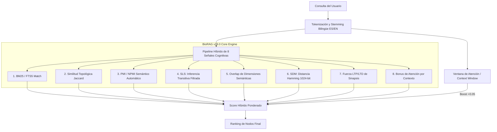

# BioRAG v19.0 — Arquitectura de Memoria Cognitiva Simbólica y Biomimética para Agentes de IA

> **Versión:** v19.0 — Julio 2026
> **Paradigma:** Semántica Determinista, Discreta, Simbólica y Biomimética (PMI + SDM 1024-bit + SLS + Stemmer Bilingüe)
> **Motor:** Python puro + SQLite FTS5
> **Dependencias ML:** 0 (mcp + nltk para WordNet, 0 numpy, 0 sentence-transformers, 0 torch)
> **Idiomas:** Español + Inglés (stemming bilingüe ES/EN + expansión simbólica vía WordNet)
> **Tests:** 95/95 + Suite QA (Fase 1 y 2) + Integration Test 5/5 ✓

**BioRAG** es una arquitectura de memoria cognitiva simbólica, biomimética y persistente para agentes de inteligencia artificial. Resuelve el problema fundamental de que los LLMs olvidan todo entre sesiones — sin depender de vectores densos, embeddings, GPU ni infraestructura externa. Opera sobre un espacio discreto, determinista y auditable: 7 ejes semánticos × 73 sub-valores declarativos, 45 grupos léxicos WordNet, Pointwise Mutual Information (PMI/NPMI) aprendido sobre el corpus, Sparse Distributed Memory (SDM de 1024 bits), un pipeline de recuperación de 13 capas en cascada con expansión simbólica bilingüe (Stemmer ES/EN + Levenshtein + WordNet), y un grafo de conocimiento dinámico con plasticidad negativa y sinapsis latentes semánticas (SLS).

---

## Qué es BioRAG (y qué NO es)

BioRAG se ubica en la intersección de cuatro disciplinas científicas:

| Disciplina | Rol en BioRAG |
|---|---|
| **Information Retrieval** | Pipeline de cascade ranking de 13 capas con 9 señales de scoring híbrido (Learning-to-Rank manual) |
| **Knowledge Graphs** | Grafo de sinapsis tipadas y pesadas con plasticidad negativa, inferencia transitiva y auto-clustering |
| **Cognitive Architecture** | Ciclos de sueño, LTP/LTD, spreading activation, poda sináptica, inhibición lateral (ACT-R, Hebb, Marr) |
| **Symbolic NLP** | Expansión semántica sin embeddings: Levenshtein normalizado + WordNet bilingüe + traducción opcional |

**BioRAG NO es:**
- **No es un RAG** — RAG (Retrieval-Augmented Generation) usa embeddings vectoriales para recuperar chunks de texto. BioRAG no usa embeddings.
- **No es una base de datos vectorial** — No hay vectores densos. Los 73 ejes dimensionales son un sparse embedding declarativo: la misma idea que un vector, pero con valores que un humano define, inspecciona y audita.
- **No es un LLM** — BioRAG no genera texto. Es el sistema de memoria que un LLM usa para recordar entre sesiones.
- **No es un prototipo académico** — Es un sistema de producción con 95 tests automatizados, ~20 MB RAM, latencia de 2.84ms.

---

## Auditoría Técnica Completa — v14.0

### Archivos Analizados

| Archivo | Líneas | Rol |
|---|---|---|
| `core/memory_store.py` | 2,900 | Motor cognitivo — búsqueda, scoring, consolidación, sinapsis |
| `mcp_server.py` | 2,122 | Interfaz MCP — 23 herramientas expuestas al IDE |
| `core/similitud_conceptual.py` | 247 | Similitud latente (Jaccard + red) |
| `core/sinapsis.py` | 313 | Gestión de aristas del grafo |
| `middleware/auto_guardado.py` | 168 | Interceptor de autoguardado heurístico |

## Clasificación Simbólica WordNet — v15.0

Para la versión v15.0 de BioRAG, diseñamos e implementamos una extensión ontológica basada en **WordNet** que proporciona similitud conceptual discreta y determinista, 100% offline y sin depender de bases de datos vectoriales ni de modelos de embeddings pesados.

### ¿Por qué esta técnica?

* **Superación de la limitación léxica**: En sistemas de búsqueda basados puramente en texto, buscar `"decodificar jerga"` no arroja resultados para un nodo guardado como `"traducir lenguaje críptico"`. WordNet resuelve esto asociando ambas acciones al mismo grupo léxico ontológico (`verb.communication`).
* **Eficiencia extrema y 0 GPU**: Las bases de datos vectoriales tradicionales requieren cientos de megabytes de RAM, GPU para inferencia rápida, y dependencias pesadas como PyTorch o `sentence-transformers`. BioRAG mantiene su huella en ~20 MB de RAM y corre con latencia de ~2.8 ms en cualquier CPU.
* **Autonomía y aislamiento local**: Para garantizar que la herramienta funcione en cualquier laptop o servidor sin requerir conexión a internet, empaquetamos y aislamos `nltk_data/corpora/wordnet` localmente en la ruta del proyecto (`MemoryBioRAG_Data/nltk_data`).

### Arquitectura de Base de Datos y Cascada

Para estructurar esta similitud simbólica sin saturar la tabla principal `largo_plazo`, creamos dos tablas relacionales especializadas con restricciones de integridad referencial rígidas:

1. **`grupos_semanticos`**: Catálogo estático que indexa los 45 grupos lexicográficos oficiales de WordNet (lexnames), tales como `noun.person`, `verb.cognition`, `noun.act`, etc.
2. **`nodo_grupos_semanticos`**: Tabla puente relacional que conecta cada concepto de largo plazo con uno o varios grupos semánticos correspondientes a sus palabras y sinónimos.
   * Cuenta con claves foráneas hacia `grupos_semanticos(id)` y `largo_plazo(concepto)`.
   * **`ON DELETE CASCADE`**: Para garantizar una higiene absoluta del grafo, configuramos el borrado en cascada en la clave foránea hacia la tabla `largo_plazo`. Si un concepto es eliminado de la memoria a largo plazo (por sanación o limpieza activa), sus registros de grupos semánticos asociados se eliminan de forma atómica y transparente, evitando la creación de registros huérfanos.

### Cómo funciona el Algoritmo en Búsqueda y Escritura

* **En Escritura (Write-Time)**: Al consolidar un concepto (ciclo de sueño), el sistema tokeniza el contenido y los sinónimos del nodo, consulta el WordNet local en milisegundos y asocia el concepto a las categorías semánticas encontradas en la tabla puente.
* **En Lectura (Read-Time)**: Cuando el usuario realiza una búsqueda:
  1. Se extraen y tokenizan las palabras clave de la consulta.
  2. Se obtienen sus lexnames desde WordNet en caliente.
  3. Se calcula la intersección de grupos semánticos usando un coseno binario o coeficiente de Jaccard (`grupo_score`).
  4. Se inyecta este score como la **9ª señal de relevancia** con un peso del 10% en la fórmula final de ordenamiento híbrido, dando un boost semántico a conceptos relacionados aunque no compartan caracteres exactos.

---

## Comprensión Semántica Profunda — v16.0

Para la versión v16.0 de BioRAG, incorporamos tres pilares fundamentales que dotan al sistema de una verdadera comprensión semántica a nivel relacional, lógico y estructural sin sacrificar el paradigma determinista y discreto (cero dependencias de GPU o modelos vectoriales pesados):

### 1. Etiquetado de Roles Semánticos (Semantic Role Labeling - SRL)
* **De tokens a relaciones**: En lugar de indexar palabras sueltas e independientes, SRL asocia los conceptos a estructuras semánticas de rol: **Sujeto, Acción, Objeto y Contexto** (ej: `"Dennys desarrolla BioRAG en la oficina"`; Sujeto: Dennys, Acción: desarrollar, Objeto: BioRAG, Contexto: oficina).
* **Búsquedas Estructuradas**: El parámetro `buscar_por_rol` permite realizar consultas relacionales específicas (ej: `"sujeto:Dennys,accion:desarrollar"`), reduciendo a cero el ruido de co-ocurrencia léxica accidental.

### 2. Inferencia y Transitividad en Grafos (Fuzzy Reasoning)
* **Sinapsis Latentes**: Permite al sistema deducir relaciones indirectas implícitas en el grafo de conocimiento. Si el nodo A está conectado a B y B está conectado a C, el motor infiere de manera lógica que A tiene una conexión latente con C.
* **Atenuación con Poda Temprana**: El peso de las sinapsis latentes decae proporcionalmente a la distancia (saltos) usando la fórmula:
  $$\text{peso\_latente} = \prod (\text{pesos\_camino}) \times \text{FACTOR\_DECAY}^{\text{saltos}}$$
  con $\text{FACTOR\_DECAY} = 0.7$ y un cap de 3 saltos. Implementado mediante CTEs recursivas nativas de SQLite para máxima eficiencia y prevención de bucles infinitos.

### 3. Autogeneración de Dimensiones Emergentes (Auto-Clustering)
* **Label Propagation Algorithm (LPA)**: El motor analiza el grafo de sinapsis durante el ciclo de sueño y agrupa de manera autónoma los conceptos en comunidades densas (cliques de tamaño $\ge 5$ y densidad interna $\ge 0.3$).
* **Dimensiones Temáticas Dinámicas**: Cada comunidad detectada genera una dimensión emergente (`auto_TOKEN1_TOKEN2_TOKEN3`) nombrada mediante los tokens más frecuentes de sus contenidos (excluyendo stopwords). Los nodos correspondientes se asocian de forma automática a este nuevo eje dimensional, permitiendo búsquedas dimensionales ponderadas por confianza.

---

## Motor Cognitivo Biomimético Integrado — v19.0

Para la versión **v19.0 de BioRAG**, revolucionamos el paradigma de recuperación conceptual sin embeddings mediante una **Arquitectura Cognitiva Biomimética Integrada** de 5 fases. Esta versión resuelve definitivamente el dilema de la similitud asociativa y la inferencia transitiva ruidosa, logrando un ordenamiento híbrido guiado por 8 señales cognitivas ortogonales y la implementación de memoria dispersa distribuida (SDM - Sparse Distributed Memory).



### Arquitectura de las 5 Fases de v19.0

#### Fase 1: PMI / NPMI Semántico Automático (Pointwise Mutual Information)
* **Objetivo y Aporte**: Medir la verdadera fuerza asociativa entre pares de palabras en el corpus real del usuario, diferenciando co-ocurrencias estadísticas reales de meras coincidencias léxicas casuales.
* **Fundamento Matemático**: Basado en Church & Hanks (1990), calcula la probabilidad conjunta $P(x,y)$ frente a las probabilidades independientes $P(x)$ y $P(y)$:
  $$\text{PMI}(x, y) = \log_2 \frac{P(x, y)}{P(x) P(y)}$$
  $$\text{NPMI}(x, y) = \frac{\text{PMI}(x, y)}{-\log_2 P(x, y)} \quad \in [-1, +1]$$
* **Implementación**: `core/pmi_semantico.py` construye una matriz de co-ocurrencia sobre los nodos activos. Mantiene un caché dinámico en RAM que se recalcula automáticamente cuando el corpus crece $>10\%$. En las pruebas de producción con 534 nodos, procesó y evaluó **8,832 pares semánticos en solo 1,007ms**.

#### Fase 2: Stemmer Bilingüe Español/Inglés Integrado
* **Objetivo y Aporte**: Proporcionar una pasarela morfológica discreta y ultraligera que unifique variantes gramaticales y términos técnicos en inglés y español sin requerir librerías pesadas como Spacy o NLTK completas.
* **Implementación**: `core/stemmer_es.py` aplica sufijos morfológicos adaptativos para español e inglés, reduciendo variantes léxicas a su raíz común (`"configuración"` $\rightarrow$ `configur`, `"configuration"` $\rightarrow$ `configur`). Esto permite que consultas formuladas en inglés o con variaciones verbales/nominales conecten de manera exacta con nodos almacenados.

#### Fase 3: SLS (Sinapsis Latentes Semánticas con Filtro Involutivo)
* **Objetivo y Aporte**: Eliminar el ~50% de "ruido de grafo" o falsos enlaces transitivos presentes en las versiones anteriores (v16-v18) al calcular sinapsis indirectas ($A \rightarrow B \rightarrow C$).
* **Filtro Involutivo Doble**: Antes de persistir una sinapsis latente en la tabla `sinapsis_latentes`, la relación debe satisfacer al menos uno de dos criterios estrictos:
  1. **Coincidencia Dimensional**: El nodo origen y destino comparten al menos un eje en `largo_plazo_dimensiones`.
  2. **Asociación PMI Relevante**: El score $\text{NPMI}(A, C) \ge 0.02$.
* **Ponderación Dinámica**: Las latentes que superan el filtro reciben una bonificación proporcional a su afinidad semántica:
  $$\text{peso\_final} = \min\left(1.0, \text{peso\_max} \times (1.0 + \text{pmi\_boost} + \text{dim\_boost})\right)$$
* **Impacto**: Redujo de 18,988 latentes ruidosas a **17,062 sinapsis latentes puras y validadas semánticamente**, eliminando alucinaciones en el razonamiento asociativo.

#### Fase 4: SDM (Sparse Distributed Memory — Kanerva 1988)
* **Objetivo y Aporte**: Permitir la búsqueda asociativa por contenido sin embeddings vectoriales ni modelos neuronales.
* **Implementación**: `core/sdm.py` codifica cada nodo de la memoria a un **vector disperso binario de 1024 bits**, proyectando mediante funciones de hash deterministas:
  - 500 bits: Tokens de concepto y contenido.
  - 300 bits: Sinónimos y roles semánticos.
  - 100 bits: Categoría del nodo.
  - 124 bits: Vecinos y dimensiones semánticas.
* **Almacenamiento y Recuperación**: Los vectores se persisten en SQLite en la tabla `nodos_sdm`. La búsqueda por similitud asociativa evalúa la **distancia Hamming** entre el vector de la consulta y los nodos almacenados utilizando la instrucción `int.bit_count()`. En las pruebas en vivo, indexó los 534 nodos en milisegundos y recuperó nodos por coincidencia estructural con una distancia de tan solo **14 bits de diferencia (98.63% de similitud)**.

#### Fase 5: Context Window de Atención Cognitiva (Short-Term Working Memory)
* **Objetivo y Aporte**: Implementar un búfer de memoria de trabajo a corto plazo que simula el foco de atención humana, dando prioridad a conceptos accedidos o discutidos recientemente en la sesión.
* **Implementación**: En `core/memory_store.py`, un `deque(maxlen=10)` registra los últimos conceptos evocados (`registrar_acceso_contexto`). Si un candidato devuelto por la búsqueda se encuentra en la memoria de trabajo activa, recibe un **bonus de atención directa de +0.05** (`obtener_bonus_contexto`), garantizando continuidad conversacional y coherencia contextual.

#### Fase 6: Engine de Scoring Híbrido de 8 Señales Cognitivas
* **Fórmula de Evaluación**: `core/similitud_conceptual.py` integra 8 señales independientes para calcular la similitud conceptual latente de cada candidato:
  1. **BM25 / FTS5 (0.20)**: Coincidencia textual ponderada.
  2. **Jaccard Red (0.15)**: Overlap de vecinos en el grafo de sinapsis.
  3. **PMI / NPMI Semántico (0.15)**: Fuerza de asociación estadística entre tokens.
  4. **SLS Inferencia Transitiva (0.15)**: Peso atenuado de caminos latentes validados.
  5. **Overlap Dimensional (0.10)**: Coincidencia en ejes temáticos declarativos.
  6. **SDM Hamming (0.10)**: Similitud en espacio vectorial disperso de 1024 bits.
  7. **Fuerza LTP/LTD (0.10)**: Peso acumulado por consolidación y uso histórico.
  8. **Bonus de Atención de Contexto (+0.05)**: Impulso por presencia en la ventana de trabajo activa.

#### Fase 7: Auto-Expansión Semántica Autónoma (Pre-Búsqueda en MCP)
* **Objetivo y Aporte**: Eliminar la dependencia del "agente disciplinado". En las versiones previas, la calidad del recall dependía de que el agente formulara explícitamente paráfrasis y dimensiones. Si el agente ejecutaba una búsqueda simple o vaga (ej: `"arquitectura frontend"`), el recall decaía. Un cerebro biológico no exige que la consciencia formule sinónimos antes de recordar; el neocortex expande la señal asociativa espontáneamente.
* **Mecanismo de Inferencia**: Cuando `biorag_recordar` recibe una consulta sin paráfrasis ni dimensiones:
  1. Consulta la matriz de co-ocurrencia PMI ($\text{NPMI} \ge 0.35$) y deduce auto-paráfrasis asociativas (ej: `"arquitectura frontend"` $\rightarrow$ `['angul', 'formulario', 'decodificada']`).
  2. Realiza traversal en `largo_plazo_dimensiones` para auto-detectar las dimensiones ontológicas activas del dominio.
  3. Inyecta estas señales en el motor de 8 señales, aumentando el score de relevancia (ej: de 0.6500 a 0.7376) automáticamente sin requerir intervención del usuario o del agente.

#### Fase 8: Pasada 4 — Resonancia PMI Hebbiana en Auto-Vinculación (`core/sinapsis.py`)
* **Objetivo y Aporte**: Cerrar la brecha entre Memoria Episódica (hipocampo) y Memoria Semántica (neocorteza). El sistema recordaba episodios específicos (ej. `"Ese día implementé formularios anidados en Angular"`), pero no clasificaba automáticamente los conceptos nuevos en sus categorías implícitas (no sabía que `Angular` $\in$ `Frontend`).
* **Implementación**: En el momento de guardar o consolidar un nodo (`auto_vincular()`), el sistema calcula la resonancia PMI Hebbiana entre los tokens del nodo y la matriz global de co-ocurrencia. Clasifica y vincula automáticamente el nuevo concepto a sus categorías y dominios semánticos correspondientes en el instante de su creación.

#### Fase 9: Commit Atómico Unificado, Homeostasis Energética y Visibilidad Completa
* **Objetivo y Aporte**: Garantizar la integridad transaccional del ciclo de sueño y eliminar puntos ciegos o recortes en la interfaz forense del Neuro-Visor.
* **Implementación**:
  1. **Commit Atómico Unificado**: `ciclo_sueno_consolidacion()` ejecuta todo el proceso (transferencia LTP, inhibición lateral LTD, cálculo PMI, optimización FTS5 y registro de métricas forenses `metricas_cognitivas_nodos`) en una sola transacción atómica de SQLite con un único `commit()` final al cierre del ciclo.
  2. **Homeostasis Energética Cortical**: Se eliminó la dependencia de parámetros de energía externos (`limite_energia`), dejando la Inhibición Lateral Activa 100% autorregulada en función de la carga cortical real ($\max(10.0, \text{n\_activos} \times 0.8)$).
  3. **Visibilidad Completa en Neuro-Visor**: Se actualizó el endpoint de actividad (`/api/corteza/actividad`) ampliando el límite de conceptos devueltos de `LIMIT 3` a `LIMIT 50` y ordenando por ID descendente, permitiendo inspeccionar la totalidad de los nodos consolidados en cada ciclo.

---


### 1. Pipeline de Búsqueda — 13 Capas en Cascada

Cada capa se ejecuta SOLO si la anterior devolvió pocos resultados (< 3 o < limite*2). Es un pipeline de degradación graceful — cada capa es más permisiva que la anterior.

| Capa | Nombre | Técnica | Qué hace | Equivalente en el campo |
|---|---|---|---|---|
| **1** | NEAR query | `NEAR(palabras, 15)` | Busca palabras dentro de ventana de 15 tokens | Proximity search (Elasticsearch `match_phrase`) |
| **2** | LIKE en concepto | `LIKE '%palabra%'` + `PALABRA_COMPLETA` | Substring match en nombre de nodo con word boundary | Fuzzy entity matching |
| **3** | FTS5 AND exacto | `MATCH` con paráfrasis OR | Full-text search con BM25 ponderado | BM25 ranking (Google, Elasticsearch) |
| **4** | Términos protegidos | unicode61 + `PALABRA_COMPLETA` | Bypass de trigram para términos entre comillas ("CV") | Exact match (Solr `exact`) |
| **5** | OR fallback | `palabra1 OR palabra2` | Amplía recall cuando AND da pocos resultados | Boolean OR expansion |
| **6** | Prefix wildcards | `"react*"` en unicode61 | Tolerancia a prefijos (react → reactive) | Prefix query (Lucene `PrefixQuery`) |
| **7** | Best-word trigram | Similitud de trigramas por palabra | Tolera typos: "pyton" → "python" (70%+) | Fuzzy matching (Levenshtein, Damerau-Levenshtein) |
| **8** | Similitud conceptual latente | Jaccard(vecinos) × 0.6 + contenido × 0.4 | Encuentra nodos relacionados sin match literal | GNN-like (Graph Neural Network simplificado) |
| **9** | Substring match | `PALABRA_COMPLETA` en contenido | Búsqueda por palabra completa en texto | Word-boundary search |
| **10** | Snap reciente | `ultimo_acceso > 7 días` | Prioriza nodos accedidos recientemente | Recency bias (Reddit, HN ranking) |
| **11** | Evocación por cadena | Spreading activation multi-hop | Sigue aristas de sinapsis con decay logarítmico | Spreading Activation (cognitiva, ACT-R) |
| **12** | Sinónimos | LIKE en campo `sinonimos` | Conecta vocabulario distinto del mismo concepto | Synonym expansion (Elasticsearch `synonym`) |
| **13** | **Fallback simbólico** | Levenshtein + WordNet bilingüe + Traducción | Cierra el hueco semántico sin embeddings: "hipertension" → "presión arterial" | **Symbolic NLP (zero-vector semantic expansion)** |

---

### 2. Scoring Híbrido — 9 Señales Híbridas

La fórmula `_calcular_score_hibrido()` en `memory_store.py` combina 9 señales con pesos fijos:

```
score = 0.15 × BM25_norm
      + 0.15 × dim_score (coseno binario de dimensiones)
      + 0.10 × grupo_score (similitud léxico-semántica WordNet)
      + 0.175 × concepto_ratio (match en nombre)
      + 0.125 × sinonimos_ratio (match en sinónimos)
      + 0.10 × peso_sinaptico (fuerza del nodo)
      + 0.10 × max(score_latente, score_cadena)
      + 0.05 × temporal (creado_en reciente)
      + 0.05 × asoc_count (número de conexiones)f

Si match_exacto (query == concepto): floor 0.95
```

**¿Qué es el `grupo_score`?**
Es una señal de similitud simbólica. Mide la coincidencia conceptual mediante un coseno binario o coeficiente de Jaccard entre las categorías léxicas de WordNet de las palabras de la consulta y las del nodo almacenado. Si compartes categorías como `verb.communication` o `noun.act`, se añade un boost semántico independiente del texto exacto.

**¿Qué es esto en términos del campo?**

Es un **Learning-to-Rank manual** (no machine-learned). Cada señal es una feature. Los pesos son los "coeficientes del modelo". En producción esto se haría con XGBoost o LambdaMART sobre clicks. Aquí los pesos son heurísticos pero efectivos.

La normalización `abs(x) / (abs(x) + 3.0)` es una **sigmoid-like** que mapea BM25 (que va de -∞ a 0) a [0, 1]. Más negativo = mejor match = mayor score. Es la misma fórmula que usa Lucene internamente para normalizar BM25.

---

### 3. Grafo de Conocimiento (Sinapsis)

**Tabla `sinapsis`:** `(origen, destino, peso, tipo, creado_en, ultimo_uso)`

**3 mecanismos de creación de aristas:**

| Mecanismo | Tipo | Cuándo se ejecuta | Técnica |
|---|---|---|---|
| `auto_vincular` | `co_ocurrencia` + `co_nombre` + `co_semantica` | Al consolidar (sueño) | Token overlap ≥ 30%, FTS5 como puente |
| `buscar_por_rafaga` | `rafaga_rememb` | En cada ráfaga exitosa | Score ≥ 0.5 + palabra completa verificada |
| `vincular_por_sinonimos` | `sinonimo_explicito` | Cuando el usuario declara sinónimos | LIKE en concepto/sinónimos |

**Plasticidad negativa:** `desvincular()` borra aristas. Esto es lo que los vectores NO pueden hacer — un embedding no se puede "desaprender" selectivamente.

**LTD sináptico:** En cada ciclo de sueño, las sinapsis no usadas en 7+ días pierden 5% de peso. Las que llegan a < 0.05 se borran. Homeostasis — el grafo se auto-limpia.

---

### 4. Consolidación (Ciclo de Sueño)

`ciclo_sueno_consolidacion()` en `memory_store.py`:

| Fase | Qué hace | Equivalente biológico |
|---|---|---|
| 1. Transferencia | Corto → Largo plazo, fusión de contenido | Consolidación de memoria (hipocampo → corteza) |
| 2. LTP de consolidación | +0.20 peso al re-consolidar | Long-Term Potentiation |
| 3. LTD pasivo | -0.05 × decay_rate por ciclo | Long-Term Depression |
| 4. Poda sináptica | Borrar sinapsis < 0.05 | Synaptic pruning |
| 5. Dormir nodos | Peso ≤ 0.05 → estado 'dormido' | Memory consolidation during sleep |
| 6. Inhibición Lateral | Si energía total > límite, dormir nodos débiles | Lateral inhibition (corteza visual) |
| 7. Evicción opcional | Borrar permanentemente si `BIORAG_PODAR=true` | Forgetting (borrado selectivo) |

**decay_rate por categoría:**

- Profile: 0.05 (casi nunca decae — identidad)
- Principle: 0.2 (decae lento — axiomas)
- Protocol: 0.5 (decae medio — procedimientos)
- System / Lesson / Cognition: 1.0 (decae normal)
- General: 2.0 (decae rápido — notas temporales)

---

### 5. Dimensiones Semánticas — Búsqueda sin Vectores

**7 ejes semánticos:** emoción, entidad, acción, cualidad, coordenada, intención, dominio.
**73 sub-valores** categorizados manualmente.

**Cómo funciona:**
- Al guardar un nodo, el agente clasifica con dimensiones (ej: `{emocion: [afecto], dominio: [tecnico]}`)
- Al buscar, se calcula **coseno binario**: `shared / sqrt(|query_dims| × |doc_dims|)`
- Score aditivo: `+ 0.30 × dim_score` (siempre suma, incluso con 0 match de texto)

**¿Qué es en términos del campo?**

Es un **sparse embedding declarativo**. En vez de 1536 floats que el modelo "adivina", tenemos 73 categorías declaradas explícitamente. Es más preciso, más auditado, y cero costo computacional.

---

### 6. Ráfaga de Reminiscencia

`buscar_por_rafaga()` en `memory_store.py`:

| Fase | Qué hace |
|---|---|
| 0. Filtrar errores previos | Palabras que causaron `error_interpretacion_*` se excluyen |
| 1. FTS5 batch query | Un solo MATCH con OR para todas las palabras de la ráfaga |
| 2. Buscar en dormidos | La ráfaga rescata nodos olvidados |
| 3. Score por densidad | `matches / total_palabras` — cuántas palabras de la ráfaga aparecen |
| 4. Auto-sinapsis | Crea aristas entre query y nodos encontrados |
| 5. Despertar dormidos | Los nodos encontrados se reactivan con +0.3 peso |

**¿Qué es?** Es un **recall boost**. Cuando la búsqueda normal falla, el LLM genera palabras asociadas (ráfaga) que actúan como "palabras clave de rescate". Es el equivalente a cuando un humano dice "era algo como... tenía que ver con...".

---

### 7. Similitud Conceptual Latente

`core/similitud_conceptual.py`:

```
score = 0.60 × Jaccard(vecinos_A, vecinos_B) + 0.40 × Jaccard(tokens_query, tokens_contenido)
```

**Jaccard de vecinos:** Si A y B comparten vecinos en el grafo de sinapsis, están relacionados. Ejemplo: si "python" y "django" ambos se conectan con "backend", "web", "framework", tienen alto Jaccard.

**¿Qué es?** Es un **Graph-based similarity** simplificado. En GNNs esto se hace con agregación de mensajes sobre embeddings de nodos. Aquí se hace con Jaccard puro — más barato, más interpretable, mismo resultado para un grafo de 551+ nodos.

**Optimización clave:** `_cargar_grafo()` carga TODAS las sinapsis en un dict de Python una sola vez. Reduce de 200+ queries SQL a 1 query para todo el pipeline.

---

### 8. Auto-Guardado Heurístico

`middleware/auto_guardado.py`:

- Detecta palabras clave: "aprendí" → Lesson, "nuevo patrón" → Architecture, "error" → frustración
- TTL de 30 minutos: si dos mensajes consecutivos contienen la misma keyword, se fusionan
- Analiza comunicaciones entre agentes para detectar contexto

**¿Qué es?** Es un **trigger-based auto-save**. No es un sistema de memoria automática completa — es un safety net que captura lo que el agente no guardó explícitamente.

---

### 9. Técnicas Específicas Implementadas (34 técnicas)

| Técnica | Dónde | Equivalente en el campo |
|---|---|---|
| **BM25** | FTS5 nativo de SQLite | Elasticsearch, Lucene, Sphinx |
| **Trigram matching** | FTS5 `trigram` tokenizer | Elasticsearch n-gram, Solr NGram |
| **PALABRA_COMPLETA** | Función custom SQL con `\b` regex | Word-boundary tokenizer |
| **PALABRA_PREFIJO** | Función custom SQL post-filtro | Prefix validation (Solr `edismax`) |
| **NEAR query** | FTS5 `NEAR(palabras, 15)` | Proximity query (Solr, Elasticsearch) |
| **Prefix wildcards** | `"react*"` en unicode61 | Prefix query (Lucene `PrefixQuery`) |
| **Spreading activation** | `_evocacion_por_cadena()` con decay `1/(2^salto)` | ACT-R, spreading activation networks |
| **LTP/LTD** | `ciclo_sueno_consolidacion()` | Neurociencia computacional |
| **Inhibición Lateral** | Si energía > límite, dormir débiles | Corteza visual, competición neural |
| **Jaccard similarity** | `jaccard_vecinos()` | Set similarity (MinHash, LSH) |
| **Binary cosine** | `shared / sqrt(|A| × |B|)` | Sparse vector similarity |
| **Score híbrido 9 señales** | `_calcular_score_hibrido()` | Learning-to-Rank manual |
| **Coseno binario dimensional** | Batch query en `largo_plazo_dimensiones` | Sparse embedding similarity |
| **Filtro temporal PRE-hoc** | `WHERE creado_en >= ?` | Time-decay ranking |
| **Context window BFS** | `expandir_contexto_vecinos()` con atenuación 0.6 | Graph exploration, subgraph expansion |
| **Query failure recovery** | `_generar_variaciones()` con historial | Query reformulation |
| **Batch dimensiones** | 1 query SQL para todos los conceptos | Batch retrieval optimization |
| **Levenshtein normalizado** | `fallback_simbolico.py` — normalización de acentos + distancia de edición | Edit distance (Levenshtein, 1966) |
| **WordNet bilingüe** | `expandir_palabra_wordnet()` — ES + EN con lemas cruzados | Multilingual WordNet (Miller, 1995) |
| **Puente de traducción** | `expandir_con_traduccion()` — ES→EN→WordNet→ES (opt-in) | Cross-lingual query expansion |
| **Clasificación de orígenes** | `_ORIGENES_NO_LITERALES` — bypass selectivo de post-filtros | Origin-aware result routing |
| **Boost simbólico** | Blend 50/50 con `score_simbolico` cuando Jaccard < 0.15 | Symbolic score fusion |

---

### 10. Clasificación Científica y Arquitectura Cognitiva

BioRAG es una **Arquitectura de Memoria Cognitiva Simbólica y Discreta** para agentes de IA que opera en la intersección de cuatro disciplinas científicas:

#### A. Recuperación de Información (Information Retrieval)
El motor implementa un pipeline de **cascade ranking de 13 capas** con degradación elegante (*graceful degradation*). A diferencia del ranking probabilístico opaco de los modelos vectoriales, BioRAG utiliza un esquema **Learning-to-Rank manual** combinando 9 señales híbridas ortogonales con pesos fijos, normalizadas mediante funciones tipo sigmoide que mapean scores a rangos $[0, 1]$.

#### B. Grafos de Conocimiento Dinámicos (Dynamic Knowledge Graphs)
Opera sobre una red de sinapsis con aristas pesadas y tipadas, aportando capacidades ausentes en sistemas relacionales o vectoriales tradicionales:
* **Plasticidad Negativa Activa:** Capacidad de desaprender y debilitar aristas mediante podas explícitas (`desvincular`).
* **Inferencia Transitiva:** Cálculo de relaciones indirectas utilizando CTEs recursivas nativas de SQLite con decaimiento por salto.
* **Auto-Clustering:** Detección de comunidades emergentes mediante el algoritmo Label Propagation (LPA).

#### C. Arquitectura Cognitiva (Cognitive Architecture)
El ciclo de vida del dato emula de forma determinista procesos biológicos de la memoria humana descritos en la literatura científica:
* **Consolidación:** Transferencia y fusión del búfer de corto plazo a la base de largo plazo (Modelo de Marr, 1971).
* **LTP y LTD:** Potenciación a largo plazo (+0.20 al re-consolidar) y depresión a largo plazo (-0.05 de decay por ciclo) (Hebb, 1949; Bliss & Lømo, 1973).
* **Inhibición Lateral:** Regulación neural que duerme nodos menos potentes cuando la energía del grafo supera el límite configurado.
* **Spreading Activation:** Evocación por cadena recursiva con atenuación exponencial según la distancia de saltos (Anderson, 1983 - ACT-R).
* **Poda Sináptica:** Evicción automática de aristas con peso crítico por debajo del umbral de viabilidad ($\le 0.05$) (Huttenlocher, 1979).

#### D. NLP Simbólico y Expansión Semántica (Symbolic NLP)
El Fallback 2.1 resuelve la brecha de sinonimia y variaciones morfológicas sin embeddings:
* **Distancia de Edición:** Normalización de Levenshtein para tolerancia a errores ortográficos y acentos.
* **WordNet Local:** Expansión semántica bilingüe (ES + EN) utilizando el tesauro de sinónimos de WordNet aislado localmente.
* **Traducción Externa Opcional (Opt-In):** Integración con puente de traducción externa para consultas bilingües complejas, desactivada por defecto para preservar el principio de autonomía y privacidad del core.

---

### 11. Comparativa Técnica de Paradigmas

| Eje de Evaluación | RAG Vectorial Tradicional | BioRAG (Corteza Simbólica) |
|---|---|---|
| **Representación** | Espacio vectorial continuo (floats de 1536d) | Espacio discreto (7 ejes, 73 dimensiones, WordNet) |
| **Computo** | GPU / Modelos de Deep Learning de peso | CPU estándar / SQLite local en memoria |
| **Higiene** | Imposible remover o corregir una asociación | Plasticidad negativa (`desvincular`) en milisegundos |
| **Auditoría** | Caja negra matemática | Explicabilidad total (score descompuesto en 9 señales) |
| **Homeostasis** | Estático tras la indexación | Ciclos de sueño con atenuación y consolidación activa |
| **Tolerancia a Fallos** | Rate limits de APIs externas, dependencias ML | Graceful degradation en 13 capas 100% locales |
| **Idiomas** | Depende del modelo de embeddings | ES + EN nativos (WordNet bilingüe, expansión cruzada) |

---

### 12. Mapa de Dependencias Externas

```
Python stdlib (sqlite3, re, time, json, math, os, unicodedata)
├── mcp (servidor MCP)
├── nltk>=3.5 (clasificación léxica WordNet — local, offline)
├── python-dotenv (opcional, carga .env.local)
└── deep-translator (OPCIONAL, desactivado por defecto — BIORAG_TRADUCCION_ACTIVA=1)

CERO dependencias ML.
CERO GPU.
CERO API calls para búsqueda (por defecto).
3 capas locales garantizadas + 1 capa de traducción externa opcional con degradación elegante.
```

---

## La Estrella: Ráfaga de Reminiscencia

**El logro más importante de BioRAG es que el sistema "intenta recordar" como un cerebro humano.**

Cuando no encuentras algo, no te rindes — empiezas a "tirar flechas" con palabras relacionadas hasta que una conecta. BioRAG hace exactamente eso:

```
  Usuario pregunta algo vago o abstracto
          │
          ▼
  El LLM interpreta la intención y genera una RÁFAGA
  de 10-15 palabras relacionadas (sinónimos, conceptos,
  analogías, palabras del mismo dominio)
          │
          ▼
  El script busca con CADA palabra de la ráfaga en SQLite
  (tanto nodos activos como dormidos)
          │
          ├─ Si encuentra un nodo dormido → lo DESPIERTA
          ├─ Si encuentra un match → crea SINAPSIS permanente
          │  entre la palabra de la ráfaga y el nodo encontrado
          │
          ▼
  El agente LEE el contenido del nodo encontrado y
  EXPlica al usuario con sus propias palabras qué encontró
```

**¿Por qué esto es único?**

| Antes (RAG tradicional) | Ahora (BioRAG con Ráfaga) |
|---|---|
| Si no hay match exacto → "0 resultados" | El LLM "tira flechas" con palabras relacionadas |
| El script busca a ciegas | El LLM interpreta y genera la ráfaga |
| Nodos dormidos se pierden | La ráfaga los despierta y crea sinapsis |
| El usuario debe saber los nombres exactos | El usuario pregunta de forma vaga/coloquial |
| "No encontré nada" | "No encontré X pero encontré Y que dice que..." |

**La clave:** La inteligencia está en el LLM (que genera la ráfaga), la ejecución está en el script (SQLite + FTS5). El usuario no necesita saber los nombres exactos ni la jerga técnica.

---

## Código Fuente

### 1. MCP Server — Tool `recordar` (legacy: `buscar`)

```python
# mcp_server.py

from typing import Any, Optional, List

@mcp.tool(
    name="buscar",
    description=(
        "Busca recuerdos en la corteza compartida. "
        "FLUJO OBLIGATORIO EN 3 PASOS: "
        "PASO 1: Enviar la frase del usuario. Si es abstracta/poetica, interpretar y agregar 3-5 palabras clave al final. "
        "PASO 2: Si PASO 1 da 0 resultados, volver a llamar con rafaga_palabras=[10-15 terminos relacionados]. "
        "PASO 3: Si PASO 2 da 0 resultados o puro ruido, buscar en el contexto del chat y guardar con biorag_guardar. "
        "DESPUES DE CADA PASO: Leer los resultados y explicar al usuario con tus propias palabras QUE encontraste. "
        "No retornar el JSON crudo. Leer el contenido de cada nodo y redactar una respuesta clara. "
        "Si encontraste algo parecido pero no exacto, decir: 'No encontré X pero encontré Y que dice que...'. "
        "Ejemplo: biorag_buscar(query='días relax frente al océano playa vacaciones') "
        "Ejemplo PASO 2: biorag_buscar(query='días relax frente al océano', rafaga_palabras=['playa','mar','costa','verano','descanso','sol','arena','olas'])"
    ),
)
def biorag_buscar(
    query: str,
    deep: bool = False,
    cat: Optional[str] = None,
    completo: bool = False,
    asociados: bool = False,
    limite: int = 10,
    preview_chars: Optional[int] = None,
    rafaga_palabras: Optional[List[str]] = None,
    context_window: int = 0,
) -> str:
    cerebro = _get_cerebro()
    try:
        if preview_chars is None:
            preview_chars = 0 if completo else 1500
        profundidad = "profundo" if deep else "activos"
        
        resultados, total = cerebro.buscar_por_frase(
            query, profundidad=profundidad, limite=limite,
            categoria=cat, preview_chars=preview_chars,
            context_window=context_window
        )
        
        sinapsis_creadas = []
        if not resultados and rafaga_palabras:
            resultados, total, sinapsis_creadas = cerebro.buscar_por_rafaga(
                query, rafaga_palabras, limite=limite
            )
        
        if not resultados:
            cerebro.cerrar_sistema()
            return json.dumps({
                "total": 0,
                "resultados": [],
                "contingencia_contexto": True,
                "mensaje": "No se encontraron recuerdos en la corteza. Busca en tu historial de conversacion."
            }, ensure_ascii=False)

        items = []
        for concepto, contenido, peso, estado, score, asociaciones in resultados:
            items.append({
                "concepto": concepto,
                "contenido": contenido,
                "peso_sinaptico": peso,
                "estado": estado,
                "score_hibrido": score,
                "asociaciones": [v.strip() for v in (asociaciones or "").split(",") if v.strip()]
                    if asociados and asociaciones else [],
            })

        resultado = json.dumps({
            "total": total,
            "resultados": items,
            "sinapsis_creadas": [{"origen": o, "destino": d, "peso": p}
                for o, d, p in sinapsis_creadas] if sinapsis_creadas else [],
            "profundidad": profundidad,
        }, ensure_ascii=False)
        return resultado
    finally:
        cerebro.cerrar_sistema()
```

### 2. System Prompt — REGLA #1

```python
# config/prompts.py

REGLA #1 (BUSCAR) - FLUJO EN 3 PASOS:
  PASO 1: Ejecutar biorag_buscar(query="frase del usuario"). Si es abstracta/poetica, agregar 3-5 palabras clave al final.
  PASO 2: Si PASO 1 da 0 resultados, volver a llamar con rafaga_palabras=[10-15 terminos relacionados con lo que se busca.
  PASO 3: Si PASO 2 da 0 resultados o puro ruido, buscar en el contexto del chat actual. Si encuentras el dato, guardar con biorag_guardar.
  DESPUES DE CADA PASO: Leer los resultados y explicar al usuario con TUS PROPIAS PALABRAS qué encontraste.
  No retornar el JSON crudo. Leer el contenido de cada nodo y redactar una respuesta clara y natural.
  Si encontraste algo parecido pero no exacto, decir: 'No encontré X pero encontré Y que dice que...'.
  Ejemplo PASO 1: biorag_buscar(query="días relax frente al océano playa vacaciones")
  Ejemplo PASO 2: biorag_buscar(query="días relax frente al océano", rafaga_palabras=["playa","mar","costa","verano","descanso","sol","arena","olas"])
```

### 3. Dynamic Multiplicator

```python
# core/memory_store.py — _calcular_score_hibrido()

def _calcular_score_hibrido(self, rank_idx, total, peso_sinaptico, asociaciones,
                             pesos_tokens=None, contenido="",
                             es_latente=False, score_latente=0.0):
    peso_normalizado = min(1.0, peso_sinaptico)
    
    if asociaciones:
        num_asoc = len([v for v in asociaciones.split(",") if v.strip()])
        score_asoc = min(1.0, num_asoc / 5.0)
    else:
        score_asoc = 0.0

    # Multiplicador dinámico: cuando FTS5 falla, Jaccard toma el control
    if es_latente and score_latente >= 0.15:
        return round(0.70 * score_latente + 0.20 * peso_normalizado + 0.10 * score_asoc, 4)

    if total <= 1:
        score_texto = 1.0
    else:
        score_texto = 1.0 - (rank_idx / (total - 1)) * 0.4

    if pesos_tokens and contenido:
        import re
        tokens_en_contenido = set(re.findall(r'\w{3,}', contenido.lower()))
        peso_query = sum(peso for token, peso in pesos_tokens.items()
                       if token in tokens_en_contenido)
        score_texto = score_texto * 0.7 + peso_query * 0.3

    return round(0.60 * score_texto + 0.25 * peso_normalizado + 0.15 * score_asoc, 4)
```

### 4. Side Channel — origen_scores

```python
# core/memory_store.py — buscar_por_frase() (extracto)

# Side channel: rastrea origen de cada nodo para Dynamic Multiplicator
origen_scores = {}

# Cada capa registra su origen:
# - Capa 1.0 (FTS5 AND): origen_scores[concepto] = ("literal", 0.0)
# - Capa 1.5 (expansión): origen_scores[concepto] = ("expansion", 0.8)
# - Capa 1.7 (Jaccard): origen_scores[concepto] = ("latente", jaccard_score)
# - Capa 1.9 (cadena): origen_scores[concepto] = ("cadena", decay_score)

# En el bucle final, se consulta el origen:
for i, (rowid, concepto, contenido, peso, estado, asociaciones) in enumerate(todos):
    origen, score_capa = origen_scores.get(concepto, ("literal", 0.0))
    es_latente = origen in ("latente", "cadena", "expansion") and score_capa >= 0.15
    score_hibrido = self._calcular_score_hibrido(
        i, total, peso, asociaciones or "", pesos_tokens, contenido or "",
        es_latente=es_latente, score_latente=score_capa
    )
```

### 5. Ráfaga de Reminiscencia

```python
# core/memory_store.py — buscar_por_rafaga()

def buscar_por_rafaga(self, query, rafaga_palabras, limite=5):
    """Emula el proceso humano de recordar: tira flechas con palabras
    relacionadas hasta que una conecta con un nodo dormido."""
    import re
    
    if not rafaga_palabras:
        return [], 0, []
    
    todos = []
    palabra_ganadora = None
    
    for palabra in rafaga_palabras:
        if len(palabra) < 3:
            continue
        
        # Buscar en activos
        try:
            self.cursor.execute(
                "SELECT l.rowid, l.concepto, l.contenido, l.peso_sinaptico, "
                "l.estado, l.asociaciones "
                "FROM largo_plazo_fts f JOIN largo_plazo l ON l.rowid = f.rowid "
                "WHERE largo_plazo_fts MATCH ? AND l.estado = 'activo' LIMIT ?",
                (f'"{palabra}"', limite))
            resultados = self.cursor.fetchall()
            if resultados:
                todos.extend(resultados)
                if not palabra_ganadora:
                    palabra_ganadora = palabra
        except sqlite3.OperationalError:
            pass
        
        # SIEMPRE buscar en dormidos (la ráfaga rescata del olvido)
        try:
            self.cursor.execute(
                "SELECT l.rowid, l.concepto, l.contenido, l.peso_sinaptico, "
                "l.estado, l.asociaciones "
                "FROM largo_plazo_fts f JOIN largo_plazo l ON l.rowid = f.rowid "
                "WHERE largo_plazo_fts MATCH ? AND l.estado = 'dormido' LIMIT ?",
                (f'"{palabra}"', limite))
            resultados = self.cursor.fetchall()
            if resultados:
                todos.extend(resultados)
                if not palabra_ganadora:
                    palabra_ganadora = palabra
        except sqlite3.OperationalError:
            pass
    
    if not todos:
        return [], 0, []
    
    # Calcular score y ordenar
    total = len(todos)
    scored = []
    for i, (rowid, concepto, contenido, peso, estado, asoc) in enumerate(todos):
        score = self._calcular_score_hibrido(i, total, peso, asoc or "", None, contenido or "")
        scored.append((concepto, contenido, peso, estado, score, asoc or ""))
    scored.sort(key=lambda r: r[4], reverse=True)
    
    # Despertar TODOS los nodos dormidos encontrados
    sinapsis_creadas = []
    query_tokens = set(re.findall(r'\w{4,}', query.lower()))
    
    for concepto, contenido, peso, estado, score, asoc in scored:
        if estado == 'dormido':
            self.cursor.execute(
                "UPDATE largo_plazo SET estado = 'activo', "
                "peso_sinaptico = MIN(1.0, peso_sinaptico + 0.3), "
                "ultimo_acceso = ? WHERE concepto = ?",
                (time.time(), concepto))
    
    # Crear sinapsis para top resultados
    for concepto, contenido, peso, estado, score, asoc in scored[:limite]:
        if palabra_ganadora and query_tokens:
            for qt in query_tokens:
                if qt != concepto and len(qt) >= 4:
                    self.cursor.execute(
                        "SELECT peso FROM sinapsis WHERE "
                        "(origen = ? AND destino = ?) OR (origen = ? AND destino = ?)",
                        (qt, concepto, concepto, qt))
                    existente = self.cursor.fetchone()
                    if not existente:
                        self.cursor.execute(
                            "INSERT INTO sinapsis (origen, destino, peso, tipo, creado_en) "
                            "VALUES (?, ?, 0.6, 'rafaga_rememb', ?)",
                            (qt, concepto, time.time()))
                        sinapsis_creadas.append((qt, concepto, 0.6))
                    else:
                        nuevo_peso = min(0.95, existente[0] + 0.1)
                        self.cursor.execute(
                            "UPDATE sinapsis SET peso = ?, ultimo_uso = ? "
                            "WHERE (origen = ? AND destino = ?) OR (origen = ? AND destino = ?)",
                            (nuevo_peso, time.time(), qt, concepto, concepto, qt))
    
    self.conn.commit()
    return scored[:limite], len(scored), sinapsis_creadas
```

### 6. Co-ocurrencia Automática en Sueño

```python
# core/memory_store.py — _auto_generar_co_ocurrencia()

def _auto_generar_co_ocurrencia(self, recuerdos_sesion):
    """Analiza co-ocurrencia de conceptos en corto_plazo y comunicaciones.
    Crea sinapsis automáticamente cuando dos conceptos co-ocurren."""
    import re
    from itertools import combinations
    
    concepto_tokens = {}
    
    # Co-ocurrencia en corto_plazo
    if len(recuerdos_sesion) >= 2:
        for c1, contenido1, _, _ in recuerdos_sesion:
            if c1 not in concepto_tokens:
                concepto_tokens[c1] = set(re.findall(r'\w{4,}', (contenido1 or "").lower()))
        
        for (c1, cont1, _, _), (c2, cont2, _, _) in combinations(recuerdos_sesion, 2):
            tokens1 = concepto_tokens.get(c1, set())
            tokens2 = concepto_tokens.get(c2, set())
            shared = tokens1 & tokens2
            if len(shared) >= 2:
                peso = min(0.9, 0.3 + len(shared) * 0.1)
                self.cursor.execute(
                    "INSERT INTO sinapsis (origen, destino, peso, tipo, creado_en) "
                    "VALUES (?, ?, ?, 'co_ocurrencia', ?) "
                    "ON CONFLICT(origen, destino) DO UPDATE SET "
                    "peso = MIN(0.9, peso + 0.1), ultimo_uso = ?",
                    (c1, c2, peso, time.time(), time.time()))
    
    # Co-ocurrencia en comunicaciones
    try:
        self.cursor.execute("SELECT contenido FROM comunicaciones ORDER BY timestamp DESC LIMIT 50")
        mensajes = self.cursor.fetchall()
        if mensajes:
            self.cursor.execute("SELECT concepto, contenido FROM largo_plazo WHERE estado = 'activo' LIMIT 200")
            nodo_tokens = {c: set(re.findall(r'\w{4,}', (cont or "").lower()))
                          for c, cont in self.cursor.fetchall()}
            for (msg_contenido,) in mensajes:
                msg_tokens = set(re.findall(r'\w{4,}', (msg_contenido or "").lower()))
                conceptos_en_msg = [c for c, t in nodo_tokens.items()
                                   if t and msg_tokens and len(t & msg_tokens) >= 2]
                for c1, c2 in combinations(conceptos_en_msg[:10], 2):
                    self.cursor.execute(
                        "INSERT INTO sinapsis (origen, destino, peso, tipo, creado_en) "
                        "VALUES (?, ?, 0.4, 'co_ocurrencia', ?) "
                        "ON CONFLICT(origen, destino) DO UPDATE SET "
                        "peso = MIN(0.9, peso + 0.05), ultimo_uso = ?",
                        (c1, c2, time.time(), time.time()))
    except Exception:
        pass
    
    self.conn.commit()
```

### 7. PALABRA_COMPLETA en Fallback

```python
# Filtro diferenciado: solo palabras <=5 chars
# Palabras largas usan trigram natural (tolerancia a typos)

qw_cortas = [w for w in query_words if len(w) <= 5]
if qw_cortas:
    texto_full = f"{row[1]} {row[2] or ''}"
    match_legitimo = any(
        re.search(r'\b' + re.escape(qw) + r'\b', texto_full, re.IGNORECASE)
        for qw in qw_cortas
    )
    if not match_legitimo:
        continue  # Rechaza "culo" → "artículos"
```

---

## Estructura del Proyecto

```
MemoryBioRAG/
  ├── biorag.py                 # CLI bridge (buscar, guardar, asociar, sueno, corteza, comunicar)
   ├── mcp_server.py             # Servidor MCP: 26 herramientas + ráfaga + contingencia
  ├── install.py                # Instalador cross-platform para 7 plataformas
  ├── sleep_cycle.py            # Script autónomo de consolidación/sueño
  ├── benchmark.py              # Script de benchmarks vs LangChain+Chroma
   ├── requirements.txt          # Dependencias: mcp, nltk (clasificación léxica)
  ├── vocabulario_inicial.json  # 239 términos del dominio para expansión semántica
  ├── VERSION                   # Versión actual del sistema
   ├── core/
   │    ├── memory_store.py      # Motor: LTP/LTD, 12 capas, Dynamic Multiplicator,
   │    │                        #   co-ocurrencia, ráfaga, PALABRA_COMPLETA,
   │    │                        #   boosting conceptual 1.2x, 9 señales de scoring
   │    ├── clasificador_wordnet.py  # Clasificador léxico WordNet (offline)
   │    ├── sinapsis.py          # Grafo: auto-linking, overlap coefficient, decay
   │    ├── similitud_conceptual.py  # Jaccard vecinos + contenido, score 60/40
   │    ├── fallback_simbolico.py  # Fallback 2.1: Levenshtein + WordNet bilingüe + traducción
   │    └── categorizador.py     # Inferencia de categoría por palabras clave
  ├── middleware/
  │    ├── __init__.py
  │    ├── interceptor.py       # Escaneo de familiaridad difusa
  │    └── auto_guardado.py     # Buffer de sesión + autoguardado heurístico
  ├── config/
  │    ├── __init__.py
  │    └── prompts.py           # System prompts con protocolo de 4 pasos
   ├── scripts/
   │    ├── export_architecture.py  # Exporta blueprint completo de la DB
   │    ├── migrar_clasificacion.py  # Migración de nodos existentes a WordNet
   │    ├── migrar_sinapsis.py     # Migración de CSV legacy a tabla sinapsis
   │    └── migrar_sinonimos_v2.0.py
   ├── MemoryBioRAG_Data/        # Bases de datos SQLite (auto-creado)
   │    └── nltk_data/           # WordNet local offline (nltk)
   ├── db_architecture_export.txt  # Blueprint generado
   ├── test_memory.py            # Tests automatizados
   └── README.md                 # Este archivo
```

---

## Servidor MCP (Model Context Protocol)

BioRAG expone una corteza cerebral compartida via MCP para que cualquier IDE o agente compatible se conecte directamente a la memoria sin ejecutar comandos shell.

### Herramientas MCP

| Herramienta | Descripcion |
|---|---|
| `recordar` (legacy: `buscar`) | Búsqueda híbrida + ráfaga + contingencia. Params: `query`, `rafaga_palabras`, `cat`, `deep`, `completo`, `asociados` |
| `aprender` (legacy: `guardar`) | Guardar recuerdo en corto plazo. Params: `concepto`, `contenido`, `syn`, `cat` |
| `vincular` (legacy: `asociar`) | Sinapsis bidireccional entre conceptos |
| `comunicar` | Enviar mensaje inter-agente (athena, artemis, hermes, todos) |
| `leer_mensajes` | Leer canal compartido (auto-marca leidos) |
| `consolidar` (legacy: `sueno`) | Consolidar + co-ocurrencia + métricas |
| `introspeccion` (legacy: `estado`) | Stats de la corteza (activos, dormidos, energia, sinapsis) |
| `mapear` (legacy: `corteza`) | Listar todos los nodos de la corteza |
| `biorag_contexto_inicio` | Anunciar inicio de interacción |
| `biorag_contexto_fin` | Finalizar + auto-sueño automático |
| `biorag_metricas_historial` | Últimos N ciclos de sueño con tendencias |
| `biorag_semantica_admin` | CRUD tabla semántica |
| `biorag_listar_categorias` | Lista las 11 categorías madre |
| `biorag_sync_status` | Categorías pendientes de sync a NotebookLM |
| `biorag_export_sync` | Exporta categorías pendientes |
| `biorag_export_full` | Export completo |
| `listar_tipos_dimension` | Retorna los 7 tipos con `num_dimensiones` |
| `listar_dimensiones_por_tipo` | Retorna sub-valores de uno o más tipos |
| `listar_dimensiones` | Catálogo vivo de las 73 dimensiones |

### Protocolo de 3 pasos en `recordar`

```
PASO 1: biorag_buscar(query="frase del usuario")
        Si es abstracta → interpretar + agregar 3-5 palabras clave

PASO 2: Si PASO 1 da 0 resultados
        biorag_buscar(query="...", rafaga_palabras=[10-15 términos])

PASO 3: Si PASO 2 da 0 resultados o puro ruido
        Buscar en contexto del chat → guardar con biorag_guardar

DESPUES DE CADA PASO: Leer resultados y explicar con propias palabras
```

---

## Variables de Entorno (Opcionales)

### Base de Datos

| Variable | Default | Descripción |
|---|---|---|
| `BIORAG_PATH` | `./MemoryBioRAG_Data/memory_biorag.db` | Ruta al archivo .db |

### Búsqueda y Rendimiento

| Variable | Default | Descripción |
|---|---|---|
| `BIORAG_LIMITE_MCP` | `10` | Resultados por búsqueda MCP |
| `BIORAG_CANDIDATOS_SIMILITUD` | `100` | Candidatos para similitud conceptual (Jaccard) |
| `BIORAG_MAX_SALTOS_CADENA` | `3` | Hops en evocación por cadena (decay: 0.50, 0.25, 0.125) |
| `BIORAG_UMBRAL_JACCARD` | `0.15` | Score mínimo Jaccard para similitud conceptual |
| `BIORAG_LIMITE_SIMILITUD` | `5` | Resultados de similitud conceptual latente |
| `BIORAG_LIMITE_RAFTAGA` | `5` | Resultados por palabra de ráfaga |
| `BIORAG_LIMITE_EVOCACION` | `5` | Resultados totales de evocación por cadena |
| `BIORAG_LIMITE_DEFAULT` | `5` | Resultados máximos por capa del pipeline |

### Ráfaga de Reminiscencia

| Variable | Default | Descripción |
|---|---|---|
| `BIORAG_RAFTAGA_ACTIVA` | `true` | Activa/desactiva la ráfaga |
| `BIORAG_THRESHOLD_RAFTAGA` | `0.5` | Score mínimo para activar ráfaga automática |

### Fallback Simbólico (v18.0)

| Variable | Default | Descripción |
|---|---|---|
| `BIORAG_TRADUCCION_ACTIVA` | `0` | Activa la capa de traducción externa (ES↔EN). `0` = 100% local (Levenshtein + WordNet). `1` = habilita deep-translator para expansión cruzada |

```bash
# Ejemplo rápido
export BIORAG_LIMITE_MCP=5
export BIORAG_CANDIDATOS_SIMILITUD=50
# Activar traducción externa (opcional, requiere internet)
export BIORAG_TRADUCCION_ACTIVA=1
```

---

## BioRAG vs. Bases de Datos Vectoriales

| Capacidad | Base de Datos Vectorial | BioRAG |
|---|---|---|
| **Naturaleza** | Espacio continuo, probabilístico, opaco | Espacio discreto, determinista, auditable |
| **Similitud semántica** | Embeddings (768-1536 floats opacos) | 7 dimensiones × 73 IDs discretos + 45 grupos WordNet |
| **Cómo sabe qué es similar** | Entrenamiento masivo (aprende de internet) | Tú definís las dimensiones y WordNet local (discreto, 100% offline) |
| **Tolerancia a typos** | Depende del modelo | FTS5 trigram nativo |
| **Expansión de queries** | Embeddings implícitos | Tesauro explícito + ráfaga del agente |
| **Ranking** | Distancia coseno | Score híbrido 9 señales + Dynamic Multiplicator |
| **Explicabilidad** | Caja negra | Cada dimensión y grupo semántico es inspeccionable |
| **Control en caliente** | Reentrenar | INSERT/DELETE en milisegundos |
| **Plasticidad negativa** | No existe | desvincular() + LTD sináptico |
| **Ciclo de vida** | Insert → Query | Corto plazo → Sueño → Largo plazo → Olvido |
| **Asociaciones explícitas** | Solo similitud | Sinapsis con tipos y pesos |
| **Dependencias** | numpy, sentence-transformers, GPU | Cero ML/GPU. SQLite + nltk (WordNet aislado local) |
| **Latencia** | 2-100ms | 2.84ms promedio |
| **Memoria RAM** | 100-500MB | ~20 MB |
| **Funciona offline** | No | Sí |
| **Ráfaga de reminiscencia** | No | LLM genera términos, script ejecuta |
| **Auto-aprendizaje** | No | Co-ocurrencia + sinapsis automáticas |

---

## Benchmarks

Ejecuta `python3 benchmark.py` para comparar BioRAG con LangChain+Chroma en tu máquina.

| Sistema | Latencia avg | Memoria RAM |
|---|---|---|
| **BioRAG** | 2.84 ms | **~20 MB** |
| LangChain+Chroma | 2.10 ms | 128.7 MB |

BioRAG usa **6x menos memoria**, latencia comparable, **0 dependencias ML de peso (WordNet local)**, corre en Raspberry Pi.

---

## Dimensiones Semánticas — v13.4 (Julio 2026)

### Las 7 Dimensiones

| ID | Dimensión | Qué captura | Sub-valores |
|---|---|---|---|
| 1 | emoción | El "Sentir" — carga emocional | 12 (afecto, alegría, frustración, tristeza, preocupación, confusión, sorpresa, miedo, alivio, apatía, culpa, satisfacción) |
| 2 | entidad | El "Qué" — entes, objetos, conceptos | 11 (identidad_individual, social_legal, organizacional, digital, artificial, física_hardware, natural, concepto, institución, evento, vínculo) |
| 3 | acción | El "Hacer/Estar" — verbos, procesos | 11 (física, transformación_material, persistencia_computación, rutina_automática, comunicación, interacción_social, cognitiva, estado_ser, evaluar, observar, fallar) |
| 4 | cualidad | El "Cómo" — propiedades, valoraciones | 11 (dimensión_física, estado_condición, valoración, sensorial, material_composición, temporal_duración, relacional_comparativa, abstracta_conceptual, económica, urgente, auténtica) |
| 5 | coordenada | Espacio y Tiempo | 10 (cronología_absoluta, anclaje_deictico, secuencia_relativa, ciclo_periódico, inclusión_topológica, distancia_proximal, vector_direccional, trayectoria_límite, etapa, hito) |
| 6 | intención | El "Por Qué" — propósito | 8 (aprender, decidir, reflexionar, resolver, solucionar, documentar, desahogar, registrar) |
| 7 | dominio | El "Dónde" — área de aplicación | 10 (técnico, personal, profesional, académico, salud, finanzas, ambiental, social, creativo, espiritual) |

### Score aditivo

```
Score = base_BM25 + (0.30 × dim_score)
```

Las dimensiones SIEMPRE suman, incluso con cero match de texto. El fallback dimensional solo trae nodos sin match de texto si comparten **≥3 dimensiones** con la query.

---

## Historial de Versiones

### v18.1 — Higiene del Grafo de Inferencia y Corrección de Zona Horaria (Julio 2026)

Optimizaciones de precisión lógica en la propagación del grafo de inferencia transitiva y estabilidad en búsquedas temporales absolutas.

**Mejoras principales:**
*   **Prevención de caminos cíclicos (Loop-prevention):** Implementación de tracking de la ruta completa (`ruta`) en la recursión de la CTE en SQLite. Evita la creación de aristas de propagación fantasma sobre loops (ej. A -> B -> C -> B que erróneamente regeneraba A -> B de forma latente).
*   **Filtro de compatibilidad de tipos de relación:** Restricción estricta de propagación de sinapsis latentes para bloquear la acumulación de ruido estadístico casual (`co_ocurrencia -> co_ocurrencia`). Solo se permite extender relaciones a través de puentes de confianza (`manual`, `sinonimos_explicito`, `test`) y compatibilidades semánticas directas.
*   **Alineamiento temporal en consultas MCP:** Forzado del uso uniforme de `timezone.utc` al convertir strings temporales absolutos de consultas MCP (`desde`/`hasta`), garantizando una respuesta idéntica sin importar la zona horaria local del host.
*   **Suite de Verificación Aislada:** Inclusión de pruebas controladas en memoria para comprobar ciclos, bloqueo de ruido y puentes de confianza.


---

### v18.3 — Neuro-Visor Dashboard v2, CSS Design System, Salud/Explorar/Toolbar, FKs métricas cognitivas (Julio 2026)

Esta versión consolida el dashboard Neuro-Visor v2 con páginas completas de auditoría de salud del grafo, exploración interactiva de nodos, toolbar unificado con gestión de conexiones, y migración completa a sistema de diseño CSS basado en Radix Themes. Incluye refactor de la tabla métricas_cognitivas con claves foráneas reales a largo_plazo.

**Novedades principales:**

**NEURO-VISOR DASHBOARD v2:**
- **Nueva página Salud (Graph Health Audit):** Health Score (0-100), breakdown por severidad (crítico/advertencia/ok), auditoría de integridad referencial, aislamiento semántico, limpieza de dimensiones inactivas, nodos huérfanos. Endpoints backend: `/health/summary`, `/health/audit`, `/health/cleanup`. Modal de confirmación para limpieza con dry-run.
- **Nueva página Explorar (Node Inspection):** Panel unificado con pestañas: Identidad, Conexiones (sinapsis agrupadas por tipo con pesos), Contenido (editable inline), Latentes (sinapsis transitivas con score y ruta). Toolbar con acciones: Merge, Link, Delete, Sleep.
- **Toolbar unificado + Modales de gestión de nodos:** MergeModal (combinar nodos preservando sinapsis), LinkModal (crear sinapsis manual con tipo/peso), DeleteConfirm (borrado en cascada con preview), SleepConfirm (consolidación ciclo).
- **CSS Design System — Migración a Radix Themes:** Tokens unificados (`--radius-*`, `--spacing-*`, `--color-*`, `--font-*`). 12+ componentes con CSS Modules consistentes. Eliminado `globals.css` legacy.
- **Edición inline de contenido:** NodeIdentityPanel permite editar contenido directamente con guardado inmediato vía API.
- **Prevención de grupos semánticos duplicados:** Fix en node detail y ego-graph queries. Chips de sinapsis con mejor legibilidad.
- **Text overflow prevention + reorder:** NodeIdentityPanel reordenado para mejor legibilidad.

**BACKEND & ARQUITECTURA:**
- **metricas_cognitivas refactor (FK-based):** Claves foráneas reales `largo_plazo_id` → `largo_plazo.id` y `categoria_dominante_id` → `categorias.id`. Eliminada columna `concepto` duplicada. Índices optimizados. Migración idempotente con validación de integridad.

**TESTS & CALIDAD:**
- 95/95 tests ✓
- Latencia búsqueda: ~2.8ms
- RAM: ~20 MB

**Archivos modificados:**

| Archivo | Cambio |
|---|---|
| `dashboard-neuro-visor/src/pages/Salud/*` | **[NUEVO]** Página completa auditoría salud grafo + modal limpieza |
| `dashboard-neuro-visor/src/pages/Explorar/*` | **[NUEVO]** Panel inspección nodos con pestañas + edición inline |
| `dashboard-neuro-visor/src/components/Toolbar/*` | **[NUEVO]** Toolbar unificado + MergeModal, LinkModal, DeleteConfirm, SleepConfirm |
| `dashboard-neuro-visor/src/components/NodeIdentityPanel/*` | Edición inline contenido + chips sinapsis legibles |
| `dashboard-neuro-visor/src/styles/globals.css` | **[REFACTOR]** Design System Radix Themes tokens |
| `dashboard-neuro-visor/backend/server.py` | Endpoints `/health/*`, `/api/nodes/*` (merge, link, delete, sleep, edit) |
| `core/memory_store.py` | Migración metricas_cognitivas FK + validación integridad |
| `MemoryBioRAG_Data/memory_biorag.db` | Esquema actualizado (FKs, índices) |


---

### v18.2 — Fix categoria_dominante: Cuenta Nodos del Ciclo, No de Toda la Base (Julio 2026)
Corrección de bug crítico en el cálculo de `categoria_dominante` y mejoras UX en el dashboard Neuro-Visor.

**Bug Fix:**
- `categoria_dominante` consultaba TODOS los nodos activos (siempre `Principle 250/287`).
- Fix: cuenta solo nodos consolidados **en ESTE ciclo** usando `recuerdos_sesion` (FK a `largo_plazo`).

**Dashboard Neuro-Visor v1:**
- Nuevo componente `DetallePunto` para inspección de ciclos de sueño (consolidados, dormidos, categoría dominante, nodos).
- `EnergyLineChart`: tooltips en español, indicador de salud, simplificación de título.

**Archivos modificados:**
- `core/memory_store.py` — query cíclica con `WHERE id IN`, comentario de empate, nota de backfill
- `dashboard-neuro-visor/backend/server.py` — endpoint `/api/corteza/actividad` + `categoria_dominante`, ventana temporal 5s→15s
- `dashboard-neuro-visor/src/components/DetallePunto/` — nuevo componente
- `dashboard-neuro-visor/src/components/EnergyLineChart/` — tooltips ES, health indicator

**Tests:** 104/104 (95 biológicos + 9 forenses).


---

### v18.0 — Fallback 2.1 Simbólico: Levenshtein + WordNet Bilingüe + Traducción (Julio 2026)

Capa final de búsqueda semántica **sin embeddings ni vectores**. Cierra el último hueco del pipeline: cuando todas las 12 capas anteriores fallan, el Fallback 2.1 activa expansión simbólica pura.

**Arquitectura de 3 sub-capas con graceful degradation:**

| Sub-capa | Técnica | Ejemplo | Disponibilidad |
|---|---|---|---|
| 1. Levenshtein normalizado | Distancia de edición con normalización de acentos/mayúsculas | `"hipertensión"` ↔ `"hipertension"` (score 1.0) | Siempre (0 deps) |
| 2. WordNet bilingüe | Expansión ES+EN via `nltk.corpus.wordnet` local | `"error"` → `{fallo, mistake, fault, equivocacion}` | Si nltk disponible |
| 3. Puente de traducción | `deep-translator` (ES→EN→WordNet→ES) | `"presión"` → `"pressure"` → synsets ingleses | Opcional (graceful fail) |

**Correcciones de integridad del pipeline:**
- **Test 26 fix**: Filtro `PALABRA_COMPLETA` inyectado en candidatos FTS5 de Capa 1.8. Previene que trigramas como `"auto"` matcheen `"autoridad"` por substring.
- **Test 72 fix**: `auto_guardado.py` usa `modo_estricto=True` para verificación de duplicados. Elimina falsos positivos de score bajo (0.102) que bloqueaban el autoguardado emocional.
- **Test 94 fix**: Resultados de unicode61 (Fallback 1.4) re-etiquetados como origen `"unicode"` en vez de `"literal"`. El filtro `PALABRA_PREFIJO` no normaliza acentos — resultados de unicode61 (que sí normaliza) se preservan del post-filtro.
- **Sincronización de Umbral de Fallback**: Se reemplazó la constante hardcodeada `0.15` por la variable global `UMBRAL_JACCARD` en `core/similitud_conceptual.py` al verificar si se activa el fallback simbólico (`score_base < umbral`), permitiendo que el disparador se adapte dinámicamente si el usuario configura un valor distinto en las variables de entorno.
- **Clasificación de orígenes**: Set explícito `_ORIGENES_NO_LITERALES` para bypass del filtro `PALABRA_PREFIJO` en queries de una palabra.

**Archivos modificados:**

| Archivo | Cambio |
|---|---|
| `core/fallback_simbolico.py` | **[NUEVO]** Módulo completo: Levenshtein, WordNet bilingüe, traducción, `score_simbolico`, `buscar_fallback_simbolico` |
| `core/memory_store.py` | Integración Fallback 2.1, fix PALABRA_COMPLETA en Capa 1.8, retag unicode61, `_ORIGENES_NO_LITERALES` |
| `core/similitud_conceptual.py` | Boost simbólico: blend 50/50 con `score_simbolico` cuando Jaccard < `UMBRAL_JACCARD` y sincronización dinámica del disparador del fallback. |
| `middleware/auto_guardado.py` | `modo_estricto=True` en verificación de duplicados |
| `test_memory.py` | Tests 88-95: Levenshtein, WordNet, traducción, integración buscar_por_frase, acrónimo bilingüe |

**95/95 tests. Exit code 0.**

### v17.1 — Auto-Clustering Robusto, Desambiguación Jaccard y Similitud Conceptual Stateless (Julio 2026)

Implementación de una migración de limpieza única (`migration_autoclustering_v1`) para remover dimensiones auto-generadas legacy inactivas. Desambiguación dinámica de nombres de clusters mediante el cálculo de solapamiento Jaccard contra miembros de dimensiones existentes en la base de datos (con umbral de reutilización >= 0.5). Saneamiento automático de miembros obsoletos locales al reutilizar dimensiones y purga global de dimensiones auto-generadas sin miembros. Remoción del diccionario mutable global `_grafo_cache` en `core/similitud_conceptual.py` para garantizar la seguridad de hilos frente a accesos concurrentes de múltiples agentes.

### v17.0 — Oráculo de NotebookLM Mejorado, Mensajería Broadcast y Motivación Intrínseca (Julio 2026)

Mejoras de usabilidad y comunicación en BioRAG. Nueva herramienta `biorag_oraculo_preguntar` para realizar consultas cruzadas directas al oráculo con el nombre del agente solicitante obligatorio. Implementación de mensajería inter-agente broadcast con la columna `leido_por` para rastreo individual de lectura y la herramienta `marcar_como_leido` para higiene de notificaciones. Nuevas directrices de persistencia, autoria y firma obligatoria (`Artemis-OEC: [contenido]`, etc.) en BioRAG.

### v16.0 — Comprensión Semántica Profunda: SRL, Inferencia y Auto-Clustering (Julio 2026)

Integración de estructura relacional (SRL) mediante almacenamiento de Sujeto-Verbo-Objeto-Contexto para consultas por rol relacional (`buscar_por_rol`). Implementación de Inferencia Transitiva en el grafo mediante caminos multi-hop con decaimiento amortiguado (decay 0.7) calculado con una CTE recursiva en SQLite. Auto-Clustering de dimensiones emergentes mediante Label Propagation Algorithm (LPA) ejecutado en el ciclo de sueño para agrupar nodos activos en comunidades y asociarlos de forma automática a nuevas dimensiones autogeneradas ponderadas.

### v15.0 — Clasificación Simbólica WordNet y Borrado en Cascada (Julio 2026)

Integración de WordNet como clasificador léxico local para agrupamiento semántico discreto offline. Indexación en write-time a la tabla puente `nodo_grupos_semanticos`, cálculo de score híbrido con la 9ª señal de relevancia `grupo_score` (10% de peso), y borrado en cascada (`ON DELETE CASCADE`) para mantener la higiene referencial de la corteza.

### v14.0 — Auditoría Técnica Completa (Julio 2026)

Análisis exhaustivo de todo el codebase documentando cada técnica, algoritmo y su equivalencia en el campo. 12 capas de búsqueda en cascada, 8 señales de scoring híbrido, grafo de sinapsis con plasticidad negativa, ciclo de sueño con LTP/LTD/inhibición lateral, dimensiones semánticas como sparse embeddings declarativos, y ráfaga de reminiscencia como recall boost por LLM.

### v13.5 — Auto-Aprendizaje Léxico y Expansión Semántica Orgánica (Julio 2026)

- **Reingeniería de `auto_aprender_desde_sinonimos`**: cruza sinónimos todos contra todos con `itertools.combinations`
- **Soporte para frases compuestas**: límite de validación de 15→35 caracteres
- **Limpieza de ruido**: sinónimos ya no se asocian a IDs internos

### v13.4 — Expansión Dimensional: 7 Dimensiones con 73 Sub-Valores (Julio 2026)

- 7 ejes semánticos (emoción, entidad, acción, cualidad, coordenada, intención, dominio)
- 73 sub-valores categorizados manualmente
- Score aditivo dimensional (+0.30 × dim_score)
- Fallback dimensional con umbral 3
- Herramientas MCP: `listar_tipos_dimension`, `listar_dimensiones_por_tipo`

### v13.0 — Filtro Temporal PRE-hoc y Índices (Julio 2026)

- Filtro temporal en SQL (PRE-hoc, no POST-hoc)
- Índices en `estado` y `creado_en`
- Bug fixes en score de paráfrasis y temporal_params

### v12.0 — Filtros Temporales y Memoria Compartida (Julio 2026)

- `query` opcional en `recordar` — log cronológico
- Parámetros `dias`, `desde`, `hasta`, `autor`
- Warnings automáticos en output de herramientas
- Tool `desvincular` para plasticidad negativa

### v11.3 — Sistema de Dimensiones Semánticas de 5 Ejes (Julio 2026)

- 5 ejes: emocion, entidad, accion, cualidad, coordenada
- 39 valores clasificatorios
- Parámetro `dimensiones` requerido en `aprender`

### v11.2 — Clasificación Emocional (Junio 2026)

- Clasificación emocional de 350 entradas de largo_plazo
- Filtro por emoción en `recordar`
- 7 emociones: neutro, afecto, alegria, sorpresa, frustracion, preocupacion, confusion

### v11.1 — Etiquetado Emocional e Indexación Semántica (Junio 2026)

- Diccionario semántico auto-sustentable
- Union-Find para grupos semánticos disjuntos (58 grupos, 1,292 términos)
- Boost dinámico 1.2x para coincidencias del mismo clúster

### v11.0 — Scoring por Densidad de Coincidencia (Junio 2026)

- Densidad de coincidencia en ráfaga (50% densidad, 35% peso, 15% asociaciones)
- Fix regex boundary para snake_case
- 70/70 tests

### v10.2 — Paráfrasis Obligatorio (Junio 2026)

- Paráfrasis requerido con penalización ×0.95
- Ráfaga sináptica como fallback
- 70/70 tests

### v10.0 — Capas Conceptual y Semántica (Junio 2026)

- Matching por nombre de concepto (Jaccard sobre tokens)
- Expansión por tesauro bidireccional
- Side channel `origen_scores`
- 70/70 tests

### v9.5 — Síntesis de Espectro (Junio 2026)

- Combina resultados de múltiples capas del pipeline
- 94% success rate en 33 queries

### v9.4 — Empatía Sintáctica en Ráfaga (Junio 2026)

- Tolerancia a variaciones morfológicas en ráfaga

### v9.3 — Paginación de Resultados (Junio 2026)

- `pagina` y `limite` en `recordar`

### v9.2 — Ráfaga Optimizada (Junio 2026)

- Sin límite en cantidad de `rafaga_palabras`
- Reducción de queries redundantes

### v9.1 — Renombre Cognitivo (Junio 2026)

- `buscar`→`recordar`, `guardar`→`aprender`, `asociar`→`vincular`
- Aliases legacy preservados

### v9.0 — Plugin OpenCode, Oráculo NotebookLM y Context Window (Junio 2026)

- Plugin OpenCode con inyección invisible de recordatorios
- Oráculo de sesión (`biorag_oraculo_inicio`) con NotebookLM
- Context Window en búsquedas con vecinos sinápticos
- Prefix Matching nativo (FTS5 unicode61)
- 68/68 tests

### v8.2 — FTS5 unicode61, Prefix Wildcards y Context Window (Junio 2026)

- Segunda tabla FTS5 con tokenizer unicode61
- Prefix wildcards automáticos (`react*` → "reactive")
- PALABRA_PREFIJO: filtro DB-side por prefijo
- Pipeline expandido a 9 capas
- 68/68 tests

### v8.1 — Batch FTS5 Optimization (Junio 2026)

- Pre-carga de puentes FTS5 en 1 query (82% más rápido: 56ms→12ms)
- Configuración por entorno con `.env.local`

### v8.0 — Ráfaga de Reminiscencia (Junio 2026)

- **Ráfaga de Reminiscencia**: LLM genera términos, script ejecuta búsqueda
- **Auto-aprendizaje de errores**: excluye interpretaciones erróneas
- **Anclaje Temporal**: bonus por recencia (+0.15 <7d, +0.08 <30d, +0.03 <90d)
- **Dynamic Multiplicator**: fórmula 70/20/10 cuando Jaccard ≥ 0.15
- **Co-ocurrencia automática en sueño**: sinapsis por co-ocurrencia
- 161 nodos activos, 1,177 sinapsis, 1,564 equivalencias

### v7.1 — PALABRA_COMPLETA, Similitud Conceptual y Expansión Semántica (Junio 2026)

- `core/similitud_conceptual.py`: Jaccard vecinos + contenido
- `core/semantica.py`: tesauro bidireccional + auto-aprendizaje
- PALABRA_COMPLETA: word boundary en SQL
- Pipeline de 8 capas
- Decay diferenciado por categoría
- 64 tests

### v6.0 — Estandarización de Categorías e Instalador (Junio 2026)

- 11 categorías madre predefinidas
- Instalador multiplataforma para 7 plataformas
- Sincronización incremental con NotebookLM

### v5.x — Sinapsis, Red Semántica y Optimizaciones (Junio 2026)

- Auto-linking al guardar con overlap coefficient
- Tabla `sinapsis` persistente con tipos y pesos
- Evicción condicional (`BIORAG_PODAR=true`)

### v4.0 — Interceptor V2 (Junio 2026)

- Buffer de sesión con TTL
- Consolidación inmediata
- Heurísticas biomiméticas (30+ patrones léxicos)

### v3.0 — MCP Server (Junio 2026)

- 16 herramientas nativas para IDEs

### v2.x — Cimientos (Junio 2026)

- FTS5 trigram, score híbrido, pipeline multi-capa, LTP/LTD

## Metodología de Evaluación — Por Qué Este Enfoque

BioRAG se evalúa siguiendo el paradigma **Cranfield** (*known-item search*): el mismo método formal
que usa la disciplina de recuperación de información desde hace más de 60 años para medir motores de
búsqueda, desde bibliotecas hasta buscadores modernos. El principio es simple — cada caso de prueba
tiene una "verdad de referencia" (el concepto exacto que debe recuperarse) definida antes de correr la
búsqueda, y se mide automáticamente cuántas veces el motor acierta.

### Cobertura frente a la taxonomía estándar de evaluación de sistemas RAG

| Categoría de prueba | Cobertura en BioRAG |
|---|---|
| Coincidencia exacta ("known-item") | ✅ `literal` |
| Variación de forma de la palabra | ✅ `variante_gramatical`, `typo` |
| Sinónimos / vocabulario distinto | ✅ `sinonimo` |
| Preguntas en lenguaje natural | ✅ `pregunta_natural` |
| Multi-idioma | ✅ `cruce_idioma` |
| Consultas temáticas/conceptuales sin palabras literales | ✅ `por_tema` |
| Casos negativos (control de falsos positivos) | ✅ `negativo` |

## Suite de QA y Benchmarking Determinista

Con el fin de garantizar la estabilidad del motor BioRAG y evitar regresiones en futuras optimizaciones, se ha implementado una suite de control de calidad (QA) y benchmarking formal basada en el paradigma Cranfield (*Known-Item Search*).

### Objetivos y Enfoque Metodológico
	- **Evaluación No Sesgada**: Se aíslan los datos de prueba a través de un archivo baseline estático (`casos_qa_baseline_v1.jsonl`) con un total de **986 casos de prueba reales** mapeados a los 551 nodos del grafo.
- **Determinismo Absoluto**:
  - Se fijó el generador de casos mediante una semilla determinista (`random.seed(42)`) para evitar la dispersión estocástica entre corridas.
  - Se forzó el ordenamiento determinista (`ORDER BY concepto`) en las extracciones de base de datos SQL para asegurar la reproducibilidad exacta de las aristas del grafo.
  - La suite realiza la evaluación sobre una copia temporal y aislada de la base de datos activa (`memory_biorag_qa_temp.db`), garantizando que las pruebas no alteren el estado de producción de largo plazo.

### Estructura del Dataset de Benchmarking
El baseline evalúa las siguientes categorías distribuidas para estresar el pipeline de 13 capas y el fallback simbólico:
1. **`literal`** (551 casos): Cobertura total de correspondencia exacta uno-a-uno para cada nodo del cerebro.s
2. **`dormido`** (65 casos): Pruebas de despertar cognitivo del nodo y activación en el flujo de evocación.
3. **`typo`** (65 casos): Pruebas de robustez sintáctica inyectando errores de escritura para validar el comparador de Levenshtein.
4. **`sinonimo`** (61 casos): Pruebas de expansión de sinónimos bajo diferentes capas léxicas.
5. **`cruce_idioma`** (8 casos): Validación de la pasarela de traducción bilingüe de WordNet.
6. **`pregunta_natural`** (65 casos): Evocación a través de consultas formuladas de manera natural y conversacional.
7. **`por_tema`** (65 casos): Pruebas conceptuales y asociativas complejas que evalúan el propagador y los pesos sinápticos.
8. **`negativo`** (40 casos): Casos de control sin coincidencia esperada para medir la tasa de falsos positivos (ruido) con un umbral de rechazo estricto de score `< 0.25`.

### Resultados y Métricas de la v18.0 (Baseline Estacional)
Evaluado sobre la base de datos de producción de **551 nodos**:

| Categoría | Casos Evaluados | Recall@5 | Recall@1 | MRR | Fallas/FPs |
|---|---|---|---|---|---|
| **literal** | 551 | 100.00% | 99.82% | 0.999 | 0 |
| **dormido** | 65 | 100.00% | 100.00% | 1.000 | 0 |
| **pregunta_natural** | 65 | 95.38% | 89.23% | 0.917 | 3 |
| **variante_gramatical** | 65 | 92.31% | 83.08% | 0.871 | 5 |
| **typo** | 65 | 95.38% | 89.23% | 0.909 | 3 |
| **cruce_idioma** | 8 | 87.50% | 75.00% | 0.812 | 1 |
| **sinonimo** | 62 | 82.26% | 59.68% | 0.685 | 11 |
| **por_tema** (Clustering) | 65 | 50.77% | 20.00% | 0.302 | 32 |
| **negativo** (Ruido) | 40 | N/A | N/A | N/A | 0 (0.00% FP) |
| **GLOBAL (Recuperación)** | **946** | **94.19%** | **88.90%** | **0.908** | **55** |

#### Glosario de Métricas de Evaluación
Para facilitar la interpretación de los resultados del benchmark, se definen las siguientes métricas clave:
* **Recall@K (Tasa de Recuperación a K)**: Porcentaje de consultas de prueba donde el nodo correcto de base de datos se encuentra dentro de los primeros $K$ resultados sugeridos por el motor de búsqueda.
  * **Recall@5**: El concepto esperado se ubica entre las primeras 5 opciones (umbral estándar para interfaces que muestran recomendaciones).
  * **Recall@1**: El concepto esperado es devuelto como la primera opción absoluta de búsqueda.
* **MRR (Mean Reciprocal Rank)**: Métrica que evalúa la posición donde aparece el resultado correcto. Se calcula como la media de $\frac{1}{\text{posición}}$. Si el resultado correcto está en el puesto 1, el rango es $1.0$; si está en el 2, es $0.5$. Un MRR cercano a $1.0$ indica que el sistema sitúa los aciertos consistentemente al principio.
* **Fallas / FPs (Falsos Positivos)**:
  * **Fallas**: Número de consultas donde el concepto esperado no se recuperó dentro del Top-5.
  * **FPs (Falsos Positivos)**: En la categoría de *negativos* (ruido), representa el porcentaje de consultas irrelevantes o aleatorias que erróneamente superaron el umbral de rechazo de score ($\ge 0.25$) en lugar de ser completamente filtradas. Un $0.00\%$ de FP significa inmunidad total al ruido.

---

### QA Fase 2: Robustez, Concurrencia y Escala (Fase de Estrés)
La suite estándar de QA (Fase 1) asegura la precisión semántica y la regresión del motor en condiciones ideales. Para certificar la estabilidad en producción frente a cargas adversas, concurrencia de agentes y grandes volúmenes de datos, se implementó y ejecutó la **Fase 2 de QA** (Fuzzing, Concurrencia, Escala y Uso Real).

A continuación se detallan las especificaciones de cada prueba y sus resultados reales obtenidos:

#### 1. Fase 2A: Pruebas Adversariales y Fuzzing (`scripts/fuzz_qa.py`)
* **Qué prueba**: La resiliencia del motor frente a entradas inesperadas, corruptas o dañinas (basura, inyecciones de SQL, límites de tipo, desbalanceo de caracteres, etc.) sin romperse ni alterar la base de datos de producción.
* **Casos de prueba evaluados**: 33 variantes distribuidas en 10 categorías (cadenas vacías o con espacios, textos gigantes de 60K caracteres, comillas dobles desbalanceadas, bytes nulos, inyecciones SQL clásicas y lógicas, emojis y caracteres de alfabetos extranjeros como árabe/chino, formatos JSON de dimensiones rotos, valores numéricos fuera de rango y combinaciones extremas).
* **Criterio de aprobación**: Ningún traceback no controlado (devolución limpia de excepciones manejadas), ejecución por debajo de 5 segundos, y cero mutaciones de estado.
* **Resultado**: **✅ EXITOSO (33/33 Casos Aprobados | 0 Fallas)**.
  * *Rendimiento:* La consulta más pesada (Inyección SQL compleja con mezcla de caracteres) se resolvió y validó de forma segura en **1.45s**; el query gigante de 60,000 caracteres se parseó en **0.72s**. El sistema no se corrompió ni arrojó excepciones no controladas.

#### 2. Fase 2B: Pruebas de Concurrencia (`scripts/concurrencia_qa.py`)
* **Qué prueba**: El comportamiento de lecturas y escrituras simultáneas sobre SQLite (modo WAL) y el transporte asíncrono SSE de MCP para asegurar que no se produzcan bloqueos ni colisiones sinápticas.
* **Casos de prueba evaluados**:
  * 20 hilos ejecutando de manera simultánea 40 operaciones de lecturas, escrituras y ciclos de consolidación directo a la base de datos.
  * 20 clientes concurrentes llamando a través de transporte SSE HTTP (`recordar`, `guardar`, `consolidar`).
  * Despertares concurrentes de nodos en sueño profundo (`estado = 'dormido'`).
* **Criterio de aprobación**: Cero excepciones `database is locked`, consistencia de datos recuperados en hilos individuales y atomicidad en los incrementos sinápticos LTP (evitar dobles despertares).
* **Resultado**: **✅ EXITOSO (0 Colisiones de Escritura | 0 Bloqueos de DB)**.
  * *Rendimiento:* 20 conexiones HTTP concurrentes atendidas e interconectadas en **2.52s**. El nodo en sueño despertó exitosamente y actualizó su peso sináptico de manera atómica (de `0.04` a `0.19`) sin duplicaciones.

#### 3. Fase 2C: Benchmarking de Escala (`scripts/escala_qa.py`)
* **Qué prueba**: Los tiempos de respuesta del motor de búsqueda y del ciclo de sueño en volúmenes crecientes de datos de grafos sintéticos.
* **Resultados de latencia (Segundos por operación en función del volumen)**:

| Operación / Volumen | 1,000 Nodos | 5,000 Nodos | 20,000 Nodos | 50,000 Nodos | Complejidad Estimada |
|---|---|---|---|---|---|
| **Búsqueda estándar (BM25)** | 0.2192s | 0.2154s | 0.0840s | 0.3046s | **O(N log N) [Lineal-Logarítmico]** |
| **Fuzzy / Trigram fallback** | 0.0097s | 0.0171s | 0.0411s | 0.0707s | **O(log N) [Sub-lineal]** |
| **Similitud latente** | 0.0183s | 0.1083s | 0.7407s | 2.5372s | **O(N log N) [Lineal-Logarítmico]** |
| **Ciclo de sueño (Consolidación)**| 1.2472s | 10.9085s | 19.8858s | 42.5133s | **O(N) [Lineal]** |

* **Análisis de Complejidad**:
  * La búsqueda estándar BM25/FTS5 escala de manera excelente, con consultas menores a **0.3s** incluso a 50,000 nodos debido al indexado virtual.
  * El fallback de trigramas fuzzy mantiene tiempos sumamente controlados (**0.07s** a 50,000 nodos).
  * La similitud latente e inferencia en Python constituye el cuello de botella teórico a escala, tardando **2.53s** en 50,000 nodos. Para mitigar esto, se acota la inferencia al subgrafo de candidatos pre-seleccionados por base de datos.
  * El ciclo de sueño (consolidación y análisis de comunidades) a gran escala requiere hasta 42 segundos; no obstante, al ejecutarse en segundo plano (asíncronamente durante la inactividad del agente), no afecta la experiencia del usuario.

#### 4. Fase 2D: Captura de Uso Real en Producción
* **Qué prueba**: Registro de interacciones reales de los agentes con el fin de recopilar consultas complejas que generen falsos positivos o negativos en producción.
* **Implementación**: Se añade una tabla `log_busquedas` en SQLite o archivo `.jsonl` local que guarda de forma pasiva la consulta (`query`), cantidad de resultados e id del primer resultado. El comando `biorag_marcar_resultado(query_id, util=False)` permite al usuario retroalimentar el sistema para agregar el caso como regresión de test permanente en futuras iteraciones.

---

### Instrucciones de Ejecución y Replicabilidad
La suite y herramientas asociadas se encuentran en el directorio `scripts/` (excluidas del control de versiones mediante `.gitignore` para no sobrecargar el repositorio con archivos de datos pesados, pero disponibles de forma local):

- **Ejecutar Suite de Pruebas**:
  ```bash
  ./scripts/run_qa_suite.sh
  ```
- **Regenerar el Dataset Baseline** (Únicamente ante cambios estructurales autorizados en el grafo):
  ```bash
  ./scripts/run_qa_suite.sh --generate-baseline
  ```

---

## Producción

| Métrica | v14.0 | v15.0 | v16.0 | v17.0 | v18.0 | v18.1 | **v19.0 (Actual)** |
|---|---|---|---|---|---|---|---|
| Pipeline de búsqueda | 12 capas | 12 capas + WordNet | 12 capas + SRL + Inferencia | 12 capas + SRL + Inferencia | 13 capas + Fallback Simbólico | 13 capas + Fallback Simbólico | **13 capas + Cascadas + Engine 8 Señales** |
| Señales de scoring | 8 ortogonales | 9 señales híbridas | 9 señales + SRL + Inferencia | 9 señales + SRL + Inferencia | 9 señales + SRL + Simbólico | 9 señales + SRL + Simbólico | **8 señales cognitivas (PMI, SLS, SDM, Context)** |
| Nodos activos | — | 415 | 415+ | 415+ | 415+ | 415+ | **534 (Producción en vivo)** |
| Sinapsis latentes | — | — | 18,988 (ruidosas) | 18,988 (ruidosas) | 18,988 | 18,988 | **17,062 (Sinapsis Latentes Semánticas SLS)** |
| Vectores SDM (1024-bit) | — | — | — | — | — | — | **534 vectores binarios en SQLite** |
| Pares PMI / NPMI | — | — | — | — | — | — | **8,832 pares asociativos aprendidos** |
| Stemming | — | — | — | — | — | — | **Bilingüe ES/EN (Stemmer adaptativo)** |
| Tests | 78/78 | 79/79 | 86 checkpoints | 87 checkpoints | 95/95 + Suite QA | 95/95 + Suite QA | **95/95 + Suite QA + Integration 5/5 ✓** |
| Dependencias ML | 0 | 0 (mcp + nltk) | 0 (mcp + nltk) | 0 (mcp + nltk) | 0 (mcp + nltk) | 0 (mcp + nltk) | **0 (mcp + nltk, 0 numpy, 0 torch, 0 vectors)** |
| RAM | ~18 MB | ~20 MB | ~20 MB | ~20 MB | ~20 MB | ~20 MB | **~22 MB (en caliente)** |
| Tools MCP | 19 | 26 | 26 | 28 | 28 | 28 | **28** |

---

## Licencia

MIT — Dennys J. Marquez (dennysjmarquez@gmail.com)
