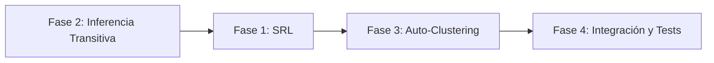

# Plan Maestro: Evolución Semántica de BioRAG v16.0

BioRAG v15.0 es un archivo asociativo sólido. Esta evolución lo convierte en un sistema de razonamiento persistente añadiendo estructura relacional (SRL), inferencia transitiva (Fuzzy Reasoning) y auto-organización dimensional (Auto-Clustering).

> [!IMPORTANT]
> **Principio inviolable:** Cero dependencias pesadas nuevas. No se integra spaCy, ni transformers, ni modelos de embeddings. La extracción SRL se delega al LLM externo (el agente que ya está activo). La inferencia transitiva usa CTEs recursivos de SQLite. El auto-clustering opera sobre la matriz de adyacencia del grafo de sinapsis existente.

---

## Orden de Implementación



> [!TIP]
> Se empieza por la Fase 2 (no por la 1) porque tiene el mayor retorno inmediato, la menor superficie de cambio y no requiere modificaciones en la interfaz MCP de guardado.

---

## Fase 2: Inferencia Transitiva en Grafos (Fuzzy Reasoning)

**Objetivo:** Permitir que la búsqueda descubra nodos indirectamente relacionados a través de caminos en el grafo de sinapsis.

### Schema SQL

```sql
-- Tabla de sinapsis latentes (caché de inferencia transitiva)
CREATE TABLE IF NOT EXISTS sinapsis_latentes (
    origen TEXT NOT NULL,
    destino TEXT NOT NULL,
    peso_atenuado REAL NOT NULL,
    saltos INTEGER NOT NULL,
    calculado_en REAL NOT NULL,
    PRIMARY KEY (origen, destino)
);
CREATE INDEX IF NOT EXISTS idx_sl_origen ON sinapsis_latentes(origen);
CREATE INDEX IF NOT EXISTS idx_sl_destino ON sinapsis_latentes(destino);
```

### Fórmula de Atenuación

```
peso_latente = peso_directo_AB × peso_directo_BC × FACTOR_DECAY^saltos
FACTOR_DECAY = 0.7
MAX_SALTOS = 3 (ya existe como MAX_SALTOS_CADENA)
UMBRAL_MINIMO = 0.05 (no guardar sinapsis latentes por debajo de esto)
```

Ejemplo: A↔B (0.9), B↔C (0.8) → A↔C latente = 0.9 × 0.8 × 0.7¹ = **0.504**

### Cambios por Archivo

#### [NEW] `core/inferencia_transitiva.py`

Módulo independiente con dos funciones:

```python
def calcular_sinapsis_latentes(cerebro, max_saltos=3, factor_decay=0.7, umbral=0.05):
    """CTE recursivo que recorre el grafo de sinapsis hasta max_saltos.
    Calcula peso_atenuado para cada par (origen, destino) no directamente conectado.
    Pobla la tabla sinapsis_latentes."""

def obtener_vecinos_latentes(cerebro, concepto, limite=5):
    """Consulta sinapsis_latentes para un concepto dado.
    Retorna lista de (destino, peso_atenuado, saltos)."""
```

La CTE recursiva en SQLite:

```sql
WITH RECURSIVE caminos(origen, destino, peso_acum, saltos, ruta) AS (
    -- Caso base: sinapsis directas
    SELECT origen, destino, peso, 1, origen || ',' || destino
    FROM sinapsis
    WHERE peso >= 0.1
    UNION ALL
    -- Caso recursivo: extender caminos
    SELECT c.origen, s.destino,
           ROUND(c.peso_acum * s.peso * 0.7, 4),
           c.saltos + 1,
           c.ruta || ',' || s.destino
    FROM caminos c
    JOIN sinapsis s ON s.origen = c.destino
    WHERE c.saltos < 3
      AND c.ruta NOT LIKE '%' || s.destino || '%'  -- evitar ciclos
      AND c.peso_acum * s.peso * 0.7 >= 0.05       -- poda temprana
)
SELECT origen, destino, MAX(peso_acum) as peso_maximo, MIN(saltos) as saltos_min
FROM caminos
WHERE origen != destino
  AND (origen, destino) NOT IN (SELECT origen, destino FROM sinapsis)  -- solo latentes
GROUP BY origen, destino
```

#### [MODIFY] `core/memory_store.py`

1. **`_crear_estructura_cerebral()`** (línea ~487): Añadir `CREATE TABLE sinapsis_latentes` después de `nodo_grupos_semanticos`.

2. **`ciclo_sueno_consolidacion()`** (línea ~1218, después de clasificación WordNet): Añadir llamada a `calcular_sinapsis_latentes(self)` para refrescar la caché.

3. **`_calcular_score_hibrido()`** (línea 1744): El parámetro `score_latente` ya existe con peso 0.10 compartido con `score_cadena` (`0.10 * max(score_latente, score_cadena)`). No se cambia la fórmula — se alimenta el parámetro que ya existe.

4. **`buscar_por_frase()`**: En la sección de scoring por candidato, después de calcular `score_latente` por Jaccard, consultar `sinapsis_latentes` para obtener un boost adicional si el candidato es vecino latente del query.

#### [MODIFY] `mcp_server.py`

Añadir parámetro opcional `usar_inferencia: bool = True` a `_recordar_impl()`. Default `True` para que funcione sin que el agente lo pida explícitamente. Si es `False`, se omite la consulta a `sinapsis_latentes`.

---

## Fase 1: Etiquetado de Roles Semánticos (SRL)

**Objetivo:** Indexar la estructura relacional de las frases (quién hace qué a quién).

> [!WARNING]
> **Decisión arquitectónica crítica:** No se integra spaCy ni ningún modelo NLP local. La extracción SRL la realiza el LLM externo (el agente que ya procesa el texto) y la pasa como campo opcional al guardar. Esto mantiene BioRAG sin dependencias pesadas y delega la inteligencia lingüística al modelo que ya la tiene.

### Schema SQL

```sql
CREATE TABLE IF NOT EXISTS predicados (
    id INTEGER PRIMARY KEY AUTOINCREMENT,
    concepto TEXT NOT NULL,
    sujeto TEXT,
    accion TEXT,
    objeto TEXT,
    contexto TEXT,
    creado_en REAL,
    FOREIGN KEY (concepto) REFERENCES largo_plazo(concepto) ON DELETE CASCADE
);
CREATE INDEX IF NOT EXISTS idx_pred_concepto ON predicados(concepto);
CREATE INDEX IF NOT EXISTS idx_pred_sujeto ON predicados(sujeto);
CREATE INDEX IF NOT EXISTS idx_pred_accion ON predicados(accion);
CREATE INDEX IF NOT EXISTS idx_pred_objeto ON predicados(objeto);
```

### Cambios por Archivo

#### [MODIFY] `core/memory_store.py`

1. **`_crear_estructura_cerebral()`**: Añadir `CREATE TABLE predicados` con sus índices.

2. **`percibir_corto_plazo()`** (línea 958): Añadir parámetro opcional `predicados: list[dict] = None`. Cada dict tiene `{sujeto, accion, objeto, contexto}`. Se almacenan en una tabla temporal `corto_plazo_predicados`.

3. **`consolidar_concepto()`** y **`ciclo_sueno_consolidacion()`**: Propagar predicados de corto a largo plazo (mismo patrón que dimensiones).

4. **`buscar_por_frase()`**: Si la frase contiene una estructura interrogativa con palabras clave de rol (`quién`, `qué hizo`, `a quién`), ejecutar una consulta paralela a la tabla `predicados` y combinar scores.

#### [MODIFY] `mcp_server.py`

1. **`_aprender_impl()`**: Añadir parámetro opcional `predicados: str = None` (JSON string de lista de dicts). Parse y pasar a `percibir_corto_plazo()`.

2. **Tool description de `aprender`**: Documentar el formato esperado:
```json
predicados: '[{"sujeto":"Dennys","accion":"corrigió","objeto":"bug de Angular","contexto":"sesión de debugging"}]'
```

3. **`_recordar_impl()`**: Añadir parámetro `buscar_por_rol: str = None` para búsquedas estructuradas tipo `"sujeto:Dennys,accion:corregir"`.

---

## Fase 3: Autogeneración de Dimensiones (Auto-Clustering)

**Objetivo:** Detectar agrupaciones temáticas emergentes en el grafo de sinapsis y crear dimensiones semánticas de forma autónoma.

> [!IMPORTANT]
> No se usan embeddings vectoriales. Se aplica detección de comunidades sobre la matriz de adyacencia del grafo de sinapsis usando el algoritmo de componentes densas (variante simplificada de Louvain implementada en Python puro).

### Schema SQL

```sql
-- Extensión de la tabla existente dimensiones_semanticas
-- Nuevas columnas para dimensiones auto-generadas
ALTER TABLE dimensiones_semanticas ADD COLUMN auto_generada INTEGER DEFAULT 0;
ALTER TABLE dimensiones_semanticas ADD COLUMN confianza REAL DEFAULT 1.0;
ALTER TABLE dimensiones_semanticas ADD COLUMN generado_en REAL;
```

### Cambios por Archivo

#### [NEW] `core/auto_clustering.py`

Módulo independiente:

```python
def detectar_comunidades(cerebro, min_densidad=0.3, min_nodos=5):
    """Algoritmo de detección de comunidades sobre el grafo de sinapsis.
    1. Cargar matriz de adyacencia desde tabla sinapsis
    2. Calcular componentes conexos con peso > umbral
    3. Para cada componente con >= min_nodos nodos:
       a. Extraer tokens más frecuentes del cluster
       b. Verificar si ya existe una dimensión similar
       c. Si no existe, crear dimensión emergente con nombre auto-generado
    Retorna lista de comunidades detectadas."""

def nombrar_comunidad(tokens_frecuentes):
    """Genera un nombre provisional para la dimensión emergente
    basándose en los 3 tokens más frecuentes del cluster.
    Formato: 'auto_TOKEN1_TOKEN2_TOKEN3'"""

def asignar_dimensiones_emergentes(cerebro, comunidades):
    """Para cada comunidad detectada, asignar la dimensión emergente
    a todos los nodos del cluster que no la tengan."""
```

El algoritmo de detección de comunidades en Python puro (sin networkx):

```python
def _label_propagation(adj_matrix, nodos, max_iter=50):
    """Label Propagation Algorithm — O(E × iter), sin dependencias.
    Cada nodo adopta la etiqueta más frecuente entre sus vecinos
    ponderada por peso sináptico. Converge en ~10 iteraciones."""
```

#### [MODIFY] `core/memory_store.py`

1. **`_crear_estructura_cerebral()`**: Migración segura para añadir columnas `auto_generada`, `confianza` y `generado_en` a `dimensiones_semanticas`.

2. **`ciclo_sueno_consolidacion()`**: Al final del ciclo (después de inhibición lateral y antes de vaciar corto plazo), ejecutar `detectar_comunidades()` y `asignar_dimensiones_emergentes()` **solo si** hay más de 50 nodos activos (umbral mínimo para que el clustering tenga sentido estadístico).

3. **`buscar_por_frase()`**: En el cálculo del `dim_score`, incluir dimensiones auto-generadas con un factor de confianza ponderado: `dim_score_final = dim_score_manual + dim_score_auto × confianza`.

#### [MODIFY] `mcp_server.py`

1. **`listar_dimensiones`**: Añadir campo `auto_generada` en la respuesta para que el agente pueda distinguir dimensiones manuales de emergentes.

---

## Fase 4: Consolidación, Tests y Verificación

### Tests Unitarios (añadir a `test_memory.py`)

```
Test 80: Inferencia transitiva — A↔B (0.9), B↔C (0.8), verificar que
         buscar A retorna C con score atenuado > 0.
         Verificar que sinapsis_latentes se pobla correctamente.

Test 81: Inferencia transitiva — Anti-ciclo. A↔B↔C↔A no genera
         entradas duplicadas ni loops infinitos en sinapsis_latentes.

Test 82: SRL — Guardar nodo con predicados, consolidar, buscar
         "quién corrigió el bug" y verificar que retorna el nodo correcto.

Test 83: SRL — Búsqueda por rol. buscar_por_rol="sujeto:Dennys"
         retorna solo nodos donde Dennys es sujeto, no objeto.

Test 84: Auto-Clustering — Crear 10 nodos con sinapsis densas entre sí,
         ejecutar ciclo de sueño, verificar que se genera una dimensión
         emergente y se asigna a los nodos del cluster.

Test 85: Auto-Clustering — Verificar que dimensiones auto-generadas
         aparecen en listar_dimensiones con flag auto_generada=1.

Test 86: Regresión completa — Los 79 tests existentes pasan sin cambios.
```

### Verificación Manual

```bash
# 1. Ejecutar suite completa de tests
python3 -m pytest test_memory.py -v

# 2. Verificar que la caché de sinapsis latentes se pobla
python3 -c "
from core.memory_store import SQLiteMemoryBioRAG
c = SQLiteMemoryBioRAG()
c.cursor.execute('SELECT COUNT(*) FROM sinapsis_latentes')
print(f'Sinapsis latentes: {c.cursor.fetchone()[0]}')
c.cerrar_sistema()
"

# 3. Verificar que no hay regresión en tiempos de búsqueda
python3 -c "
import time
from core.memory_store import SQLiteMemoryBioRAG
c = SQLiteMemoryBioRAG()
t0 = time.time()
c.buscar_por_frase('implementacion memoria', profundidad='activos', limite=10)
print(f'Búsqueda: {(time.time()-t0)*1000:.1f}ms')
c.cerrar_sistema()
"
```

---

## Resumen de Impacto por Archivo

| Archivo | Fase 2 | Fase 1 | Fase 3 |
|---|---|---|---|
| `core/inferencia_transitiva.py` | **[NEW]** | — | — |
| `core/auto_clustering.py` | — | — | **[NEW]** |
| `core/memory_store.py` | Schema + ciclo_sueno + buscar_por_frase | Schema + percibir + consolidar + buscar_por_frase | Schema migration + ciclo_sueno + buscar_por_frase |
| `core/sinapsis.py` | — | — | — |
| `mcp_server.py` | `usar_inferencia` param | `predicados` + `buscar_por_rol` params | `auto_generada` en listar_dimensiones |
| `test_memory.py` | Tests 80-81 | Tests 82-83 | Tests 84-86 |
| `VERSION` | — | — | v16.0 |
| `CHANGELOG.md` | — | — | Actualizar |
| `README.md` | — | — | Actualizar |

---

## Open Questions

> [!IMPORTANT]
> **1. Rendimiento de la CTE recursiva:** Con ~460 nodos y ~32,000 relaciones, la CTE recursiva hasta 3 saltos podría generar un volumen significativo de caminos. Se necesita validar empíricamente si SQLite resuelve esto en menos de 1 segundo durante el ciclo de sueño. Si excede, se reduce `MAX_SALTOS` a 2.

> [!IMPORTANT]
> **2. Frecuencia del auto-clustering:** Se propone ejecutar la detección de comunidades solo durante el ciclo de sueño y solo si hay más de 50 nodos activos. Esto evita cómputo innecesario en cortezas pequeñas. Confirmar si este umbral es adecuado o se prefiere otro.

> [!IMPORTANT]
> **3. Formato de predicados SRL:** El agente externo (Athena/Artemis/Hermes) deberá generar los predicados SRL al guardar. Esto implica actualizar las tool descriptions de `aprender` y las instrucciones del system prompt de cada agente. Confirmar si se quiere hacer obligatorio o mantenerlo opcional (el nodo funciona igual sin predicados, solo pierde la búsqueda por rol).
